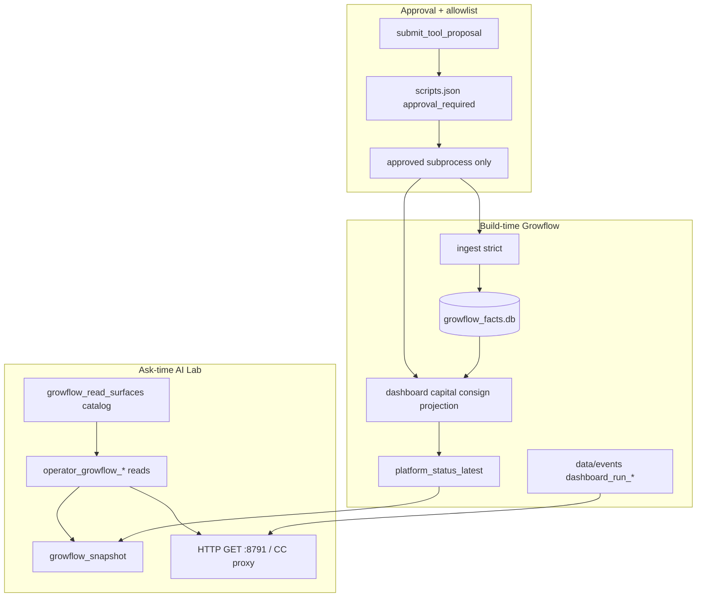

# Growflow ↔ AI Lab — Fully Gated Production Plane

**Status:** G0 done / G1 started (`overall_ok` green after projection JSON default)  

**Date:** 2026-07-15  
**Branch context:** Ops Platform work lives on `cursor/growflow-ops-platform`; do not mix with unrelated feature branches unless explicitly ported.  
**SSOT companions:** `docs/GROWFLOW_OPS_PLATFORM.md`, `ai-lab/registry/growflow_read_surfaces/`, `config/platform.yaml`

## Locked decisions

- **Posture:** Internal single-org, localhost/LAN; Desk **never** GraphQL and **never** `POST /api/retail/refresh` (B3).
- **Write scope (v1 live gate):** refresh plane + **capital scenario** (approval → buy-plan → capital JSON). Consignment sheet confirms = **v1.1** after SLO green streak.
- **Success bar:** `platform_status.overall_ok=true` during store hours for **5 consecutive scheduled cycles**, all catalog tools live-pass, approval write smoke pass, ingest **strict** green.

---

## Current gaps to close first (blocking “fully gated”)

| Gap | Evidence | Target |
|-----|----------|--------|
| Ingest strict fail | Contract requires `Orders.objectId` / `Orders.User.FullName`; live union payload fails validation while rows still upsert | Strict green; orchestrator drops warning-mode default |
| Projection stale | `sales_projection_latest.json` can lag; midday/preclose tasks not proven | Continuous daily+intraday freshness &lt; 12h |
| `overall_ok` false | SLO breaches on projection (and transfers age) | Green under schedule with documented optional domains |
| Approval writes unproven | tools in `scripts.json` exist; no live approve→exec→artifact smoke | Live matrix PASS |
| Contracts incomplete | catalog surfaces with `contract: null` (platform_status, consign, projection, BI) | New contracts + schema validate on promote |

**Known code debt:** `run_platform_orchestrator.py` still defaults `--validation-mode warning` — must flip to `strict` only after G0 contract fix.

---

## Integration layers (required architecture)

### L0 — Safety policy (non-negotiable)

Document in `ai-lab/registry/growflow_read_surfaces/README.md` + Cursor rule:

1. Ask-time: catalog → snapshot → Desk GET tools only.
2. Writes: brain approval queue + `scripts.json` only; paths must exist on disk.
3. Kill deprecated `growflow_sales_today` entirely (remove from allowlist execute path).
4. Env for runners: `GROWFLOW_RETAIL_ORG` from `Growflow/config/config.yaml` (`nugzdispensary`) if unset.
5. Fail closed: Desk answers `degraded`/`unavailable` when `fixture_suspected` or required domain SLO breached.

### L1 — Contracts (SSOT for promote)

| Contract | Path | Covers |
|----------|------|--------|
| Fact ingest (fix) | `contracts/growflow_fact_ingest.json` | Align required_fields with live GraphQL union shape (Orders fragment / null-tolerant budtender) |
| Retail dashboard | `contracts/retail_dashboard.json` | Existing + `meta.trust` / `org_id` required |
| **NEW** platform_status | `contracts/platform_status.json` | domains map, slo_breaches, overall_ok |
| **NEW** sales_projection_eod | `contracts/sales_projection_eod.json` | collected_so_far, base/cons/agg, sales_date, as_of_local |
| **NEW** retail_consignment_view | `contracts/retail_consignment_view.json` | kpi_strip + meta for CC JSON |
| **NEW** retail_capital_view | `contracts/retail_capital_view.json` | kpi_banner + meta.source_exists |
| **NEW** company_bi_report | `contracts/company_bi_report.json` | summary + sections.pos_from_facts |
| Transfer receipts | existing | Require scheduled rebuild within capital SLO |
| **NEW** operator_tool_envelope | `ai-lab/operator_desk/contracts/result_envelope.json` | ok, freshness, known_blockers, metrics bounds |

**Promotion rule:** `*_latest.json` writes must validate against contract (fail = do not overwrite “promoted” pointer; keep previous good artifact).

### L2 — Growflow build plane

- `scripts/run_platform_orchestrator.py`: default **strict** ingest after contract fix; print step logs; emit events.
- Schedulers (`install_platform_scheduler.ps1`): ingest 2h, dashboard 4h, projection midday+preclose, transfers daily, capital daily, status always.
- `scripts/run_platform_release_gate.py`: fail hard on fixture; fail hard if `overall_ok` false for **required** domains (retail, consign ops, capital, projection); transfers as warning→required after first green rebuild.

### L3 — Serve plane

- Growflow API `:8791` — enrich every GET with `meta.trust`; health aggregates status.
- ai-lab proxy `command-center/.../routers/retail.py` — GET mirror + capital approve/deny only on control channel.
- Prepared snapshot builder — regenerate after successful promote; confidence from trust, not docs.

### L4 — AI Lab tool plane

| Role | Tool IDs | Gate |
|------|----------|------|
| Reads | `operator_growflow_status`, `_retail`, `_capital`, `_consignment`, `_projection`, `_bi_summary`, `_catalog` | Freshness enum; no refresh |
| Writes (propose) | `growflow_ingest_facts`, `growflow_build_retail_dashboard`, `growflow_build_retail_consignment`, `growflow_build_retail_capital`, `growflow_platform_orchestrator`, `growflow_build_projection_buy_plan`, **NEW** `growflow_run_daily_sales_projection`, **NEW** `growflow_build_platform_status`, **NEW** `growflow_build_transfer_receipts` | `approval_required: true` |
| Capital interactive | existing `retail_capital_scenario` via CC → Growflow execute | approval card + ops event |
| Forbidden | Desk refresh; GraphQL; deprecated sales_today exec | tests enforce |

Add Desk propose wrappers (or document that writes go via `operator_machine_submit_action` / approvals with exact `tool_name`) so Guru/Desk can propose without inventing paths.

### L5 — Observability

- `data/events/latest.json` + CC ops publish on complete/fail.
- Snapshot `known_blockers` mirrors `slo_breaches`.
- Optional Telegram later (out of v1).

---

## Phase plan

### Phase G0 — Ingest strict + promote integrity (days 1–2)

1. Probe live `findOrderItems` node shape for Orders union; fix `growflow_fact_ingest.json` + normalizer (tolerate missing User.FullName; require SoldAt/prices; budtender optional→warn).
2. Golden fixture from real anonymized sample row for gateway unit test.
3. `ingest_growflow_facts.py --validation-mode strict --days 7` exit 0.
4. Orchestrator default strict; remove warning as default.
5. Contract validate before overwrite of `retail_dashboard_latest.json`.

**Exit:** strict ingest green; dashboard promote green; fixture detector still blocks $9-sample.

### Phase G1 — Projection continuous + overall_ok (days 2–4)

1. Live run `run_daily_sales_projection.py` + close path documented.
2. Add `sales_projection_eod.json` contract; status domain uses it.
3. Prove Task Scheduler LastResult=0 for `GrowflowPlatformProjectionMidday` / `Preclose` (or fix `scheduled_task_pythonw` env/org).
4. Rebuild transfers DB once; tighten transfer SLO or mark “warn-only” explicitly in status schema.
5. `build_platform_status` → `overall_ok=true` for **required** domains.

**Exit:** status green after orchestrator; snapshot confidence ≥ 0.8 without projection/fixture blockers.

### Phase G2 — Contracts + catalog completeness (days 3–5)

1. Author NEW contracts listed above; wire catalog `contract` fields (no nulls for production surfaces).
2. `scripts/validate_latest_artifacts.py` — CI + pre-promote.
3. Desk envelope JSON Schema; unit tests for every tool return shape.
4. Remove/disable deprecated `growflow_sales_today` from executable allowlist.

**Exit:** catalog 100% contracted; validate script in release gate.

### Phase G3 — Approval write path proof (days 4–6)

1. Map each write `tool_name` → argv allowlist (no freeform shell).
2. Live smoke (human approve on Acheron):
   - propose `growflow_build_platform_status` → approve → status rewritten
   - propose `growflow_run_daily_sales_projection` → approve → projection fresh
   - propose `growflow_platform_orchestrator --kind dashboard` → approve → dashboard built_at updates
   - capital scenario via CC (skip_approval=false) → approve → `retail_capital_latest.json` updates + ops event
3. Deny path smoke (no side effects).
4. Audit log evidence paths recorded in `docs/GROWFLOW_LIVE_GATE_MATRIX.md`.

**Exit:** signed matrix with timestamps; all write tools PASS once.

### Phase G4 — Full AI Lab tool live matrix (days 5–7)

Automated + manual matrix (`ai-lab/scripts/live_growflow_tool_matrix.py`):

| # | Tool / surface | Assertion |
|---|----------------|-----------|
| R1 | catalog | surfaces ≥ N; policy flags present |
| R2 | status | freshness ∈ enums; blockers list; no METRICS.md prose |
| R3 | retail | net &gt; 100 and orders &gt; 3 unless fixture flag |
| R4 | capital | source_exists; kpi_banner non-empty |
| R5 | consign | kpi_strip present |
| R6 | projection | sales_date = today (store TZ) or SLO staleness declared |
| R7 | BI | ok or explicit not_built |
| R8 | API health | `/api/v1/platform/health` matches status file |
| R9 | snapshot rebuild | parity with status |
| W1–W4 | approval writes | G3 cases |
| X1 | Desk refresh attempt | blocked / absent |
| X2 | GraphQL from Desk path | not imported |

Nightly job optional: matrix dry-run reads only; writes never automatic.

### Phase G5 — Soak + promote to “production gate” (week 2)

1. 5 consecutive store-hour cycles with `overall_ok=true`.
2. CC UI smoke: Operations trust green, Capital, Consignment, projection card.
3. Freeze warn-mode ingest; document SaaS still deferred (`docs/SAAS_PHASE_DEFERRED.md`).
4. Update vault `job_growflow_retail.md` with gate checklist.

---

## Test pyramid

| Layer | What | Where |
|-------|------|-------|
| Unit | fixture detector; ingest path normalize; Desk no-refresh; envelope schema | `Growflow/tests`, `operator_desk/tests` |
| Contract | JSON Schema validate fixtures + latest | `tests/test_*_contracts.py`, `validate_latest_artifacts.py` |
| Integration | orchestrator steps with mocked GraphQL or recorded raw | `tests/test_platform_orchestrator.py` |
| Release gate | `run_platform_release_gate.py` fail-closed | CI + pre-schedule |
| Live matrix | R1–R9, W1–W4, X1–X2 against Acheron | `live_growflow_tool_matrix.py` + markdown report |
| Soak | 5× scheduled green | ops checklist |

---

## Safety checklist (must stay true)

- [ ] No GraphQL on ask-time code paths (Desk / snapshot / catalog)
- [ ] No Desk `POST /refresh`
- [ ] Writes require pending approval + allowlisted `tool_name`
- [ ] Promote never overwrites with fixture or failed contract
- [ ] `overall_ok` false ⇒ Desk `degraded` for financial claims
- [ ] Secrets only via env/credential paths already used
- [ ] Consignment sheet writes **out of v1** until G5 soak done

---

## Deliverables

1. Fixed ingest contract + strict green
2. New contracts for platform_status, projection_eod, consign view, capital view, BI, Desk envelope
3. Catalog with zero null contracts for prod surfaces
4. Release gate + validate_latest + live matrix script
5. `docs/GROWFLOW_LIVE_GATE_MATRIX.md` filled from Acheron run
6. Schedulers proven; `overall_ok` green under cadence
7. Vault/Cursor policy updated to “gated production plane”

## Out of scope (explicit)

- Multi-tenant SaaS / IdP / Postgres
- Consignment confirm writes (v1.1)
- Full company_bi margin engine rebuild
- Telegram notify wiring

---

## Execution todos

- [x] **g0-ingest-strict** — Fix path walk for Orders union list; fix dedupe keys; strict ingest green; orchestrator default strict (promote-time validate still open)
- [x] **g1-projection-overall-ok** — Default `--json-out` on daily projection; live `overall_ok=true` (soak under schedule still open)
- [ ] **g2-contracts-catalog** — Add platform_status / projection_eod / consign / capital / BI / Desk envelope contracts; wire catalog; kill deprecated sales_today exec
- [ ] **g3-approval-write-smoke** — Allowlisted argv map; live approve/deny smokes for status, projection, orchestrator dashboard, capital scenario
- [ ] **g4-live-tool-matrix** — `live_growflow_tool_matrix.py` covering all Desk reads + write gates + forbidden paths; fill LIVE_GATE_MATRIX.md
- [ ] **g5-soak-promote** — 5 consecutive green store-hour cycles; CC UI smoke; vault job gate checklist; freeze warn-mode
