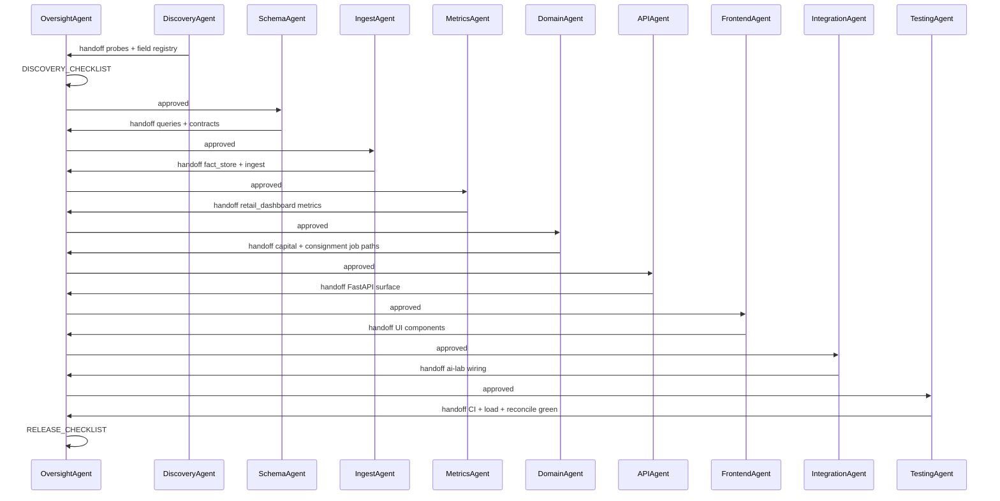

# Retail Intelligence System — Full Technical Wireframe & Multi-Agent Build Architecture

**Status:** Pre-build specification (completeness over brevity)  
**Scope:** Full plan as specified — Operations + Capital + Consignment tabs, foundation layer, ai-lab integration, parallel Sheets maintenance (to be reduced later)  
**Theme:** Dark Command Center shell; teal chart accent  
**Last updated:** 2026-06-11

---

## Table of contents

1. [System purpose & ROI posture](#1-system-purpose--roi-posture)
2. [Full system wireframe (layers)](#2-full-system-wireframe-layers)
3. [UI wireframes (all tabs)](#3-ui-wireframes-all-tabs)
4. [Module & component catalog](#4-module--component-catalog)
5. [Data stores & schemas](#5-data-stores--schemas)
6. [API surface (FastAPI + ai-lab proxy)](#6-api-surface-fastapi--ai-lab-proxy)
7. [Data flow & integrity checks](#7-data-flow--integrity-checks)
8. [Multi-agent build architecture](#8-multi-agent-build-architecture)
9. [Oversight / monitoring agent (OversightAgent)](#9-oversight--monitoring-agent-oversightagent)
10. [Orchestration logic](#10-orchestration-logic)
11. [Validation & monitoring strategy](#11-validation--monitoring-strategy)
12. [Script stability safeguards](#12-script-stability-safeguards)
13. [Phased implementation plan (agent-assigned)](#13-phased-implementation-plan-agent-assigned)
14. [Duplicate maintenance register (reduce later)](#14-duplicate-maintenance-register-reduce-later)

---

## 1. System purpose & ROI posture

### 1.1 Product definition

**Retail Intelligence System (RIS)** is a layered data platform with a Command Center UI that:

- Replicates GrowFlow’s 4-widget operational dashboard (accurate reconciliation required)
- Exceeds GrowFlow on trust, landed margin, budtender coaching, period compare, capital scenarios, consignment confirms
- Feeds ai-lab Guru/tools from the same trusted artifacts
- Maintains Google Sheets dashboards in parallel until React parity is proven

### 1.2 Primary user journeys

| Journey | Entry | Success criteria |
|---------|-------|------------------|
| Daily ops review | Retail → Operations | Trust green; discount trend + budtender flags reviewed in &lt;5 min |
| Buy planning | Retail → Capital | Scenario run completes; approval promotes trusted output; KPIs match CLI |
| Consignment close | Retail → Consignment | Confirm vendors; sheet + SQLite updated; approval audit logged |
| AI question | Chat → Guru | Router hits `retail_dashboard` tools; answer cites trusted JSON + validation report |
| Ops maintenance | Task Scheduler / CLI | Ingest + dashboard build succeed; validation reports `ok=true` |

---

## 2. Full system wireframe (layers)

```
┌─────────────────────────────────────────────────────────────────────────────────────────┐
│ LAYER 7 — PRESENTATION (ai-lab Command Center)                                          │
│  App.jsx → Retail tab → RetailSubNav → [Operations | Capital | Consignment]             │
│  TrustStrip | AlertStrip | DashboardFilters | WidgetGrid | ApprovalSidebar hooks        │
│  WebSocket ← feed_bus ← dashboard_run_completed | growflow_write_completed             │
└───────────────────────────────────────────────┬─────────────────────────────────────────┘
                                                │ HTTP proxy (localhost)
┌───────────────────────────────────────────────▼─────────────────────────────────────────┐
│ LAYER 6 — SERVE API (Growflow dashboard/backend — FastAPI :8791)                          │
│  GET  /api/retail-dashboard          full payload + meta                                  │
│  GET  /api/retail-dashboard/meta     trust strip fast path                                │
│  GET  /api/retail-dashboard/alerts   alert strip + AI narrative slot                      │
│  GET  /api/retail-dashboard/capital  projection trusted + KPIs + chart series           │
│  GET  /api/retail-dashboard/consignment  SQLite + sheet mirror state                      │
│  POST /api/retail-dashboard/refresh  queue ingest + build (async job id)                │
│  POST /api/retail-dashboard/capital/scenario  queue projection run (approval pending)     │
│  POST /api/retail-dashboard/consignment/confirm  queue confirm write (approval pending)   │
│  GET  /api/retail-dashboard/jobs/{id}  job status                                       │
│  GET  /api/retail-dashboard/health   liveness + last runs                               │
└───────────────────────────────────────────────┬─────────────────────────────────────────┘
                                                │ read only
┌───────────────────────────────────────────────▼─────────────────────────────────────────┐
│ LAYER 5 — AGGREGATE CACHE (data/retail_dashboard.db)                                    │
│  dashboard_runs | budtender_sales | discounts_daily | budtender_category | brand_summary │
│  period_compare_kpis | alerts | meta_json per run_id                                     │
└───────────────────────────────────────────────┬─────────────────────────────────────────┘
                                                │ written by
┌───────────────────────────────────────────────▼─────────────────────────────────────────┐
│ LAYER 4 — METRIC RUNNERS (canonical scripts)                                            │
│  build_retail_dashboard.py | build_projection_by_category_brand.py (scenario)           │
│  consignment_daily_allocation.py (confirm path) | ingest_growflow_facts.py              │
│  → data_validation_gateway.validate_and_normalize() → strict mode                       │
└───────────────────────────────────────────────┬─────────────────────────────────────────┘
                                                │ read
┌───────────────────────────────────────────────▼─────────────────────────────────────────┐
│ LAYER 3 — METRIC LIBRARIES                                                            │
│  lib/retail_dashboard/* | lib/projection_* | lib/consignment_* | lib/brand_profit_velocity│
│  lib/growflow_line_pricing | lib/brand_category_normalize | lib/product_landed_cost_*   │
└───────────────────────────────────────────────┬─────────────────────────────────────────┘
                                                │ read
┌───────────────────────────────────────────────▼─────────────────────────────────────────┐
│ LAYER 2 — FACT & DOMAIN STORES (SQLite)                                                 │
│  data/growflow_facts.db     order_lines, orders, users, stores, products, ingest_runs   │
│  data/transfer_receipts.db  transfer_receipts, packages, product_landed_cost_current     │
│  data/consignment.db        vendor state, ledger (existing)                               │
│  state/trusted_outputs/     validation-gated JSON per metric_id                          │
│  state/validation_reports/  ok, confidence, drift, warnings                               │
└───────────────────────────────────────────────┬─────────────────────────────────────────┘
                                                │ written by
┌───────────────────────────────────────────────▼─────────────────────────────────────────┐
│ LAYER 1 — INGEST & QUERY (Growflow repo core)                                           │
│  lib/growflow_graphql.py | lib/growflow_queries.py | lib/growflow_query_registry.py     │
│  lib/growflow_fact_store.py | lib/data_validation_gateway.py | lib/schema_verification  │
└───────────────────────────────────────────────┬─────────────────────────────────────────┘
                                                │ HTTPS OAuth
┌───────────────────────────────────────────────▼─────────────────────────────────────────┐
│ LAYER 0 — GROWFLOW RETAIL GRAPHQL API                                                   │
│  findOrderItems | findOrders | findTransactions | findProducts | findBrands |           │
│  findProductCategories | findStores | findTransfers | findPackages | findUsers?           │
└─────────────────────────────────────────────────────────────────────────────────────────┘

PARALLEL (duplicate maintenance — reduce later):
  Google Sheets: projection dashboard | consignment ultra-wide sheet | taxes sheet
  company_bi CSVs + rebuilt run_pipeline
  ai-lab: prepared_context snapshots | tool registry | router intents
```

### 2.1 Deployment topology (localhost v1)

```
┌──────────────────────┐     ┌──────────────────────┐     ┌──────────────────────┐
│ Task Scheduler (Win)   │     │ dashboard/backend    │     │ ai-lab Command Center │
│ run_ingest.ps1       │     │ uvicorn :8791        │     │ Vite :5173            │
│ run_retail_dash.ps1  │     │ Growflow repo        │     │ FastAPI proxy :8000   │
│ run_transfer_db.ps1  │     └──────────┬───────────┘     └──────────┬───────────┘
│ consignment *.ps1    │                │                            │
└──────────┬───────────┘                └────────────┬───────────────┘
           │                                         │
           └─────────────────┬───────────────────────┘
                             ▼
                    E:\Repos\Growflow\data\*.db
                    E:\Repos\Growflow\state\*
```

---

## 3. UI wireframes (all tabs)

### 3.1 Global chrome (all Retail sub-tabs)

```
┌──────────────────────────────────────────────────────────────────────────────────────────┐
│ AI Lab · Command center          [ENFORCEMENT] [worker: online]     [Prepared ● green]   │
├──────────────────────────────────────────────────────────────────────────────────────────┤
│ Sidebar │ RETAIL INTELLIGENCE                                                             │
│         │ ┌─ TrustStrip ─────────────────────────────────────────────────────────────┐  │
│         │ │ ● retail_dashboard ok │ ● ingest ok │ refreshed 47m │ conf 0.92 │ stale: no │  │
│         │ │ metrics: projection ✓ transfer ✓ brand_velocity ✓                        │  │
│         │ └──────────────────────────────────────────────────────────────────────────┘  │
│         │ ┌─ AlertStrip (collapsible) ───────────────────────────────────────────────┐  │
│         │ │ [AI narrative] Discount rate 12.4% vs 8.1% prior (+4.3pp). 3 budtender     │  │
│         │ │ outliers. Validation: none. [Dismiss] [Ask Guru]                         │  │
│         │ └──────────────────────────────────────────────────────────────────────────┘  │
│         │ [Operations] [Capital] [Consignment]                                            │
│         │ ┌─ DashboardFilters ─────────────────────────────────────────────────────────┐  │
│         │ │ Period: [Last 30 Days ▼]  Store: [Nugz ▼]  ☐ Compare prior period        │  │
│         │ │ Custom: [____] – [____]                              [Go]  [↻ Refresh]     │  │
│         │ └──────────────────────────────────────────────────────────────────────────┘  │
│         │ ┌─ Compare KPI chips (when compare on) ────────────────────────────────────┐  │
│         │ │ Net Sales: $39.1k (+2.1%) │ Eff. Discount: 9.2% (+1.1pp) │ Orders: 4.2k   │  │
│         │ └──────────────────────────────────────────────────────────────────────────┘  │
│         │                                                                                  │
│         │  << TAB CONTENT >>                                                               │
└─────────┴──────────────────────────────────────────────────────────────────────────────────┘
```

**Component files (ai-lab):**

| Component | Path |
|-----------|------|
| `RetailShell.jsx` | `frontend/src/components/retail/RetailShell.jsx` |
| `TrustStrip.jsx` | `frontend/src/components/retail/TrustStrip.jsx` |
| `AlertStrip.jsx` | `frontend/src/components/retail/AlertStrip.jsx` |
| `DashboardFilters.jsx` | `frontend/src/components/retail/DashboardFilters.jsx` |
| `CompareKpiStrip.jsx` | `frontend/src/components/retail/CompareKpiStrip.jsx` |
| `RetailSubNav.jsx` | `frontend/src/components/retail/RetailSubNav.jsx` |

---

### 3.2 Operations tab (2×2 grid — full parity)

```
┌─ Card: Budtender Sales & Discounts ──────────────── [⋮ Export CSV | How calculated] ─┐
│ 🔍 Search budtenders...                                                            │
│ ┌──────────┬──────────┬────────┬───────┬─────────────┬──────────────┬───────────┐ │
│ │Budtender │Net Sales │#Orders │ AOV $ │Eff Disc % ▓▓│%Ord w/Disc ▓▓│%Net Sal ▓▓│Fl│ │
│ ├──────────┼──────────┼────────┼───────┼─────────────┼──────────────┼───────────┤ │
│ │Alice     │ $12,450  │  312   │ $39.9 │  11.2% ▓▓▓▓ │   42% ▓▓▓▓▓ │  28% ▓▓▓  │⚠ │ │
│ │Bob       │  $9,880  │  298   │ $33.2 │  18.7% ▓▓▓▓▓│   61% ▓▓▓▓▓▓│  22% ▓▓   │🔴│ │
│ └──────────┴──────────┴────────┴───────┴─────────────┴──────────────┴───────────┘ │
│ Flags: ⚠ high_discount_vs_store | 🔴 low_aov_and_high_discount                      │
└────────────────────────────────────────────────────────────────────────────────────┘

┌─ Card: Discounts Over Time ─────────────────────── [⋮] ─────────────────────────────┐
│                                    [All] [In-store] [Online]  ← if API validated     │
│  $4k ┤                                                                               │
│      │     ▓▓▓                                                                        │
│  $2k ┤ ▓▓▓▓▓▓▓▓▓▓▓▓▓▓▓▓▓▓▓▓  Net Sales (teal bars)                                    │
│      │ ─── Eff Discount % (gray line, right axis 0-100%)                             │
│      │ --- % Orders w/ Discount (teal line)                                          │
│      └──────────────────────────────────────────────────► dates                      │
│  ☐ Overlay prior period net sales (ghost bars) — v1.1 optional                       │
└────────────────────────────────────────────────────────────────────────────────────┘

┌─ Card: Budtender by Category ───────────────────── [⋮] ─────────────────────────────┐
│ ▼ Accessories (gross $1,240)                                                       │
│     Alice    gross $820   net $780   items 45                                        │
│     Bob      gross $420   net $400   items 22                                        │
│ ▼ Disposable Cartridge                                                               │
│     Alice    gross $4,100 net $3,900 items 180                                       │
│ ▶ BONG (collapsed)                                                                   │
└────────────────────────────────────────────────────────────────────────────────────┘

┌─ Card: Brand Summary ──────────────────────────── [⋮] ─────────────────────────────┐
│ ┌────────────┬─────────┬─────────┬──────────┬──────────┬──────────┬──────────────┐ │
│ │Brand       │Net Sales│Returns %│Eff Disc %│Native GM%│Landed GM%│Velocity Rank │ │
│ │Cartel      │ $8,200 ▓│  0.8%   │  6.1% ▓▓ │  52.3%   │  48.1%   │  #3          │ │
│ │Puffin Pure │ $6,100 ▓│  1.2%   │  4.0% ▓  │  61.0%   │  n/a     │  #7          │ │
│ └────────────┴─────────┴─────────┴──────────┴──────────┴──────────┴──────────────┘ │
│ Tooltip: canonical brand from normalization map; raw API string shown on hover       │
└────────────────────────────────────────────────────────────────────────────────────┘
```

---

### 3.3 Capital tab (full sheet parity target)

Maps to `DASHBOARD_LAYOUT` zones in `lib/projection_dashboard_sheet_rebuilt.py`.

```
┌─ ScenarioBar ──────────────────────────────────────────────────────────────────────┐
│ Pool $ [18000]  Velocity days [49]  Cash cycle [14]  Mode [buy-plan ▼]             │
│ [Run scenario]  status: idle | running | awaiting_approval | failed                 │
└────────────────────────────────────────────────────────────────────────────────────┘

┌─ KpiBanner (6 cells) ──────────────────────────────────────────────────────────────┐
│ Total pool │ Projected GP │ Weighted recovery │ Unallocated $ │ Buy-plan rows │ ...  │
└────────────────────────────────────────────────────────────────────────────────────┘

┌─ Row 1 charts ─────────────────────────────────────────────────────────────────────┐
│ [Pie: pool by category]  [Bar: brand allocation top 15]  [Combo: alloc vs profit]   │
└────────────────────────────────────────────────────────────────────────────────────┘

┌─ Narrative + Action blocks ──────────────────────────────────────────────────────────┐
│ Auto narrative from projection_exec_kpis + layer2 highlights                         │
│ Action: "Review fastest recovery table" / link to approval if scenario pending       │
└────────────────────────────────────────────────────────────────────────────────────┘

┌─ Tables (scroll) ──────────────────────────────────────────────────────────────────┐
│ Fastest recovery (top 20) │ Highest projected GP │ Weak efficiency │ Category perf  │
│ Detail ledger (brand×category deployment rows)                                       │
└────────────────────────────────────────────────────────────────────────────────────┘

┌─ Row 2 charts ─────────────────────────────────────────────────────────────────────┐
│ Recovery bucket chart │ Category recovery chart                                      │
└────────────────────────────────────────────────────────────────────────────────────┘

Approval flow: Run scenario → OversightAgent validates job spec → Sidebar pending card →
  Approve → subprocess build_projection_by_category_brand.py → validation strict →
  WebSocket growflow_write_completed → UI reload capital payload
```

---

### 3.4 Consignment tab (full sheet zone mirror)

Maps to `docs/CONSIGNMENT_API_FIELD_MAP.md` zones.

```
┌─ KpiStrip (F–H equivalent) ────────────────────────────────────────────────────────┐
│ Today's recommended pull │ Total open backlog │ Due in 7d │ Overdue │ MTD │ Vendors │
└────────────────────────────────────────────────────────────────────────────────────┘

┌─ ActiveTransfers (O–W) ────────────────┬─ LatestDayByVendor (Y–AF) ────────────────┐
│ Vendor │ Transfer │ Received │ Units   │ Vendor │ Accrual │ Backlog │ Rec pull │ ✓  │
│ Doc F  │ TR-123   │ 6/01     │ 120     │ Doc F  │ $240    │ $1,200  │ $400     │[Confirm]│
│ Arctic │ TR-118   │ 5/28     │ 80      │ Arctic │ $160    │ $800    │ $0       │[Confirm]│
└────────────────────────────────────────┴────────────────────────────────────────────┘

┌─ DailyLedger (A–L) — full grid ────────────────────────────────────────────────────┐
│ Date │ Vendor │ Status │ Units │ Accrual $ │ Backlog $ │ Rec pull │ Conf │ Conf $ │...│
│ scrollable; 500+ rows virtualized                                                  │
└────────────────────────────────────────────────────────────────────────────────────┘

┌─ ProductDetail (O–U) — latest day lines ───────────────────────────────────────────┐
│ Vendor │ Product │ Units sold │ Unit cost │ Accrual │ Package ids                   │
└────────────────────────────────────────────────────────────────────────────────────┘

Confirm action → POST consignment/confirm → approval gate → consignment_daily_allocation
  write path (Confirmed + Confirmed $ cells only per CONSIGNMENT_UI_WRITE_CONTRACT)
```

---

### 3.5 Approval sidebar integration

```
Sidebar event: { type: 'approval', id: 'capital_scenario_20260611_001',
  action: 'run_projection_scenario',
  detail: 'Pool $22k, velocity 49d, cash cycle 14d, buy-plan',
  diff_preview: { pool_delta: +4000, rows_affected: 47 },
  metric_id: 'projection_by_category_brand' }

[Approve] [Reject] → audit log → state/jobs/{id}.json
```

---

## 4. Module & component catalog

### 4.1 Growflow repo — new modules

| Module | Responsibility | Depends on |
|--------|----------------|------------|
| `lib/growflow_query_registry.py` | template_id → query version, field manifest | `growflow_queries.py`, `query_templates.yaml` |
| `lib/growflow_fact_store.py` | SQLite DDL, upsert, watermark, read API | `growflow_graphql` |
| `lib/retail_dashboard/fetch.py` | SQL reads for metric windows | `growflow_fact_store` |
| `lib/retail_dashboard/normalize.py` | Flat rows → canonical grain | `brand_category_normalize` |
| `lib/retail_dashboard/metrics.py` | 4 widget aggregations + compare periods | `growflow_line_pricing` |
| `lib/retail_dashboard/enrich.py` | landed cost, velocity rank, flags, alerts | `product_landed_cost_sqlite`, `brand_profit_velocity` |
| `lib/retail_dashboard/reconcile.py` | tolerance checks vs native export | metrics output |
| `lib/retail_dashboard/jobs.py` | async job queue state (file-based v1) | subprocess |
| `lib/brand_profit_velocity.py` | extracted ranking logic | fact store |
| `dashboard/backend/main.py` | FastAPI app | routers |
| `dashboard/backend/routers/retail_dashboard.py` | HTTP surface | cache_reader, jobs |
| `dashboard/backend/services/cache_reader.py` | retail_dashboard.db reads | sqlite |
| `dashboard/backend/services/refresh.py` | spawn ingest + build scripts | subprocess |
| `dashboard/backend/services/approval_queue.py` | pending writes | state/jobs |

### 4.2 Growflow repo — extended modules

| Module | Extension |
|--------|-----------|
| `lib/growflow_queries.py` | `ORDER_ITEMS_RETAIL_DASHBOARD_QUERY`, `ORDERS_RETAIL_DASHBOARD_QUERY`, `USERS_LOOKUP_QUERY`, `PRODUCTS_CATALOG_QUERY` |
| `lib/growflow_graphql.py` | retry backoff, parallel chunk executor, rate-limit sleep |
| `lib/data_validation_gateway.py` | contracts: `growflow_fact_ingest`, `retail_dashboard` |
| `scripts/ingest_growflow_facts.py` | canonical ingest runner |
| `scripts/build_retail_dashboard.py` | canonical dashboard runner |
| `scripts/probe_retail_dashboard_fields.py` | staff, returns, store, channel probes |
| `scripts/reconcile_retail_dashboard.py` | native UI gate |
| `company_bi/run_pipeline.py` | **rebuild** — reads fact store |
| `company_bi/lib/growflow_db.py` | **rebuild** — shared schema adapter |

### 4.3 ai-lab repo — new modules

| Module | Responsibility |
|--------|----------------|
| `command-center/backend/routers/retail_dashboard.py` | proxy to :8791 |
| `command-center/backend/services/growflow_job_bridge.py` | approval + subprocess bridge |
| `command-center/frontend/src/components/retail/*` | full UI tree |
| `brain/prepared_context/builders.py` | extend `build_growflow_snapshot` |
| `registry/scripts.json` | retail tools |
| `brain/router/router.py` | retail intents |

---

## 5. Data stores & schemas

### 5.1 `data/growflow_facts.db`

```sql
-- ingest_runs: audit trail per ingest
CREATE TABLE ingest_runs (
  run_id TEXT PRIMARY KEY,
  started_at TEXT NOT NULL,
  finished_at TEXT,
  watermark_from TEXT,
  watermark_to TEXT,
  lines_upserted INTEGER,
  orders_upserted INTEGER,
  validation_report_path TEXT,
  ok INTEGER NOT NULL DEFAULT 0
);

-- order_lines: one row per findOrderItems node (1 line = 1 unit until proven otherwise)
CREATE TABLE order_lines (
  object_id TEXT PRIMARY KEY,
  sold_at TEXT NOT NULL,
  sold_date_local TEXT NOT NULL,
  order_object_id TEXT,
  store_object_id TEXT,
  budtender_user_id TEXT,
  budtender_name TEXT,
  gross_price_cents INTEGER NOT NULL,
  net_price_cents INTEGER NOT NULL,
  cog_cents INTEGER,
  original_price_cents INTEGER,
  price_cents INTEGER,
  tax_cents INTEGER,
  collected_otd_cents INTEGER,
  discount_cents INTEGER,
  is_return INTEGER NOT NULL DEFAULT 0,
  channel TEXT,  -- in_store | online | unknown
  product_object_id TEXT,
  brand_raw TEXT,
  brand_canonical TEXT,
  category_raw TEXT,
  category_canonical TEXT,
  package_object_id TEXT,
  landed_cost_cents INTEGER,
  ingest_run_id TEXT NOT NULL
);
CREATE INDEX idx_ol_sold_date ON order_lines(sold_date_local);
CREATE INDEX idx_ol_order ON order_lines(order_object_id);
CREATE INDEX idx_ol_budtender ON order_lines(budtender_user_id);
CREATE INDEX idx_ol_brand ON order_lines(brand_canonical);

-- orders, users, stores, products: dimension tables (abbreviated)
CREATE TABLE orders (
  object_id TEXT PRIMARY KEY,
  completed_at TEXT,
  total_cents INTEGER,
  subtotal_cents INTEGER,
  discounts_cents INTEGER,
  budtender_user_id TEXT,
  store_object_id TEXT,
  has_discount INTEGER,
  is_return INTEGER NOT NULL DEFAULT 0
);

CREATE TABLE users (
  object_id TEXT PRIMARY KEY,
  display_name TEXT NOT NULL,
  username TEXT
);

CREATE TABLE stores (
  object_id TEXT PRIMARY KEY,
  name TEXT NOT NULL
);

CREATE TABLE products (
  object_id TEXT PRIMARY KEY,
  name TEXT,
  brand_id TEXT,
  category_id TEXT,
  sales_price_cents INTEGER
);
```

### 5.2 `data/retail_dashboard.db`

```sql
CREATE TABLE dashboard_runs (
  run_id TEXT PRIMARY KEY,
  fact_watermark TEXT,
  period_start TEXT,
  period_end TEXT,
  prior_start TEXT,
  prior_end TEXT,
  store_id TEXT,
  channel TEXT,
  built_at TEXT,
  validation_ok INTEGER,
  meta_json TEXT
);

CREATE TABLE budtender_sales (run_id, budtender_name, net_sales_cents, order_count,
  aov_cents, eff_discount_pct, pct_orders_discounted, pct_net_sales, flags_json TEXT,
  PRIMARY KEY (run_id, budtender_name));

CREATE TABLE discounts_daily (run_id, date_local, net_sales_cents, eff_discount_pct,
  pct_orders_discounted, PRIMARY KEY (run_id, date_local));

CREATE TABLE budtender_category (run_id, category_name, budtender_name,
  gross_sales_cents, net_sales_cents, item_count,
  PRIMARY KEY (run_id, category_name, budtender_name));

CREATE TABLE brand_summary (run_id, brand_name, brand_canonical, net_sales_cents,
  returns_pct, eff_discount_pct, native_margin_pct, landed_margin_pct,
  velocity_rank, cog_landed_delta_pct,
  PRIMARY KEY (run_id, brand_canonical));

CREATE TABLE period_compare_kpis (run_id, metric_key, current_value, prior_value,
  delta_abs, delta_pct, PRIMARY KEY (run_id, metric_key));

CREATE TABLE alerts (run_id, alert_id, severity, code, message, payload_json,
  PRIMARY KEY (run_id, alert_id));
```

### 5.3 Trusted artifact layout (unchanged contract)

```
state/raw_responses/{metric_id}/{timestamp}_{hash}.json
state/validation_reports/{metric_id}/{timestamp}_{hash}.json
state/trusted_outputs/{metric_id}/{timestamp}_{hash}.json
```

---

## 6. API surface (FastAPI + ai-lab proxy)

### 6.1 Request/response contracts

**GET `/api/retail-dashboard`**

```json
{
  "meta": {
    "run_id": "20260611T120000_ab12",
    "built_at": "2026-06-11T12:00:00Z",
    "period": { "start": "2026-05-12", "end": "2026-06-10", "preset": "last_30_days" },
    "prior_period": { "start": "2026-04-12", "end": "2026-05-11" },
    "store": { "object_id": "LAaRiZ5VU4", "name": "Nugz" },
    "channel": "all",
    "validation": { "ok": true, "confidence_score": 0.92, "report_path": "..." },
    "freshness": { "stale": false, "cache_age_seconds": 2820 },
    "landed_cost_coverage_pct": 0.87,
    "compare_enabled": true
  },
  "period_compare_kpis": [
    { "key": "net_sales", "current": 39100, "prior": 38300, "delta_pct": 2.09 }
  ],
  "budtender_sales": [],
  "discounts_over_time": [],
  "budtender_by_category": [],
  "brand_summary": [],
  "alerts": []
}
```

**POST `/api/retail-dashboard/capital/scenario`**

```json
{ "pool_usd": 22000, "velocity_days": 49, "cash_cycle_days": 14, "allocation_mode": "buy-plan" }
→ { "job_id": "...", "status": "awaiting_approval", "approval_id": "..." }
```

**POST `/api/retail-dashboard/consignment/confirm`**

```json
{ "vendor_id": "doc_f", "date_local": "2026-06-10", "confirmed_usd": 400.00 }
→ { "job_id": "...", "status": "awaiting_approval" }
```

### 6.2 ai-lab proxy mapping

| ai-lab route | Upstream |
|--------------|----------|
| `GET /api/growflow/retail-dashboard` | `GET http://127.0.0.1:8791/api/retail-dashboard` |
| `POST /api/growflow/retail-dashboard/refresh` | same |
| WebSocket `growflow_dashboard_event` | bridged from Growflow job completion |

---

## 7. Data flow & integrity checks

### 7.1 Primary ingest flow

```
Task Scheduler → ingest_growflow_facts.py
  → for each date chunk (parallel):
       GraphQL findOrderItems (RETAIL_DASHBOARD_QUERY)
       + findOrders batch for order headers
       + findUsers resolve pointers
       + findProducts catalog join
  → normalize → upsert growflow_facts.db
  → validate_and_normalize(metric_id=growflow_fact_ingest, mode=strict)
  → write state/* artifacts
  → OversightAgent: INGEST_CHECKLIST
```

### 7.2 Dashboard build flow

```
build_retail_dashboard.py --preset last-30-days --validation-mode strict
  → read order_lines WHERE sold_date_local in [start, end] (+ store filter)
  → metrics.py: 4 widgets + prior period + compare KPIs
  → enrich.py: landed cost join, velocity, flags, alerts
  → SUM_VALIDATION:
       sum(budtender.net) ≈ sum(brand.net) ≈ sum(daily.net) ± $0.01
  → validate_and_normalize(retail_dashboard)
  → write retail_dashboard.db + trusted_outputs
  → OversightAgent: DASHBOARD_CHECKLIST
```

### 7.3 Integrity check matrix

| Check ID | When | Rule | On failure |
|----------|------|------|------------|
| `SUM_NET_SALES` | dashboard build | budtender total = brand total = daily total | hard fail strict |
| `RECONCILE_NATIVE` | release gate | each column vs GrowFlow export ± tolerance | block promote |
| `WATERMARK_MONO` | ingest | sold_at strictly increasing per line id | warn + quarantine row |
| `DEDUPE_LINES` | ingest | object_id unique | hard fail |
| `LANDED_JOIN_RATE` | enrich | coverage % documented; null landed_margin when missing | warn if &lt;70% |
| `BUDTENDER_COVERAGE` | dashboard | % lines with budtender_name &gt; 95% | warn if low |
| `VALIDATION_OK` | serve | latest retail_dashboard report ok=true | trust strip red |
| `STALE_CACHE` | serve | age &gt; TTL | trust strip yellow |
| `SCHEMA_DRIFT` | ingest | critical_missing_paths empty | hard fail if configured |
| `COMPARE_PERIOD_LEN` | metrics | prior window same day count as current | hard fail |
| `CONSIGNMENT_CONFIRM` | write | confirmed_usd &lt;= recommended_pull + tolerance | reject approval |
| `SCENARIO_CAP` | capital job | fetch window ≤ configured max days | reject job |

### 7.4 Heap / state handling

| State artifact | Purpose | Owner |
|----------------|---------|-------|
| `data/growflow_facts.db` | source of truth for lines | IngestAgent |
| `data/retail_dashboard.db` | UI-fast aggregates | MetricsAgent |
| `state/trusted_outputs/*` | validation-gated snapshots | Gateway |
| `state/jobs/{job_id}.json` | async job + approval status | APIAgent |
| `data/register_close_taxes_state.json` | existing pattern | unchanged |
| `data/consignment.db` | vendor ledger | ConsignmentAgent |
| In-memory: ai-lab WebSocket | push events | IntegrationAgent |

**Rule:** No agent writes another agent's primary store without handoff record in `state/agent_handoffs/{id}.json`.

---

## 8. Multi-agent build architecture

### 8.1 Agent roster

| Agent ID | Name | Build responsibilities | Runtime responsibilities |
|----------|------|------------------------|-------------------------|
| **A0** | `OversightAgent` | Review all handoffs; enforce checklists; block bad merges | Continuous monitoring, stability reports |
| **A1** | `DiscoveryAgent` | API probes, field registry, reconcile script, metric formula doc | Schema drift triage |
| **A2** | `SchemaAgent` | query_registry, contracts, query_templates, growflow_queries selections | Template version bumps |
| **A3** | `IngestAgent` | fact_store, ingest_growflow_facts, graphql hardening | Scheduled ingest health |
| **A4** | `MetricsAgent` | retail_dashboard lib, build_retail_dashboard, enrich, brand_profit_velocity | Dashboard build correctness |
| **A5** | `DomainAgent` | projection + consignment + transfer integration paths | Scenario + confirm job specs |
| **A6** | `APIAgent` | dashboard/backend FastAPI, job queue, approval_queue | API health, load tests |
| **A7** | `FrontendAgent` | ai-lab retail components, recharts, proxy router | UI parity vs wireframe |
| **A8** | `IntegrationAgent` | snapshot, tools, router, WebSocket, approval sidebar wiring | ai-lab E2E |
| **A9** | `TestingAgent` | pytest, golden fixtures, CI strict, load tests, reconcile gate | Regression on every handoff |
| **A10** | `HygieneAgent` | archive _scripts, rebuild company_bi, SCRIPT_INVENTORY.md | Debt reduction sprints |

### 8.2 Communication protocol

**Handoff envelope** (`state/agent_handoffs/{handoff_id}.json`):

```json
{
  "handoff_id": "H-20260611-A3-A4-ingest-v1",
  "from_agent": "A3_IngestAgent",
  "to_agent": "A4_MetricsAgent",
  "phase": "1b",
  "artifacts": [
    "lib/growflow_fact_store.py",
    "scripts/ingest_growflow_facts.py",
    "contracts/growflow_fact_ingest.json",
    "tests/test_growflow_fact_store.py"
  ],
  "claims": {
    "watermark_works": true,
    "strict_validation": true,
    "sample_row_count": 124000
  },
  "verification_commands": [
    "PYTHONPATH=. pytest tests/test_growflow_fact_store.py -v",
    "PYTHONPATH=. python scripts/ingest_growflow_facts.py --days 7 --validation-mode strict"
  ],
  "status": "pending_oversight"
}
```

**OversightAgent** sets `status: approved | rejected` with `notes[]`.

**Inter-agent channels:**

| Channel | Use |
|---------|-----|
| Handoff files | formal stage completion |
| `docs/agent_logs/{agent}/{date}.md` | human-readable work log |
| Git commits | tagged `[A3-Ingest]` in message |
| CI | required check before next agent starts |
| Oversight report | `state/oversight/latest.json` |

### 8.3 Agent workflow (build lifecycle)



### 8.4 Per-agent deliverables & acceptance criteria

#### A1 DiscoveryAgent
- `scripts/probe_retail_dashboard_fields.py` output committed to `docs/GROWFLOW_API_FIELD_REGISTRY.md`
- `scripts/reconcile_retail_dashboard.py` produces diff report
- `docs/RETAIL_DASHBOARD_METRICS.md` signed with tolerances
- **Gate:** native widget columns reconcile OR documented exception with owner sign-off

#### A2 SchemaAgent
- All query templates in `query_templates.yaml` with `status: active`
- Contracts: `growflow_fact_ingest`, `retail_dashboard`
- `lib/growflow_query_registry.py` maps template_id → query hash

#### A3 IngestAgent
- Full fact store DDL + migrations
- Incremental watermark + parallel chunks + retry
- Ingest strict validation green on 30-day window

#### A4 MetricsAgent
- All 4 widgets + compare period + alerts + flags
- `SUM_NET_SALES` passes on golden fixture

#### A5 DomainAgent
- Capital scenario subprocess spec + approval payload
- Consignment confirm write contract doc
- Projection + consignment read paths wired to API

#### A6 APIAgent
- All endpoints in §6 implemented
- Job queue + health + load test p95 &lt; 200ms on cache read

#### A7 FrontendAgent
- All components in §3; dark theme; recharts
- Operations 2×2 + Capital full layout + Consignment zones

#### A8 IntegrationAgent
- Proxy routes; WebSocket events; tools registry; router intents
- Approval sidebar connected

#### A9 TestingAgent
- pytest coverage for fact store, metrics, API
- CI workflow runs strict canonical runners
- Load test script in `tests/load/`

#### A10 HygieneAgent (parallel track)
- `scripts/_archive/` migration
- `company_bi` rebuild
- `docs/SCRIPT_INVENTORY.md` current

---

## 9. Oversight / monitoring agent (OversightAgent)

### 9.1 Mission

Continuous **build-time gatekeeper** and **runtime stability monitor**. No downstream agent proceeds without OversightAgent approval on the handoff envelope.

### 9.2 Build-time checklist templates

**DISCOVERY_CHECKLIST**
- [ ] Staff field path validated with live sample
- [ ] Returns formula reconciled or flagged blocked
- [ ] Store where-input confirmed
- [ ] Channel field probed; UI toggle spec updated
- [ ] Field registry links to contract required_fields

**INGEST_CHECKLIST**
- [ ] pytest test_growflow_fact_store green
- [ ] No duplicate object_id in sample ingest
- [ ] Watermark advances on second incremental run
- [ ] validation report ok=true strict
- [ ] Schema drift: no critical_missing_paths

**DASHBOARD_CHECKLIST**
- [ ] SUM_NET_SALES passes
- [ ] reconcile_retail_dashboard within tolerance
- [ ] budtender_coverage documented
- [ ] landed_cost_coverage documented
- [ ] trusted_output written

**API_CHECKLIST**
- [ ] All routes return 200 on fixture DB
- [ ] refresh job completes end-to-end
- [ ] approval job blocks without approve
- [ ] load test thresholds met

**UI_CHECKLIST**
- [ ] All wireframe zones present
- [ ] Trust strip reflects validation state
- [ ] Go button does not call GraphQL from browser
- [ ] Capital scenario + Consignment confirm reach approval sidebar

**INTEGRATION_CHECKLIST**
- [ ] growflow_snapshot includes retail_dashboard_summary
- [ ] tools registry entries execute read-only
- [ ] WebSocket event received on job complete

**RELEASE_CHECKLIST**
- [ ] All prior checklists approved
- [ ] SCRIPT_INVENTORY.md updated
- [ ] Parallel Sheets runners still scheduled
- [ ] No secrets in git

### 9.3 Runtime monitoring (post-build)

`scripts/oversight_monitor.py` (or ai-lab scheduled task):

| Monitor | Frequency | Action on failure |
|---------|-----------|-----------------|
| Latest validation reports ok | 15 min | Telegram + trust strip red |
| Ingest watermark age | 1 h | stale banner |
| retail_dashboard.db age | 1 h | stale banner |
| transfer_receipts.db age | 24 h | warn on capital/landed |
| consignment refresh age | 35 min | warn Consignment tab |
| API health endpoint | 5 min | Command Center banner |
| Sum invariant spot-check | daily | block promote next run |
| Schema fingerprint drift | per ingest | yellow trust |

**Output:** `state/oversight/latest.json` consumed by TrustStrip + ToolsPanel.

### 9.4 Wiring verification (OversightAgent)

After each agent commit, OversightAgent runs **wiring graph validation**:

```
ingest_growflow_facts.py → growflow_facts.db → build_retail_dashboard.py
  → retail_dashboard.db → FastAPI cache_reader → ai-lab proxy → RetailShell

build_projection_by_category_brand.py → trusted_outputs → capital API route → CapitalTab

consignment_daily_allocation.py → consignment.db + sheet → consignment API → ConsignmentTab

validation_reports → build_growflow_snapshot → ToolsPanel + TrustStrip
```

Automated via `scripts/verify_system_wiring.py` (new):
- import graph lint (no UI → graphql direct)
- path existence checks
- contract metric_id coverage vs canonical runners

---

## 10. Orchestration logic

### 10.1 Build orchestrator (human or CI)

`scripts/run_build_phase.py --phase N` reads `docs/BUILD_PHASE_MANIFEST.yaml`:

```yaml
phases:
  - id: P0
    agents: [A1, A2]
    parallel: false
    requires_oversight: true
  - id: P1
    agents: [A3]
    requires: [P0]
  - id: P2
    agents: [A4, A5]
    parallel: true
    requires: [P1]
  # ...
```

### 10.2 Runtime job orchestrator

```
POST /refresh
  → job_id created (state/jobs/{id}.json)
  → queue: [ingest_if_stale, build_transfer_db_if_stale, build_retail_dashboard]
  → subprocess chain with status updates
  → WebSocket publish
  → OversightAgent post-job SUM_VALIDATION
```

```
POST /capital/scenario
  → validate params
  → create approval record
  → on approve: subprocess build_projection... --pool ... strict
  → on success: refresh capital cache from trusted_output
```

### 10.3 Scheduler orchestration (Windows Task Scheduler)

| Task | Script | Cadence |
|------|--------|---------|
| Ingest | `run_ingest_growflow_facts.ps1` | every 2h |
| Retail dashboard | `run_retail_dashboard.ps1` | every 4h |
| Transfer DB | `run_transfer_receipts.ps1` | daily 2am |
| Consignment refresh | existing 30m | unchanged |
| Projection sheet | existing | daily (parallel) |
| Oversight monitor | `run_oversight_monitor.ps1` | every 15m |

---

## 11. Validation & monitoring strategy

### 11.1 Three-layer validation

| Layer | Mechanism | Owner |
|-------|-----------|-------|
| **Contract** | `data_validation_gateway` + `contracts/*.json` | SchemaAgent |
| **Business** | reconcile script + SUM_* invariants | MetricsAgent + OversightAgent |
| **E2E** | pytest + Playwright (optional) + load tests | TestingAgent |

### 11.2 Confidence surfacing

Every API `meta` block includes:
- `validation.ok`, `confidence_score`, `field_confidence_counts`
- `landed_cost_coverage_pct`, `budtender_coverage_pct`
- links to `report_path` (local file URI for Tools panel)

### 11.3 AI narrative guardrails

AlertStrip narratives:
1. **Rule engine** produces structured facts (codes + numbers)
2. **LLM** may phrase narrative (IntegrationAgent) but **must not invent numbers**
3. OversightAgent spot-check: narrative numbers ⊆ alert payload JSON

---

## 12. Script stability safeguards

### 12.1 Canonical runner policy

Only these may write `state/trusted_outputs` in strict mode:
- `ingest_growflow_facts.py`
- `build_retail_dashboard.py`
- `build_projection_by_category_brand.py`
- `build_transfer_receipts_db.py`
- `export_transfer_receipt_units.py`
- `rank_mj_brands_profit_velocity_sheet.py`
- `consignment_daily_allocation.py` (confirm path)

### 12.2 Query change protocol

1. SchemaAgent bumps `template_id` version suffix
2. Update contract `required_fields`
3. Run discovery + ingest sample
4. Schema fingerprint baseline update only after OversightAgent approval
5. Frontend unaffected until API shape version bump

### 12.3 Archive policy

- All `scripts/_*.py` → `scripts/_archive/` after logic merged
- One-shot probes → deleted after merge to `probe_growflow_fields.py`
- Sheet patch scripts → archive after React parity sign-off

### 12.4 Duplicate maintenance controls (interim)

| Duplicate | Interim | Reduce when |
|-----------|---------|-------------|
| Sheets + React capital | both run | React reconcile matches sheet 30 days |
| company_bi fetch + fact ingest | both | company_bi reads fact store only |
| rank script + enrich velocity | both | enrich calls `lib/brand_profit_velocity` only |

---

## 13. Phased implementation plan (agent-assigned)

### Phase P0 — Discovery & schema (week 1)

| Agent | Tasks | Exit |
|-------|-------|------|
| A1 | probes, reconcile, RETAIL_DASHBOARD_METRICS.md, FIELD_REGISTRY | DISCOVERY_CHECKLIST |
| A2 | query_registry, contracts, extended queries | SchemaAgent handoff |
| A0 | review | P0 approved |

### Phase P1 — Fact store & ingest (week 2)

| Agent | Tasks | Exit |
|-------|-------|------|
| A3 | fact_store, ingest script, graphql hardening | INGEST_CHECKLIST |
| A9 | test_growflow_fact_store, golden samples | tests green |
| A0 | review | P1 approved |

### Phase P2 — Metrics engine (week 3)

| Agent | Tasks | Exit |
|-------|-------|------|
| A4 | retail_dashboard lib, build script, retail_dashboard.db | DASHBOARD_CHECKLIST |
| A5 | capital read path, consignment read path specs | domain handoff |
| A9 | test_retail_dashboard_*, reconcile gate CI | tests green |
| A0 | review | P2 approved |

### Phase P3 — API & jobs (week 4)

| Agent | Tasks | Exit |
|-------|-------|------|
| A6 | FastAPI full surface, job queue, approval queue | API_CHECKLIST |
| A5 | scenario + confirm subprocess wiring | write paths tested |
| A9 | load tests | p95 target met |
| A0 | review | P3 approved |

### Phase P4 — Frontend Operations + Capital (week 5–6)

| Agent | Tasks | Exit |
|-------|-------|------|
| A7 | Operations 2×2 + Capital full layout + chrome | UI partial checklist |
| A8 | proxy routes | proxy works |
| A0 | review | P4 approved |

### Phase P5 — Consignment UI + approvals (week 7)

| Agent | Tasks | Exit |
|-------|-------|------|
| A7 | Consignment full zones + Confirm UX | UI checklist |
| A8 | approval sidebar, WebSocket, write bridge | INTEGRATION_CHECKLIST |
| A0 | review | P5 approved |

### Phase P6 — AI, hygiene, release (week 8)

| Agent | Tasks | Exit |
|-------|-------|------|
| A8 | snapshot, tools, router, AI narratives | integration complete |
| A10 | archive scripts, company_bi rebuild | SCRIPT_INVENTORY |
| A9 | CI strict all runners, full reconcile | RELEASE_CHECKLIST |
| A0 | final sign-off | **v1 release** |

### Phase P7 — Reduce duplication (ongoing)

| Agent | Tasks |
|-------|-------|
| A10 | demote sheet formula maintenance; single ingest for company_bi |
| A0 | monitor duplicate register §14 |

---

## 14. Duplicate maintenance register (reduce later)

| ID | Duplicate | Owner | Reduction target date |
|----|-----------|-------|------------------------|
| DM-01 | Projection Google Sheet charts + React Capital charts | A7/A10 | P7 |
| DM-02 | company_bi GraphQL fetch + fact ingest | A3/A10 | P7 |
| DM-03 | `_sales_today.py` + ingest | A3/A10 | P1 complete |
| DM-04 | brand rank sheet script + enrich velocity | A4/A10 | P2 complete |
| DM-05 | Consignment sheet layout + React grid | A7/A10 | post v1 30-day validation |
| DM-06 | Manual CLI scenarios + Capital sliders | A5 | intentional until approval proven |

---

## Appendix A — Metric formula references

All column formulas live in `docs/RETAIL_DASHBOARD_METRICS.md` (DiscoveryAgent deliverable). API serves `GET /api/retail-dashboard/metrics-doc` for UI drawer.

## Appendix B — Related documents

| Doc | Role |
|-----|------|
| `docs/RETAIL_DASHBOARD_TECHNICAL_WIREFRAME.md` | this file |
| `docs/GROWFLOW_API_FIELD_REGISTRY.md` | validated API fields |
| `docs/RETAIL_DASHBOARD_METRICS.md` | reconciled formulas |
| `docs/CONSIGNMENT_UI_WRITE_CONTRACT.md` | confirm write scope |
| `docs/SCRIPT_INVENTORY.md` | script disposition |
| `docs/GROWFLOW_CANONICAL_RUNNERS.md` | runner registry |
| `.cursor/plans/retail_dashboard_replica_*.plan.md` | Cursor plan mirror |

---

*End of technical wireframe. Execute via `scripts/run_build_phase.py --phase P0` after OversightAgent bootstrap.*
