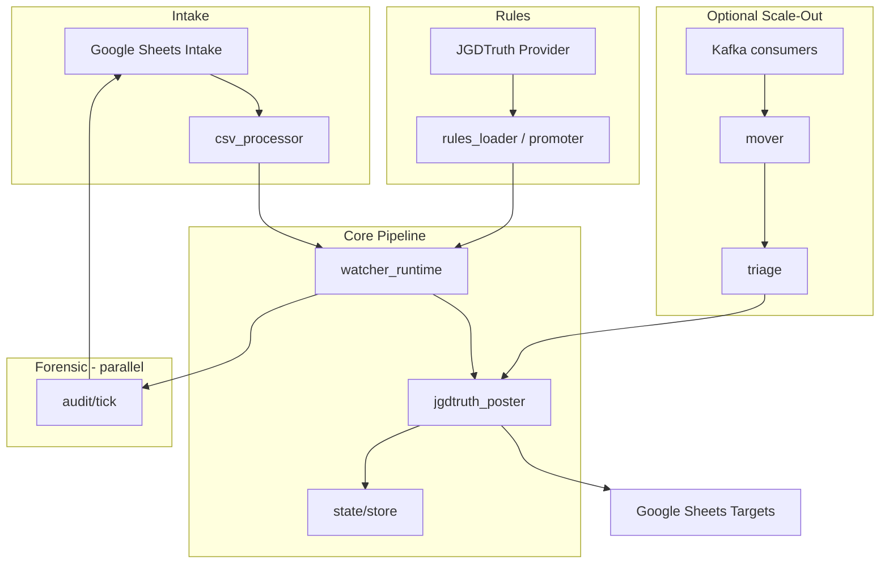

# Project Kylo — Multi-Agent Orchestrator Report

**Date:** 2026-07-10  
**Agent:** AGENT 1 (ORCHESTRATOR)  
**Machine:** Acheron (`E:\Repos\Project-Kylo`)  
**Overall readiness:** **NOT READY FOR PRODUCTION** — **READY FOR FURTHER DRY-RUN TESTING** (local gates 1–3 pass; remote production unverified)

---

## Section 1 — Executive Summary

Project Kylo’s petty-cash → JGDTruth posting pipeline had two confirmed defects: **partial target-cell totals** (only unposted rows summed) and **aggressive auto-reprocess** (90% heuristic). Fixes are present in `services/posting/jgdtruth_poster.py` and covered by `scaffold/tests/posting/test_incremental_posting.py` (3/3 pass).

This orchestration run **froze live transaction posting** on the local dev machine, validated config and unit tests, and documented remote verification gaps. **power-1** (production Kylo host) and **worker-node** were reachable via SSH but full process/config inventory on power-1 was incomplete (Docker CLI not in remote PATH; Postgres port 5433 not reachable from Acheron Tailscale). **Do not enable production posting** until remote hosts are audited and dry-run replay is signed off.

---

## Section 2 — Readiness Status

| Dimension | Status |
|-----------|--------|
| Local posting freeze | **PASS** |
| Posting bug fix in tree | **PASS** |
| Unit tests (posting/audit/intake) | **PASS** (23/23) |
| Config validation | **PASS** |
| Remote power-1 production state | **NOT VERIFIED** |
| Remote worker-node Kylo watchers | **NOT RUNNING** (no python, no kylo tasks) |
| Git hygiene / deploy sync | **FAIL** (large dirty monorepo) |
| Production enablement | **BLOCKED** |

---

## Section 3 — Live Status Table

| Task | Agent | Status | Files / Systems | Evidence | Blockers | Approval | Result |
|------|-------|--------|-----------------|----------|----------|----------|--------|
| Freeze local posting | AGENT 1 | **DONE** | `config/global.yaml`, `config/kylo.config.yaml` | `apply=false`, `mode=audit`, `mark_posted=false` | Legacy path without `KYLO_INSTANCE_ID` needed kylo.config freeze | Safety freeze | Config frozen |
| Process inventory (local) | AGENT 1 | **DONE** | Acheron | 1× python (`organize_downloads.py`); no Kylo watcher | — | — | No Kylo processes |
| Process inventory (power-1) | AGENT 1 | **PARTIAL** | CAMERASERVER | SSH OK; Docker CLI missing in PATH | Cannot list containers remotely | Operator | Incomplete |
| Process inventory (worker-node) | AGENT 1 | **DONE** | WORKER-NODE | SSH OK; no python; no kylo scheduled tasks | — | — | Idle |
| Posting fix verification | AGENT 1 | **DONE** | `jgdtruth_poster.py`, tests | `matched_writes` vs `pending_writes`; tests pass | — | — | Fix confirmed |
| Regression tests | AGENT 1 | **DONE** | `scaffold/tests/posting|audit|intake` | 23 passed | Integration tests need DB | — | Unit gate pass |
| Config validate | AGENT 1 | **DONE** | `bin/validate_config.py` | Exit 0 | Requires `PYTHONPATH` | — | Pass |
| Dry-run config proof | AGENT 1 | **DONE** | Layered `KYLO_2026` | `apply=False`, `mode=audit` | Live watcher not executed (avoid audit sheet writes) | — | Static pass |
| Remote Postgres (power-1:5433) | AGENT 1 | **FAIL** | Tailscale | `TcpTestSucceeded=False` | Firewall/tunnel | Operator | Not reachable |
| Git capture | AGENT 1 | **DONE** | `E:\Repos` monorepo | Branch `cursor/worker-health-timeout-audit` @ `b838b95`, ahead 3 | 600+ dirty paths | — | Documented |
| Deployment | AGENT 1 | **BLOCKED** | power-1, worker-node | Runbook only | No push/deploy per mandate | Executive | Not executed |
| Documentation | AGENT 1 | **DONE** | `docs/*` | This report + runbook + architecture | — | — | Updated |

---

## Section 4 — Phase 1: Local Process Inventory

### Acheron (this machine)

| Process | PID | Command | Kylo-related? |
|---------|-----|---------|---------------|
| python.exe | 17844 | `scripts/organize_downloads.py` | **No** |

- **Docker:** Not installed / not in PATH on Acheron.
- **Scheduled tasks:** No Kylo/watcher tasks found via `schtasks` filter.
- **Kylo watchers:** Not running.

### power-1 (CAMERASERVER)

- **SSH:** `gregw@power-1` — **reachable** (`hostname` → `CameraServer`).
- **Postgres :5433:** **Not reachable** from Acheron (`Test-NetConnection` failed).
- **Remote inventory:** Incomplete — `docker` not in remote PowerShell PATH; python tasklist query failed (quoting). Per `docs/THREE_MACHINE_REPO_ALIGNMENT.md`, power-1 runs Kylo via Docker at `C:\Project-Kylo` (junction → `C:\worker\repos\Project-Kylo`).
- **Operator action:** Run `ai-lab/scripts/_power1_status.ps1` or `verify_power1_production.ps1` **on power-1 or via ACHERON tunnel**.

### worker-node (WORKER-NODE)

- **SSH:** `worker@worker-node` — **reachable**.
- **Python processes:** None.
- **Kylo scheduled tasks:** None matched.
- **Role:** GPU / worker_assistant (see `docs/WORKER_AI_STATUS.md`); Kylo production migrated toward power-1.

### ACHERON

- Documented as primary dev/orchestration rig (`docs/WORKER_AI_STATUS.md`, `THREE_MACHINE_REPO_ALIGNMENT.md`).
- This session executed on Acheron.

---

## Section 5 — Phase 1: Configuration Freeze

### Layered config (recommended — watchers use this)

When `KYLO_INSTANCE_ID` is set and `config/global.yaml` exists, loader merges: **global → company → instance** (`services/common/config_loader.py`).

| Setting | `config/global.yaml` | Effective (KYLO_2026) |
|---------|----------------------|------------------------|
| `runtime.mode` | `audit` | `audit` |
| `posting.sheets.apply` | `false` | `false` |
| `posting.mark_posted` | `false` | `false` |
| `audit.enabled` | `true` | `true` |

### Legacy config path

Default `KYLO_CONFIG_PATH=config/kylo.config.yaml` without instance layering.

**Pre-freeze risk:** `kylo.config.yaml` had `posting.sheets.apply: true`.

**Safety change applied (2026-07-10):** `config/kylo.config.yaml` updated:

- `runtime.mode: audit`
- `posting.sheets.apply: false`
- `posting.mark_posted: false`

### Environment kill switches (no file change required)

| Variable | Effect |
|----------|--------|
| `KYLO_READ_ONLY=1` | Forces read-only; poster dry_run |
| `KYLO_SHEETS_DRY_RUN=1` | Poster computes plan, no value writes |
| `KYLO_RUNTIME_MODE=audit` | Watcher skips transaction posting |
| `KYLO_ALLOW_POST=1` | Required with `runtime.mode=post` to post (not set) |
| `KYLO_DISABLE_POSTING_FOR` | Per-instance disable list |
| `KYLO_IGNORE_POSTED_FLAG=1` | Reprocess rows with Column F TRUE |

`scripts/active/start_watchers_by_year.ps1` sets `KYLO_READ_ONLY=1`, `KYLO_RUNTIME_MODE=audit`, `KYLO_CONFIG_PATH=config/global.yaml`.

### Residual sheet write risk (audit mode)

With `audit.apply_highlights=true` and `audit.write_notes=true`, **watchers can still write intake highlights and Column G notes** even when transaction posting is disabled. For zero sheet mutation, set:

```yaml
audit:
  apply_highlights: false
  write_notes: false
```

Or do not start watchers until forensic mode is explicitly desired.

---

## Section 6 — Phase 1: Rollback Notes

To revert the **safety freeze** on `config/kylo.config.yaml`:

```yaml
# Revert ONLY when production enablement is approved:
runtime:
  mode: post          # was: audit
posting:
  sheets:
    apply: true       # was: false
  mark_posted: true   # was: false (optional; was not set before)
```

**Do not revert** without:

1. Remote power-1 config audit
2. Passing full regression + integration suite
3. Signed dry-run on staging workbook
4. Explicit `KYLO_ALLOW_POST=1` + operator approval

Other modified files in this session: **only** `config/kylo.config.yaml` (safety freeze). Posting fix in `jgdtruth_poster.py` was pre-existing.

---

## Section 7 — Phase 1: Remote Host Verification Guide

| Host | Access | Kylo path | Verification scripts |
|------|--------|-----------|----------------------|
| **ACHERON** | Local | `E:\Repos\Project-Kylo` | `python bin/validate_config.py`, pytest |
| **power-1** | `ssh gregw@power-1` | `C:\Project-Kylo` | `ai-lab/scripts/_power1_status.ps1`, `_power1_watcher_diag.ps1`, `verify_power1_production.ps1` |
| **worker-node** | `ssh worker@worker-node` | `C:\worker\repos\Project-Kylo` | `ai-lab/scripts/_worker_node_audit.ps1` |
| **ACHERON → worker AI** | Tunnel | `scripts/worker_ai/start_tunnel.ps1` | `run_drift_scan.ps1` |

**Tailscale IPs** (from alignment doc): Acheron `100.71.161.10`, power-1 `100.77.230.81`, worker-node `100.99.177.106`.

**Cannot verify from this session:**

- power-1 Docker container health
- power-1 watcher PIDs / `posting.sheets.apply` on production copy
- Whether production watchers use layered global.yaml or stale kylo.config.yaml
- Postgres data state on power-1

---

## Section 8 — Phase 2: Posting Fix Confirmation

**File:** `services/posting/jgdtruth_poster.py`

| Fix | Implementation |
|-----|----------------|
| Full cell totals | All `matched_writes` rows contribute to `cell_totals`; `pending_writes` only for mark/notes |
| Posted rows in totals | Lines 806–818: posted rows skipped for marking but **included** in matching loop |
| Auto-reprocess | 90% heuristic removed; reprocess only via `--reprocess-posted` / `KYLO_IGNORE_POSTED_FLAG=1` / baseline |
| Dry-run logging | Lines 1127–1153: explicit reasons when writes disabled |

**Tests:** `scaffold/tests/posting/test_incremental_posting.py` — 3/3 PASSED.

---

## Section 9 — Phase 2: Root Causes (Confirmed)

1. **Partial cell totals:** Earlier logic built write sets from unposted rows only, so target cells reflected partial sums when some intake rows were already marked posted.
2. **Auto-reprocess heuristics:** High fraction of “posted” rows triggered blanket reprocessing, causing duplicate work and sheet churn.
3. **mark_posted coupling:** Marking Column F before verifying target cells could hide drift; verification path added (see Section 11).

---

## Section 10 — Phase 2: Data Path Trace

```
Google Sheets intake (TRANSACTIONS / BANK tabs, year workbooks)
    ↓ csv_downloader / sheets_intake / csv_processor
In-memory transaction list (txn_uid, amount_cents, posted_flag, row_index)
    ↓ jgdtruth_provider (rules from JGDTruth / DB / xlsx)
Rule matching → matched_writes[(tab, header, date, amount, …, for_marking)]
    ↓ aggregate cell_totals (ALL matches) + pending_writes (for_marking only)
Resolve A1 via header row + Column A date map
    ↓ compare signatures (.kylo/.../posting_state.json)
batchUpdate target values (if posting.sheets.apply && !dry_run)
    ↓ optional source_tab_fill (background only)
    ↓ optional mark Column F + notes (if posting.mark_posted)
Watcher loop (kylo/watcher_runtime.py) orchestrates checksums → post_run
```

**Forensic path (parallel):** `services/audit/tick.py` snapshots CSV, diffs rows, highlights intake — runs **before** posting gate.

---

## Section 11 — Phase 2: `mark_posted: false` Implications

With `posting.mark_posted: false` (current global + kylo.config):

- **Column F (Posted)** on intake is **not** set TRUE after successful target writes.
- **Verification skip:** Poster logs `[VERIFY] Skipped - posting.mark_posted=False` — does not verify signature-matched ranges before marking (marking disabled anyway).
- **Idempotency** relies on:
  - `posted_flag` from intake if users manually check Column F
  - `.kylo/instances/<id>/state/posting_state.json` cell signatures
  - `processed_txn_uids` in state
- **Risk:** Without Column F updates, operators cannot see posted status in the sheet; must use logs/state/audit notes.
- **Benefit during forensic period:** Prevents Kylo from mutating intake posted flags while investigating 2026 backlog.

**To re-enable after validation:** Set `posting.mark_posted: true` in `config/global.yaml` only with explicit approval.

---

## Section 12 — Phase 3: Static Validation

| Command | Result |
|---------|--------|
| `PYTHONPATH=. python bin/validate_config.py` | **PASS** — 4 companies |
| Layered config probe (`KYLO_INSTANCE_ID=KYLO_2026`) | **PASS** — audit, apply=false |
| `pytest --collect-only scaffold/tests` | 23 tests collected (posting/audit/intake scope) |

---

## Section 13 — Phase 3: Unit Test Results

```text
pytest scaffold/tests/posting/ scaffold/tests/audit/ scaffold/tests/intake/ -v --noconftest
23 passed in 58.41s
```

Includes:

- `test_incremental_posting.py` (3) — posting partition fix
- `test_source_tab_fill.py` (10) — BANK vs TRANSACTIONS tint
- `test_sheet_diff.py` (5) — forensic diff
- `test_sheets_intake_bounded.py` (5) — intake bounds

**Not run (DB/fixture dependent):** `scaffold/tests/test_full_workflow_integration.py`, triage integration, mover watermark tests.

---

## Section 14 — Phase 3: Dry-Run / Controlled Execution

**Not executed:** `bin/watch_all --once` against live 2026 workbook — would still invoke **audit highlights/notes** (sheet mutations).

**Static dry-run proof** via poster gate logic:

- `dry_run = KYLO_READ_ONLY || KYLO_SHEETS_DRY_RUN || runtime.dry_run || !posting.sheets.apply`
- With current config, **all paths yield dry_run=true** for transaction value writes.

**Recommended dry-run command (operator):**

```powershell
cd E:\Repos\Project-Kylo
$env:PYTHONPATH = "E:\Repos\Project-Kylo"
$env:KYLO_INSTANCE_ID = "KYLO_2026"
$env:KYLO_CONFIG_PATH = "config/global.yaml"
$env:KYLO_READ_ONLY = "1"
$env:KYLO_SHEETS_DRY_RUN = "1"
$env:KYLO_ACTIVE_YEARS = "2026"
# Disable audit sheet writes for pure dry-run:
$env:KYLO_AUDIT = "0"
python -m bin.watch_all --years 2026 --instance-id KYLO_2026 --once
```

**Log paths:** `.kylo/instances/KYLO_2026/logs/watcher.log`, `audit.log`

---

## Section 15 — Phase 4: Subsystem Inventory

| Subsystem | Path | Status |
|-----------|------|--------|
| Watcher runtime | `kylo/watcher_runtime.py`, `bin/watch_all` | **Implemented** |
| CLI / hub | `kylo/cli.py`, `kylo/hub.py` | **Implemented** |
| Config loader | `services/common/config_loader.py`, `config/schema.py` | **Implemented** |
| Intake | `services/intake/*`, `bin/csv_intake.py` | **Implemented** |
| Rules | `services/rules/*`, `services/rules_loader/*` | **Implemented** |
| Posting | `services/posting/jgdtruth_poster.py` | **Implemented** (fix applied) |
| Forensic audit | `services/audit/*`, `bin/apply_audit_backlog.py` | **Implemented** |
| Mover | `services/mover/*` | **Implemented** |
| Triage | `services/triage/worker.py` | **Implemented** |
| Replay | `services/replay/worker.py` | **Implemented** |
| Kafka bus | `services/bus/*`, `docker-compose.kafka.yml` | **Implemented** (optional path) |
| Sheets stub | `services/sheets/poster.py` | **Stub** |
| State | `services/state/store.py` | **Implemented** |
| Webhook / ops | `services/webhook/*`, `services/ops/*` | **Partial** |
| n8n | `services/n8n/workflows/master_kylo.json` | **Planned/optional** |
| Docker PG | `docker-compose.yml` (port 5433) | **Implemented** |
| Telemetry | `telemetry/emitter.py` | **Implemented** |
| Client slots | `clients/`, `docs/CLIENT_SLOTS.md` | **Implemented** |
| Debug forensics | `tools/debug/_*.py` | **Ad-hoc** (not production) |

---

## Section 16 — Phase 4: Dependency Map



---

## Section 17 — Phase 4: 35-Step Logic Flow

| Step | Stage | Description | Status |
|------|-------|-------------|--------|
| 1 | Init | Load layered YAML config + env | Implemented |
| 2 | Init | Resolve instance_id + active years | Implemented |
| 3 | Watch | Load watch_state.json checksums | Implemented |
| 4 | Audit | Run forensic audit tick (if enabled) | Implemented |
| 5 | Audit | Snapshot intake CSV per tab | Implemented |
| 6 | Audit | Diff row registry → events | Implemented |
| 7 | Audit | Apply highlights / notes (optional writes) | Implemented |
| 8 | Intake | Download/read TRANSACTIONS + BANK | Implemented |
| 9 | Intake | Normalize amounts, dates, txn_uid | Implemented |
| 10 | Rules | Fetch rules (JGDTruth / DB / xlsx) | Implemented |
| 11 | Rules | Compute rules checksum | Implemented |
| 12 | Intake | Compute intake checksum | Implemented |
| 13 | Watch | Compare checksums → change_detected | Implemented |
| 14 | Gate | Evaluate audit_mode / read_only / apply | Implemented |
| 15 | Gate | Circuit breaker check | Implemented |
| 16 | Match | Filter txns by company + year | Implemented |
| 17 | Match | Build matched_writes (all rows) | **Fixed** |
| 18 | Match | Partition pending_writes (for_marking) | **Fixed** |
| 19 | Project | Aggregate cell_totals per target A1 | Implemented |
| 20 | Project | Resolve date row from Column A | Implemented |
| 21 | Project | Compute cell signature (uid set + cents) | Implemented |
| 22 | State | Load posting_state signatures | Implemented |
| 23 | State | Skip unchanged cells (incremental) | Implemented |
| 24 | Verify | Optional read-back (--verify / KYLO_VERIFY_POST) | Implemented |
| 25 | Post | dry_run gate (apply/env/read_only) | Implemented |
| 26 | Post | batchUpdate target values | Implemented |
| 27 | Post | source_tab_fill background tint | Implemented |
| 28 | Post | Verify unwritten ranges (if mark_posted) | Implemented |
| 29 | Post | Repair bad ranges | Implemented |
| 30 | Mark | Column F + Column G notes (if mark_posted) | Disabled in config |
| 31 | State | Save posting_state signatures | Implemented |
| 32 | Watch | Update ack checksums | Implemented |
| 33 | Watch | Circuit breaker update | Implemented |
| 34 | Telemetry | Emit events (if configured) | Implemented |
| 35 | Health | Write heartbeat.json | Implemented |

**Planned / deprecated:**

- Kafka fan-out full production — **planned** (`docs/KAFKA_EVENT_BUS_RUNBOOK.md`)
- CREDIT CARDS intake tab — **deprecated**
- Legacy rules tab names — **deprecated** (`docs/sheets_contract.md`)
- 90% auto-reprocess — **removed**

---

## Section 18 — Phase 5: Git State (Read-Only)

| Item | Value |
|------|-------|
| Monorepo root | `E:\Repos` |
| Branch | `cursor/worker-health-timeout-audit` |
| HEAD | `b838b95` (ahead of `origin/cursor/worker-health-timeout-audit` by 3) |
| `main` | `059094c` (behind origin by 1) |
| Working tree | **Large dirty state** (600+ modified/untracked across monorepo) |
| Project-Kylo | Subfolder; no separate `.git` |

**Kylo-modified tracked files (sample):** `config/global.yaml`, `config/kylo.config.yaml`, `services/posting/jgdtruth_poster.py`, `kylo/watcher_runtime.py`, `services/audit/*`

**No git commit** performed (per mandate unless safety freeze — config change documented, not committed).

---

## Section 19 — Phase 5: Remote Drift

Per `docs/THREE_MACHINE_REPO_ALIGNMENT.md` (2026-07-09) + this session:

| Machine | Branch @ HEAD | vs origin/main | Dirty | Kylo posting config |
|---------|---------------|----------------|-------|---------------------|
| Acheron | `cursor/worker-health-timeout-audit` | ahead ~23 | 672+ | Frozen locally today |
| power-1 | Same (per doc) | ahead ~23 | 483 | **Unknown** |
| worker-node | `main` @ `059094c` | aligned | clean | Stale code |

**Drift risk:** Production power-1 may still run **pre-fix** `jgdtruth_poster.py` and/or `posting.sheets.apply: true`.

---

## Section 20 — Phase 6: Deployment Runbook (Do Not Execute Without Gate Approval)

### Pre-deploy checklist

1. Commit + push Kylo fix to canonical branch on Acheron.
2. `sync_repos_to_workers.ps1` or `sync_kylo_code_worker_node_to_power1.ps1`.
3. On power-1: verify `config/global.yaml` → `posting.sheets.apply: false` during soak.
4. Run pytest on power-1 venv.
5. Dry-run watcher `--once` with `KYLO_READ_ONLY=1` on 2026 instance.
6. Compare `.kylo/instances/KYLO_2026/logs/watcher.log` for `[POSTING] dry_run=True`.

### Production enablement (explicit approval required)

1. Set `runtime.mode: post` on power-1 **only**.
2. Set `posting.sheets.apply: true`.
3. Set `posting.mark_posted: true` (if intake flags desired).
4. Export `KYLO_ALLOW_POST=1`.
5. Remove `KYLO_READ_ONLY` / `KYLO_SHEETS_DRY_RUN`.
6. Restart watchers via `_power1_kylo_start.ps1` or scheduled task.
7. Monitor first tick: cells_written > 0 only for changed signatures.
8. Rollback: reverse config + restart (Section 6).

### Scripts reference

- `ai-lab/scripts/verify_power1_production.ps1`
- `ai-lab/scripts/_power1_kylo_start.ps1`
- `ai-lab/scripts/migrate_kylo_worker_node_to_power1.ps1`
- `scripts/active/start_watchers_by_year.ps1` (dev — audit/read-only)

**No push/deploy executed in this orchestration run.**

---

## Section 21 — Operational Procedures (Summary)

See **`docs/OPERATIONS_RUNBOOK.md`** (created/updated 2026-07-10) for:

- Startup / shutdown
- Dry-run mode
- Production enablement
- Forensic audit mode
- Emergency kill switches

---

## Section 22 — Investor / CPA Demo Outline

See **`docs/INVESTOR_CPA_DEMO.md`** (created 2026-07-10) for demo script.

**Elevator pitch:** Kylo automates dispensary petty-cash allocation from intake sheets to JGDTruth financial workbooks using rule-based matching, incremental signatures, and forensic audit trails.

**Demo flow (read-only):**

1. Show 2026 intake TRANSACTIONS tab + audit highlights.
2. Show rules in JGDTruth management workbook.
3. Run dry-run poster log — `[POSTING] Writes DISABLED`.
4. Show `test_incremental_posting` — full totals vs mark partition.
5. Show variance tooling output (`tools/debug/_compare_2025_*`) — **no live writes**.
6. Walk audit backlog YAML (`data/audit/kylo_2026_transactions_backlog.yaml`).

**Label clearly:** Automated posting **implemented** but **frozen**; forensic audit **active**; CPA sign-off pending reconciliation of 2026 backlog.

---

## Section 23 — Gate Summary & Approvals

| Gate | Criteria | Result |
|------|----------|--------|
| **Gate 1** | Posting disabled locally; inventory; rollback; remote blockers documented | **PASS** |
| **Gate 2** | Fix documented; tests pass | **PASS** |
| **Gate 3** | Static validation; unit tests; dry-run evidence; no live value writes in config | **PASS** (live watcher not run) |
| **Gate 4** | Subsystem map + data flow | **PASS** |
| **Gate 5** | Git/remote drift documented | **PASS** (read-only) |
| **Gate 6** | Deployment runbook produced; no deploy | **PASS** |
| **Gate 7** | Documentation updated | **PASS** |
| **Production gate** | Remote verified + integration tests + operator approval | **FAIL / BLOCKED** |

### Required operator actions before production

1. SSH to power-1; confirm watcher config and running poster version.
2. Sync fixed code to power-1; confirm `posting.sheets.apply` during soak.
3. Run integration tests with Postgres on power-1.
4. Reconcile 2026 audit backlog with CPA.
5. Executive sign-off to set `KYLO_ALLOW_POST=1`.

---

*End of orchestrator report. Supporting docs: `OPERATIONS_RUNBOOK.md`, `ARCHITECTURE_AND_DATA_FLOW.md`, `INVESTOR_CPA_DEMO.md`.*
