# Guru

Concise implementation spec for wiring `command-center` into the real `ai-lab` systems and adding persistent configuration modes without blending operator-chat context.

## Plan status (live)

**Diagrams:** All Mermaid flowcharts in this file use **green = built**, **amber = partial**, **gray = unbuilt** (plus **legacy** / **stub** where noted). See **§ Visual Overview → Diagram Legend** for the exact `classDef` lines.

| Phase | Steps | Status |
|-------|--------|--------|
| 1. Real command path | Chat → orchestrator, approvals → queue, execution → brain | Done |
| 2. Guru shell | Guru tab, mode threads, backend session | Done |
| 3. First behavior modes | RR, PR, ATL (AL/TL in service) | Done |
| 4. Worker-backed capability | SSH adapter, repo_cartographer, surface in chat/repo | Done |
| 5. Remaining modes | AL, TL polish | Done in service |
| 6. Local Assistant V1 | Session state, grounded answers, scan_results, artifact loading — see **§19** | **Done** — Phase 1 implemented |
| 7. Unified sources + web | Web baked in, local-first routing, Phase-2 (proposals, repo search, web tool) — see **§20** | **Done** — §21 implemented |
| 7.5 PDR Phase 2.75→3 | Structured prompt, typed proposals, lifecycle, timezone, config loader, tests, web query builder, Phase 3 stubs — see **§22** | **Done** — §22 documented and implemented |
| 3.1 Local Assistant UX | Conversational fallback, integration tests, real web, proposal UX, session persistence — see **§24** | **Done** — §24.13 allowlist gate, normalize_chat_text, hard insufficient_evidence; §24.14 trace (partial), transparency. **Plus (2026-03):** weather/time without Tavily/Serper (**Open-Meteo** + local time routing — see **Recent implementation updates**). **Wired:** `failure_analysis` (used when `last_failure` is loaded as `failure_record`); `tool_registry` (consulted in proposal + approval gating for metadata). **Trace:** `turn_trace` is emitted with expected fields, but `sources_used` is still often empty/placeholder (so remains **partial**). |
| 3.2 Hardware Observability | CPU/GPU metrics, process attribution, telemetry, alerts, approval-gated resource controls — see **§25** | **Done** — initial wiring + **§25.16** runtime fixes (CPU sample, `nvidia-smi` path, WS replay dedupe, hardware API error logging) |
| 4. Operations Fabric | Central ops backbone, system/worker/file registries, ROI-first automation — see **§23** | **Done** — backbone complete; assistant answers from ops registries |
| Worker Service Integration | Tunnel-backed Worker Assistant, n8n, and Ollama — see **§26** | **Phase 1 complete.** **Phase 2 — partial:** **Repo index pipeline is live** — `repo_watcher` → `RepoIndexCoordinator` → worker `index_repo` (`target=staging`) → strict validation → `retrieve` smoke (`target=staging`) → `promote_repo_index`; Gates **A/C**; `index_policy.yaml` with **byte-aligned** `policy_hash` (hub + worker); `GET /api/repo/index_state` (+ optional `?worker_repo_id=` merges worker `/repo_status`); contract: `docs/WORKER_REPO_INDEX_API_CONTRACT.md`; slow tunnel timeouts for `index_repo` + `promote_repo_index`. **Still open:** orchestrator **natural-language** routing to index/retrieve/summarize; n8n proposal→approval→`worker_n8n_trigger()` e2e; Worker Assistant in proposal flows; Ollama offload policy; tunnel manager/reconnect; worker-aware per-turn telemetry; richer UI/API (tunnel in payload, last checked, latency, failure detail, action buttons). |
| Deployment | Railway / production deploy | **Deferred** — circle back after Railway account setup |
| UI shell — tab persistence | Main tabs stay mounted (CSS hide); chat/compute/guru keep running in background | **Done** — see **Recent implementation updates** below |

**Phase 6 (Local Assistant V1):** Phase 1 implemented (session state, structured tool results, scan_results intent, evidence loading, anti-hallucination, session_id). Phase-2 and web extension are specified in **Section 20**.

**Phase 7 (Unified sources + web):** One assistant; web as built-in evidence source when needed (weather, today, latest, docs). No user-visible modes. See **Section 20** for source-selection policy, freshness detection, Phase-2 components (proposal engine, repo search, topic/pending_proposal, web tool), and guardrails.

**Phase 4 (worker):** When `WORKER_SSH_HOST` is set in the backend env, “scan repo” runs repo_cartographer on the worker over SSH; main persists the summary to `summaries/repos/`. Optional: `WORKER_SSH_USER`, `WORKER_AI_LAB_PATH` (worker’s ai-lab root). Chat shows the result; `GET /api/repo/summaries` exposes scan list for the Repo panel; chat refetches summaries after a scan so the panel updates. \"Scan repo &lt;name&gt;\" passes repo name to the orchestrator. **Worker integration is split into:** (1) **SSH task execution** — already in place for repo scan and remote commands; (2) **tunneled remote service usage** — Worker Assistant (8765), n8n (5678), Ollama (11434) exposed via SSH local port forwarding; see **§26** for full Worker Service Integration.

**What's next (priority order):** (1) **Tighten what's already wired (partial refinement):** improve failure_analysis → fused-evidence diagnosis injection + GrowFlow-style proposal mapping; ensure tool_registry metadata consistently drives approval/risk wording where runtime is still heuristic; make `turn_trace.sources_used` meaningful (not routing_reason/empty placeholders). (2) **Section 20 audit:** Section 20 contains both concepts that were later implemented in §§21–24 and some behaviors that may still only be partially realized in runtime usage; it should be checked specifically for anything still marked as expected behavior rather than implemented wiring. (3) **Worker Service Integration Phase 2:** route real tasks to Worker Assistant (index repo, retrieve, summarize on worker); implement n8n proposal → approval → worker_n8n_trigger() end-to-end; add Ollama offload policy (when worker vs local, fallback if worker down); improve worker health API/UI (tunnel status in payload, last checked, latency, failure detail, action buttons); add worker-aware per-turn telemetry (worker chosen, service, reason, outcome, latency, fallback). (4) **§24.14 (optional):** multi-step execution engine; learning log / approval-outcome memory. (5) Deployment (Railway) when ready.

**Modules present on live path (but still refine):** `brain/failure_analysis.py` is called by `evidence_loader` when router requests `failure_record` evidence, and its structured output is consumed by `evidence_fusion` to generate diagnosis-based proposals. `brain/tool_registry.py` is consulted by `proposal_engine` + `approval_gate` for tool metadata (risk_level / approval_required). `turn_trace` logs the expected fields, but `sources_used` is currently often empty/placeholder, so reconstruction is only **partial**.

**Phase 4 (Operations Fabric) as built:** `ops/` root under ai-lab with `registry/systems.yaml`, `workers.yaml`, `automations.yaml`; `ops/docs/`, `ops/graphs/`, `ops/runbooks/`, `ops/logs/`, `ops/reports/`. `brain/ops_registry.py` loads registries and exposes `get_ops_summary_text()` for the assistant. Intent `ops_overview` and source target `ops_registry` are wired in router, source_router, and evidence_loader so queries like "what systems do I have", "list my workers", "ops overview" return answers from the registries.

**As built (Phases 1–5):** Chat → `backend/routers/chat.py` → `brain/orchestrator/main.py`; approvals → `backend/routers/events.py` → `brain/approval_queue/queue.py`; execution → `brain/execution.py`; event bus → `backend/services/feed_bus.py` → `/ws/events` → frontend `useWebSocket.js`; Guru tab → `backend/routers/guru.py`, `backend/services/guru_service.py` → memory/workflow_rules.json, preferences.json, policy/allowlists.yaml, logs/config_changes; worker scan → `brain/ssh_worker.py`, summaries → `summaries/repos/`, `backend/routers/repo.py` GET /api/repo/summaries. Boot: `scripts/start.ps1` (optionally `-LocalOnly`). Frontend: `frontend/src/App.jsx`, `ChatPanel.jsx`, `GuruPanel.jsx`, `ComputePanel.jsx`, `FeedPanel.jsx`, `RepoPanel.jsx`, `ToolsPanel.jsx`, `frontend/src/hooks/useWebSocket.js`, stores in `frontend/src/store`. **Not built:** Railway production deploy.

**Local boot:** Use `.\scripts\start.ps1 -LocalOnly` from `command-center\command-center`. Backend requires Python 3.12 or 3.11 (3.14 has no pydantic-core wheels); the start script creates a `.venv` with a compatible Python. See **BOOT.md** for dependency install failures and manual steps.

**Runtime rules:** The orchestrator loads `memory/workflow_rules.json` when returning the default answer (intent "answer"); if any RR rules exist, the reply includes an "Active RR rules" line so chat (and future LLM integration) can apply them.

Sync note: runtime constants and handoff identities in this spec must match `../../docs_source/WORKER_CURRENT.md` and `../../docs_source/contracts/`.

### Recent implementation updates (rolling, 2026-03)

These items are **as built** in repo; keep this list aligned when behavior changes.

| Area | What changed |
|------|----------------|
| **Frontend — tabs** | `App.jsx`: Chat, Guru, Compute, Feed, Repo, Tools, Diagnostics panels **stay mounted**; inactive tabs use `display: none` so **in-flight chat**, **Compute REST polling**, and **Guru local state** are not torn down on tab switch. Tab bar: `role="tab"` / `aria-controls` / `aria-labelledby`. |
| **Frontend — chat** | `lib/api.js`: `POST /api/chat` uses **180s** client `AbortSignal` timeout (slow local LLM). `ChatPanel.jsx`: request-generation ref so **stale replies** do not overwrite newer sends. |
| **Frontend — hardware store** | `store/index.js`: `useHardwareStore.update` ignores **all-zero** WS snapshots when a **good** RAM/GPU snapshot is already held (avoids replay clobbering REST load). |
| **Backend — WS** | `services/feed_bus.py`: only the **latest** `hardware` event is kept in history before append (new subscribers do not replay a pile of stale hardware messages). |
| **Backend — hardware API** | `routers/hardware.py`: failed `brain.hardware` import/snapshot logs **`brain_snapshot_failed`**. `nvidia_poller.py` fallback snapshot uses **interval CPU sample** (same psutil caveat as collectors). |
| **Brain — collectors** | `cpu_monitor.py`: **`cpu_percent(interval=0.08)`** — psutil’s first `interval=None` read is **0**. `gpu_monitor.py`: resolve **`nvidia-smi`** via **`NVIDIA_SMI_PATH`**, then **`Program Files` / `Program Files (x86)` NVSMI** before `shutil.which` (avoid Windows **System32 stub**). |
| **Brain — evidence / web quota** | `tools/weather_context.py` (**Open-Meteo**, no API key). `source_router.py`: **weather** → local `weather` target (not Tavily/Serper); **time-only** freshness → **no** paid web. `evidence_loader.py` / `evidence_fusion.py` / `source_selection.py` / `orchestrator/main.py` fallback aligned. Tests: `tests/test_source_router.py`. |
| **Scripts** | `scripts/stop.ps1` (ports 8000, 5173), `scripts/restart.ps1` (stop → `start.ps1`). |
| **Docs / env** | Root `README.md`: Compute troubleshooting, **`NVIDIA_SMI_PATH`**, **`WEATHER_*`**, mounted-tab note. `backend/.env.example`: NVIDIA + weather vars. |

## Steps to full wiring and usability

This is the clean path from good architecture to fully operational system.

### 1. Finish the live runtime wiring first

These are the highest-priority gaps because the modules already exist.

**Step 1 — Refine failure_analysis output in fused evidence**

- **Goal:** Keep failure answers structured/sharp, and ensure the structured fields translate into the right next proposals.
- **Do:** Verify `analyze_failure()` -> `evidence_fusion` injection produces the expected proposal candidates (category/likely_cause/suggested_actions -> `repo_search` / `ops_overview` / `worker_health` etc).
- **Files:** brain/orchestrator/evidence_loader.py, brain/orchestrator/evidence_fusion.py, brain/orchestrator/main.py, brain/failure_analysis.py.
- **Done when:** "why did that fail" produces a diagnosis and the follow-on proposals match the intended suggested_actions semantics.

**Step 2 — Tighten tool_registry governance in proposals/approvals**

- **Goal:** Make tool metadata govern approval/risk wording consistently where runtime is still heuristic.
- **Do:** Audit remaining hardcoded approval/risk phrasing; ensure `approval_required` / `risk_level` from tool_registry is applied consistently in the proposal + approval messaging pipeline.
- **Files:** brain/orchestrator/proposal_engine.py, brain/orchestrator/approval_gate.py, brain/orchestrator/main.py, brain/tool_registry.py.
- **Done when:** Every proposal can say clearly: what tool it uses, whether approval is required, risk level, side effects.

**Step 3 — Make turn_trace sources_used meaningful**

- **Goal:** Make debugging and trust real (turn_trace should reflect actual evidence sources, not placeholders).
- **Do:** Keep emitted fields, but improve `sources_used` mapping (derive from loaded evidence items / fused evidence decision, not routing_reason/empty strings).
- **Files:** brain/orchestrator/main.py, brain/telemetry.py.
- **Done when:** Every turn can be reconstructed end to end with a real sources list.

### 2. Complete Worker Phase 2

Right now the worker is wired as infrastructure. Next it must become an active execution node.

**Step 4 — Route real tasks to Worker Assistant**

- **Goal:** Let orchestrator use worker services for actual work.
- **Do:** Add task routing for index_repo, retrieve, summarization on worker.
- **Files:** brain/router/router.py, brain/orchestrator/main.py, brain/worker_clients.py.
- **Done when:** Natural prompts can trigger worker-backed tasks, not just health checks.

**Step 5 — Implement n8n proposal → approval → execution**

- **Goal:** Make worker workflows runnable through the assistant.
- **Do:** Create proposal for workflow trigger; require approval; on approval, call `worker_n8n_trigger()`; report result clearly.
- **Files:** brain/orchestrator/main.py, brain/worker_clients.py, brain/orchestrator/proposal_engine.py, brain/orchestrator/approval_gate.py.
- **Done when:** You can say something like "trigger the worker indexing workflow" and the assistant can propose, wait, then run it.

**Step 6 — Add worker Ollama policy**

- **Goal:** Make the worker model endpoint usable intentionally.
- **Do:** Define when to prefer local Ollama vs worker Ollama; how to fail back cleanly; whether model listing / health / inference are separate capabilities.
- **Files:** brain/orchestrator/main.py, brain/worker_clients.py, brain/tool_registry.py, ops/registry/workers.yaml.
- **Done when:** The assistant can explain why it is using local vs worker inference.

**Step 7 — Improve worker visibility**

- **Goal:** Make the worker easier to trust and debug.
- **Do:** Add tunnel status to API and UI; last checked time; latency display; probable cause text for failures.
- **Files:** backend/routers/workers.py, brain/worker_health.py, brain/worker_tunnel.py, frontend/src/components/ComputePanel.jsx (paths relative to command-center).

**Step 8 — Add worker-aware telemetry traces**

- **Goal:** Know when and why the worker was used.
- **Do:** Log per turn: worker selected, service selected, reason, latency, success/failure, fallback used or not.
- **Files:** brain/telemetry.py, brain/orchestrator/main.py, brain/worker_clients.py.

### 3. Tighten Local Assistant UX

**Step 9 — Finish the hard no-evidence behavior**

- **Goal:** Make it impossible for low-signal chat to fall into robotic output.
- **Do:** Hard branch for answer_style == insufficient_evidence; always return one human fallback line; expand opener matching slightly if needed.
- **Done when:** You never see raw "Insufficient evidence." or "[Orchestrator] Intent: answer..." for simple chat. (Note: hard insufficient_evidence override and allowlist gate are already in place; verify and expand if gaps remain.)

**Step 10 — Add transparency line**

- **Goal:** Help the assistant feel deliberate.
- **Do:** Add one short line when useful, e.g. "Used: local scan + session memory. Reason: you referred to the last scan." (Transparency line from routing_reason is already appended in main.py; extend or refine as needed.)
- **Files:** brain/orchestrator/main.py, brain/orchestrator/strategies.py.

**Step 11 — Improve proposal phrasing**

- **Goal:** Make next steps obvious.
- **Do:** Standardize: proposed action, what it will do, approval required yes/no, exact phrase to continue.
- **Done when:** The assistant consistently tells you what happens next.

### 4. Audit Section 20 against reality

**Step 12 — Spec vs runtime audit**

- **Goal:** Remove drift between Guru and code.
- **Do:** Review §20 and mark each item as: live, partial, spec only. Focus on: local+web comparison behavior, proposal usage, web-informed actions, source routing depth.
- **Output:** A short checklist in Guru or a separate audit doc.

### 5. Build the next intelligence layer

These are the big upgrades after the current runtime is honest and wired.

**Step 13 — Multi-step execution engine**

- **Goal:** Move from one-turn replies to real task progression.
- **Do:** Add task state: goal, current_step, completed_steps, pending_step, blocked_on_approval. Pattern: plan → do one step → update session → decide next step → wait for approval / continue.
- **Files:** brain/task_engine.py (or similar), brain/orchestrator/main.py, brain/session_state.py.

**Step 14 — Learning log / approval memory**

- **Goal:** Let the system adapt to you.
- **Do:** Store approved/denied proposals, executed_ok / executed_fail, user corrections. Use later for proposal ranking, preferred action patterns, better defaults.
- **Files:** brain/learning_log.py, brain/session_state.py, brain/orchestrator/proposal_engine.py.

### 6. Move from stubs to real automation

**Step 15 — Turn automation planner into a real planner**

- **Goal:** "Build automation" should create a concrete plan package.
- **Output:** objective, steps, graph, connectors, files to create, risks, approval request.
- **Files:** brain/automation/planner.py (or equivalent).

**Step 16 — Turn runner into a real runner**

- **Goal:** Execute approved automation steps.
- **Do:** Support dry-run, manual run, status tracking, error reporting.
- **Files:** brain/automation/runner.py, ops/registry/automations.yaml.

**Step 17 — First ROI automations**

- Do these first: repo/docs maintenance; file organization + lineage; worker/system health reporting; receipt/bill intake; app onboarding scaffolding.

### 7. Add persistence and deployment durability

**Step 18 — Session persistence**

- Use SQLite first. Persist: session state, pending proposals, active topic, last failure, last artifacts; learning outcomes later.
- **Files:** brain/session_store.py, brain/session_state.py.

**Step 19 — Deployment prep**

- Only after runtime is stable. Prepare: env loading, service startup order, health endpoints, log paths, restart behavior, production-safe config. Then do Railway or chosen deployment target.

### Recommended execution order

| When | Steps |
|------|--------|
| **Immediate** | Refine failure_analysis -> proposal mapping; ensure tool_registry drives approval/risk wording consistently; improve turn_trace.sources_used semantics; verify hard no-evidence fallback coverage; refine transparency line. |
| **Next** | Worker Assistant task routing; n8n proposal → approval → execution; Ollama policy; richer worker UI/API/telemetry; Section 20 audit. |
| **Then** | Multi-step execution engine; learning log; real automation planner; real automation runner; ROI automations. |
| **Then** | Session persistence; deployment. |

### Definition of "complete and wired in"

This system is complete enough to rely on when:

- failure answers are structured and sharp
- tool metadata governs proposals and approvals
- every turn is traceable
- worker is used for actual work, not just health (includes **automated repo index** on the worker under hub coordinator policy)
- n8n and worker assistant are executable through approval flow
- Ollama offload is policy-driven
- no simple chat falls into robotic no-evidence replies
- the assistant can work through multi-step tasks
- the first real automations save you time weekly
- session survives restart

### Best next single sprint

**Sprint: "Runtime honesty + Worker Phase 2"**

1. Refine failure_analysis (diagnosis + proposal mapping)  
2. Tighten tool_registry-driven proposal/approval metadata  
3. Improve turn_trace.sources_used semantics  
4. Add/verify hard no-evidence fallback  
5. Route Worker Assistant tasks  
6. Implement n8n proposal/approval/trigger  
7. Add worker transparency/telemetry  

That sprint closes the biggest live-path gaps.

## Visual Overview

Use this section as a quick map before reading the full spec:

- `Wiring Graph`: overall handshake between main chat, Guru, backend, orchestrator, execution, approvals, worker execution, summaries, and observability.
- `Systems Graph`: ownership boundaries between UX, `command-center`, `ai-lab` core authority, persistent rule stores, and worker-side execution.
- `Main Chat Orchestration Sequence`: how a user request becomes either a reply, an execution, or an approval.
- `RR Save Flow`: how direct-save response refinement becomes a normalized rule used at runtime.
- `ATL Preview And Confirm Flow`: how governance changes are previewed, confirmed, audited, and then used by orchestration.
- `SSH Worker Execution Sequence`: how worker-backed tasks flow through execution, SSH, and result persistence.
- `Frontend Panel Data-Source Graph`: which frontend tabs depend on which backend endpoints, event streams, and stores.
- `Current Vs Target Architecture Graph`: what is still stubbed, what is already wired, and what the finished shape should be.
- `Exact Live Code Relation Graph`: the concrete module-to-module relationships in the current `command-center` and `ai-lab` runtime.
- `Runtime Authority And Approval Graph`: where authority decisions happen, and what can answer, execute, or require approval.
- `Guru Persistence And Runtime Consumption Graph`: how Guru threads write normalized rules and how runtime layers consume them later.
- `Event Bus And Store Propagation Graph`: how backend events reach frontend stores and visible panels.
- `Approval Queue State Machine`: the lifecycle of a queued approval from creation to approval or denial.
- `Execution Resolution And Logging Graph`: how a tool run resolves from registry lookup to execution logs.
- `API To Runtime State Effect Graph`: which API surfaces affect chat, approvals, Guru, events, and execution state.

### Diagram Legend (colors = wiring status)

Use the same **three** flowchart styles everywhere below so you can scan any figure for what is **live**, **partial**, or **not wired**.

| CSS class | Color (approx.) | Meaning |
|-----------|-----------------|--------|
| **`built`** | **Green** | On a **live code path** today (implemented + wired). |
| **`partial`** | **Amber / gold** | **Exists but incomplete**: stub, behind a flag, hub/worker-only (no chat NL), missing tests, or “works in one context only.” |
| **`unbuilt`** | **Dark gray** | **Not implemented** or **not yet connected** to the runtime described in the caption. |
| **`legacy`** | **Brown-gray** | **Superseded** or “old path” in migration diagrams only (not “bad”, just replaced). |
| **`stub`** | **Slate** | **Stub / placeholder module** (compiles but not production-complete). |

**Mermaid (copy into each `flowchart`):**

```text
classDef built fill:#1a4d23,stroke:#5ddf8a,color:#f2fff6
classDef partial fill:#8a7118,stroke:#e6c82a,color:#fff8e6
classDef unbuilt fill:#3a3a3a,stroke:#888,color:#c8c8c8
classDef legacy fill:#5a4a3a,stroke:#b8956a,color:#f5ebe0
classDef stub fill:#3d4550,stroke:#7a8aa0,color:#dde4f0
```

**Sequence diagrams** (`sequenceDiagram`): **Green box** = frontend or fully wired client path; **Teal / blue-gray box** = backend + worker paths that exist in code. Captions call out anything still stubbed.

**State diagrams** (`stateDiagram-v2`): States are **neutral** unless the caption says “green = implemented”; use the caption + § references for status.

**Tables** with a **Status** column should use the same words: *Built*, *Partial*, *Stub*, *Not built*.

- **Actual paths:** Code-grounded and many mixed diagrams use real file/script names (e.g. `backend/routers/chat.py`, `brain/orchestrator/main.py`, `frontend/src/hooks/useWebSocket.js`, `scripts/start.ps1`).
- `Code-grounded diagrams`: diagrams based directly on the current implementation in `command-center` and `ai-lab` source files. These should be treated as the best representation of the system as it exists today.
- `Target-state planning diagrams`: diagrams that describe the intended end state after the Guru wire-in and revision plan is fully implemented. These should be treated as architectural direction, not proof that the current code already behaves that way.
- `Mixed diagrams`: diagrams that start from current code paths but include planned replacements or future runtime behavior. These are useful for migration planning and should be read together with the `Current Vs Target Architecture Graph`.

Current implementation / code-grounded:

- `Exact Live Code Relation Graph`
- `Event Bus And Store Propagation Graph`
- `Approval Queue State Machine`
- `Execution Resolution And Logging Graph`
- `API To Runtime State Effect Graph`

Target-state planning:

- `Wiring Graph`
- `Systems Graph`
- `RR Save Flow`
- `ATL Preview And Confirm Flow`
- `SSH Worker Execution Sequence`
- `Guru Persistence And Runtime Consumption Graph`

Mixed / migration-oriented:

- `Main Chat Orchestration Sequence`
- `Frontend Panel Data-Source Graph`
- `Current Vs Target Architecture Graph`
- `Runtime Authority And Approval Graph`

### Wiring Graph

*Colors: **green** = live; **amber** = partial (worker HTTP / `supervisor_bridge`, light observability). **Unbuilt:** Railway/production deploy.*

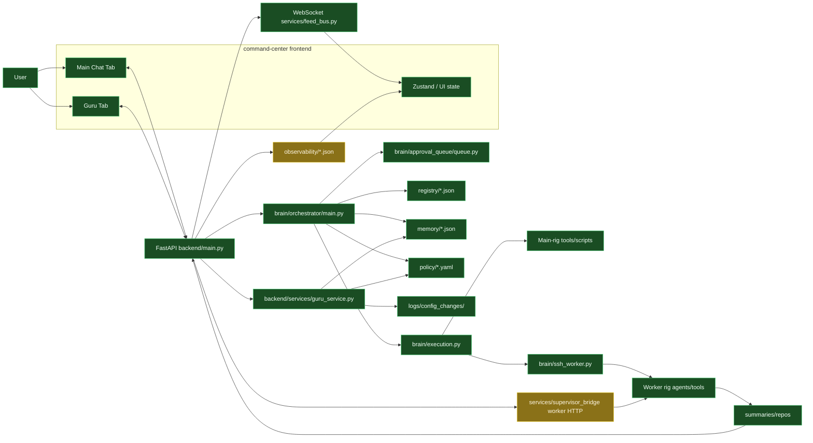

### Systems Graph

*Green = live. Amber = partial (worker HTTP indexing path; ops registries optional). Gray = not built (e.g. Railway). **Phases 1–5** backend + brain + Guru + summaries are wired.*

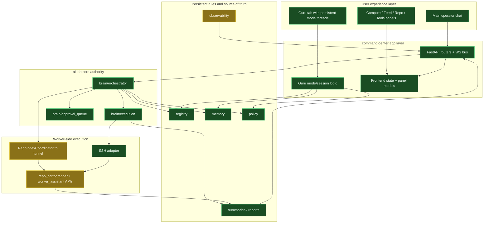

### Main Chat Orchestration Sequence

*Sequence diagrams: **green box** = operator UI (live). **Teal box** = backend + brain paths that exist today. For flowchart colors see **Diagram Legend** above.*

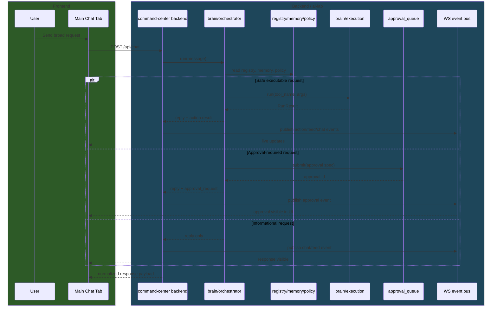

### RR Save Flow

*Green = Frontend. Teal = Guru service + storage + runtime (built).*

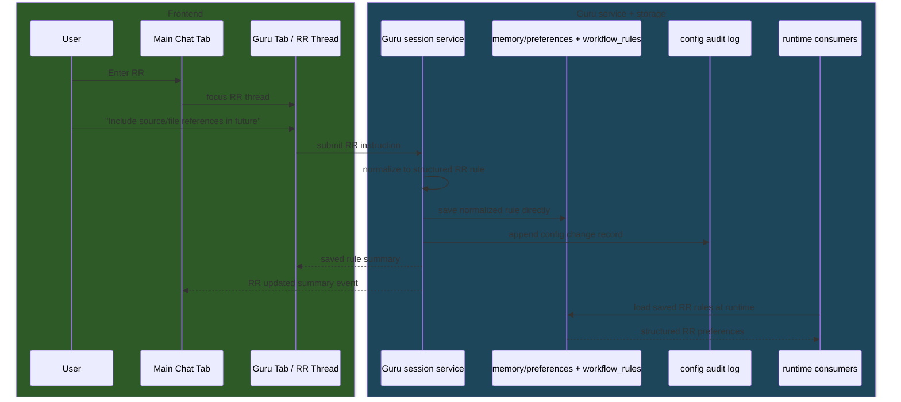

### ATL Preview And Confirm Flow

*Green = Frontend. Teal = Guru service + policy + runtime (built).*

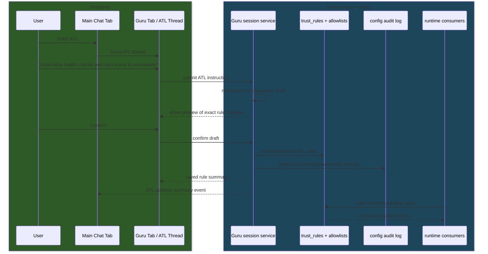

### SSH Worker Execution Sequence

*Green = Frontend. Teal = Backend + worker + summaries (built).*

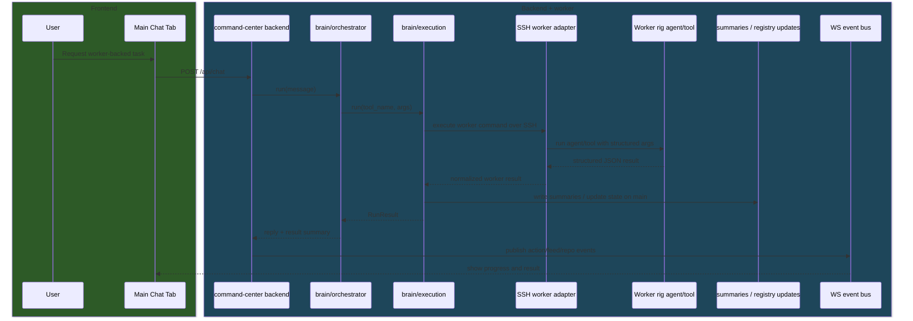

### Frontend Panel Data-Source Graph

*All nodes below are **live** (green in this figure). Paths: Chat ↔ POST /api/chat, GET/POST /api/approvals; Guru ↔ session; Compute ↔ `/api/hardware/snapshot`; Feed/Events ↔ `/ws/events`; Repo ↔ `/api/repo/tree`, summaries, **optional** `/api/repo/index_state`; Tools ↔ registry + logs. Stores under `frontend/src/store`.*

```mermaid
flowchart LR
    classDef built fill:#1a4d23,stroke:#5ddf8a,color:#f2fff6
    classDef partial fill:#8a7118,stroke:#e6c82a,color:#fff8e6
    classDef unbuilt fill:#3a3a3a,stroke:#888,color:#c8c8c8

    subgraph Tabs["Frontend tabs"]
        Chat[Chat]
        Guru[Guru]
        Compute[Compute]
        Feed[Feed]
        Repo[Repo]
        Tools[Tools]
    end

    subgraph Backend["Backend data providers"]
        ChatAPI[POST /api/chat + GET,POST /api/approvals]
        GuruAPI[/api/guru session]
        HWAPI[/api/hardware/snapshot]
        WS[/ws/events]
        RepoAPI[/api/repo/tree + summaries]
        ToolAPI[registry + execution + approval logs]
    end

    subgraph Stores["Frontend state"]
        ChatStore[useChatStore]
        EventStore[useEventStore]
        HWStore[useHardwareStore]
        FeedStore[useFeedStore]
        RepoStore[useRepoStore]
        GuruStore[useGuruStore]
    end

    Chat --> ChatStore
    ChatAPI --> ChatStore
    ChatAPI --> EventStore

    Guru --> GuruStore
    GuruAPI --> GuruStore

    Compute --> HWStore
    HWAPI --> HWStore

    Feed --> FeedStore
    WS --> FeedStore
    WS --> EventStore

    Repo --> RepoStore
    RepoAPI --> RepoStore
    WS --> RepoStore

    Tools --> EventStore
    ToolAPI --> EventStore

    class Chat,Guru,Compute,Feed,Repo,Tools,ChatAPI,GuruAPI,HWAPI,WS,RepoAPI,ToolAPI,ChatStore,EventStore,HWStore,FeedStore,RepoStore,GuruStore built
```

### Current Vs Target Architecture Graph

***Brown-gray (legacy)** = old assumptions (superseded). **Green** = current live target. Migration is done for these paths: chat.py → orchestrator; approval queue; execution; SSH; live panels. `supervisor_bridge` remains in use for worker HTTP (indexing), not “replaced by” execution.*

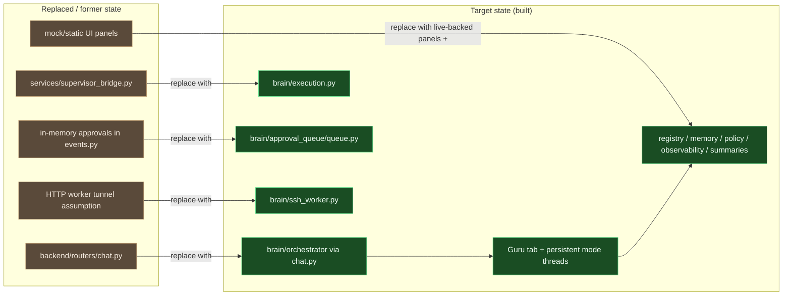

### Exact Live Code Relation Graph

*All nodes below are implemented. Paths: command-center/command-center relative for backend/frontend; brain relative to ai-lab root.*

```mermaid
flowchart TD
    classDef built fill:#1a4d23,stroke:#5ddf8a,color:#f2fff6
    classDef partial fill:#8a7118,stroke:#e6c82a,color:#fff8e6
    classDef unbuilt fill:#3a3a3a,stroke:#888,color:#c8c8c8

    ChatRouter[backend/routers/chat.py] --> AILabPath[backend/core/ai_lab.ensure_ai_lab_root_on_path]
    ChatRouter --> Orch[brain/orchestrator.main.run]
    ChatRouter --> Bus[backend/services/feed_bus.py]

    EventsRouter[backend/routers/events.py] --> Bus
    EventsRouter --> ApprovalQueue[brain/approval_queue/queue.py]
    EventsRouter --> Execution[brain/execution.py]

    Bus --> WSRoute[/ws/events]
    Bus --> FrontendWS[frontend/src/hooks/useWebSocket.js]

    FrontendWS --> EventStore[useEventStore]
    FrontendWS --> FeedStore[useFeedStore]
    FrontendWS --> HardwareStore[useHardwareStore]
    FrontendWS --> RepoStore[useRepoStore]

    AppShell[frontend/src/App.jsx] --> ChatPanel[ChatPanel.jsx]
    AppShell --> ComputePanel[ComputePanel.jsx]
    AppShell --> FeedPanel[FeedPanel.jsx]
    AppShell --> RepoPanel[RepoPanel.jsx]
    AppShell --> ToolsPanel[ToolsPanel.jsx]
    AppShell --> GuruTab[GuruPanel.jsx]

    GuruTab --> GuruStore[useGuruStore]
    ChatPanel --> ChatStore[useChatStore]
    AppShell --> UiStore[useUiStore]

    class ChatRouter,AILabPath,Orch,Bus,EventsRouter,ApprovalQueue,Execution,WSRoute,FrontendWS,EventStore,FeedStore,HardwareStore,RepoStore,AppShell,ChatPanel,ComputePanel,FeedPanel,RepoPanel,ToolsPanel,GuruTab,GuruStore,ChatStore,UiStore built
```

### Runtime Authority And Approval Graph

*Built: Router = brain/orchestrator/main.py; Execution = brain/execution.py; Queue = brain/approval_queue/queue.py; resolve path = backend/routers/events.py _execute_approved → execution.run.*

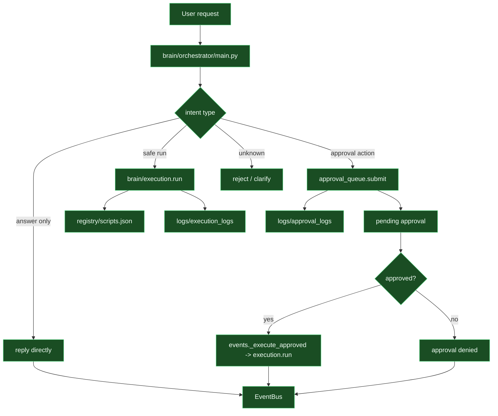

### Guru Persistence And Runtime Consumption Graph

*Built: GuruSvc = backend/services/guru_service.py; backend/routers/guru.py; writes to memory/*.json, policy/allowlists.yaml, logs/config_changes; orchestration loads workflow_rules.json (and preferences) at runtime.*

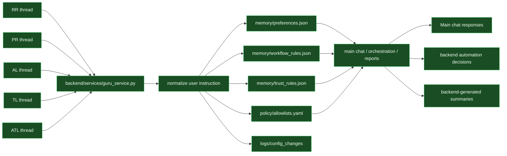

### Event Bus And Store Propagation Graph

*Built: EventBus = backend/services/feed_bus.py; /ws/events in backend; frontend/src/hooks/useWebSocket.js → stores → Sidebar.jsx, ChatPanel.jsx, FeedPanel.jsx, ComputePanel.jsx, RepoPanel.jsx.*

```mermaid
flowchart LR
    classDef built fill:#1a4d23,stroke:#5ddf8a,color:#f2fff6
    classDef partial fill:#8a7118,stroke:#e6c82a,color:#fff8e6
    classDef unbuilt fill:#3a3a3a,stroke:#888,color:#c8c8c8

    BackendEvents[action / approval / approval_resolution / hardware / feed / repo / chat] --> EventBus[services/feed_bus.py publish]
    EventBus --> WebSocket[/ws/events]
    WebSocket --> UseWS[frontend useWebSocket.js]

    UseWS --> EventStore[useEventStore]
    UseWS --> FeedStore[useFeedStore]
    UseWS --> HardwareStore[useHardwareStore]
    UseWS --> RepoStore[useRepoStore]

    EventStore --> Sidebar[Sidebar.jsx]
    EventStore --> ChatPanel[ChatPanel.jsx approval cards]
    FeedStore --> FeedPanel[FeedPanel.jsx]
    HardwareStore --> ComputePanel[ComputePanel.jsx]
    RepoStore --> RepoPanel[RepoPanel.jsx]

    class BackendEvents,EventBus,WebSocket,UseWS,EventStore,FeedStore,HardwareStore,RepoStore,Sidebar,ChatPanel,FeedPanel,ComputePanel,RepoPanel built
```

### Approval Queue State Machine

*State diagram: neutral styling. **Implementation** of submit/list/resolve is **built** (`brain/approval_queue/queue.py`, `routers/events.py`).*

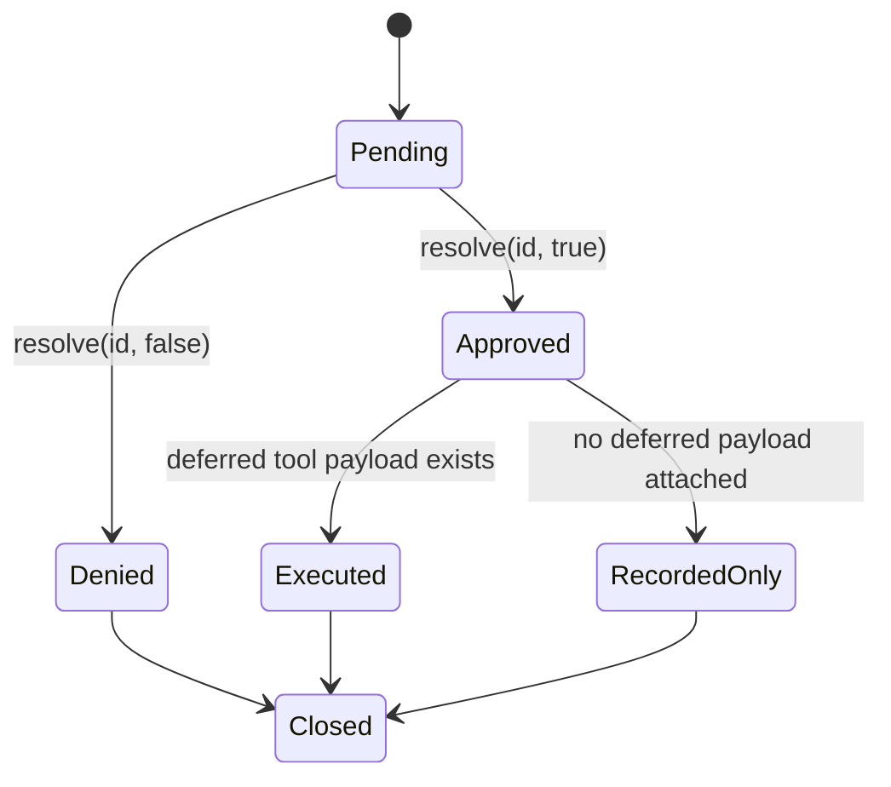

### Execution Resolution And Logging Graph

*Built: brain/execution.py (_find_tool, _resolve_path, registry/scripts.json, subprocess.run, logs/execution_logs).*

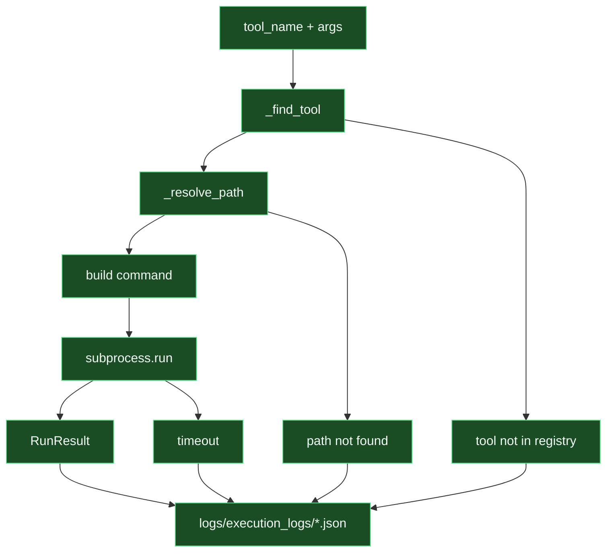

### API To Runtime State Effect Graph

*Built: POST /api/chat (routers/chat.py); GET/POST /api/approvals (routers/events.py); /ws/events (feed_bus); Guru = routers/guru.py; /api/hardware/snapshot (routers/hardware.py); /api/repo/tree, GET /api/repo/summaries (routers/repo.py).*

```mermaid
flowchart TD
    classDef built fill:#1a4d23,stroke:#5ddf8a,color:#f2fff6
    classDef partial fill:#8a7118,stroke:#e6c82a,color:#fff8e6
    classDef unbuilt fill:#3a3a3a,stroke:#888,color:#c8c8c8

    ChatAPI[POST /api/chat] --> ChatMessages[chat responses]
    ChatAPI --> EventBus[feed/chat events]
    ChatAPI --> ApprovalEvents[pending approval event]

    ApprovalList[GET /api/approvals] --> EventStore[event store]
    ApprovalResolve[POST /api/approvals/resolve] --> ApprovalQueue[approval_queue]
    ApprovalResolve --> ActionEvents[action events]

    WebSocket[/ws/events] --> EventStore
    WebSocket --> FeedStore
    WebSocket --> HardwareStore
    WebSocket --> RepoStore

    GuruAPI[Guru session endpoints] --> GuruStore[Guru tab state]
    HardwareAPI[/api/hardware/snapshot] --> HardwareStore
    RepoAPI[/api/repo/tree + summaries] --> RepoStore

    class ChatAPI,ChatMessages,EventBus,ApprovalEvents,ApprovalList,EventStore,ApprovalResolve,ApprovalQueue,ActionEvents,WebSocket,FeedStore,HardwareStore,RepoStore,GuruAPI,GuruStore,HardwareAPI,RepoAPI built
```

## 1. Goal

Turn `command-center` into a chat-first operator console that:

- uses `brain/` as the real orchestration and execution core
- uses `memory/`, `policy/`, and `registry/` as the source of truth for future behavior and authority
- keeps the existing visual theme and shell layout
- adds a dedicated `Guru` tab containing one persistent settings thread per mode
- keeps normal chat broad and conversational without accidentally mutating future AI behavior

## 2. Locked Decisions

These decisions are now fixed for implementation unless explicitly revised later.

### 2.1 Execution transport

- Worker integration is `SSH-first`.
- `WORKER_TUNNEL_URL` is not the MVP execution path.
- Any future HTTP worker service is an optional adapter layer, not the primary contract.

### 2.2 Config interaction model

- Config changes do **not** stay inside the main operator chat.
- The app gets a dedicated `Guru` tab.
- The `Guru` tab contains one persistent thread per mode.
- Each mode thread is long-lived and reopened, not recreated each time.
- Normal chat remains open and usable separately.
- Main chat consumes saved normalized rules, not raw Guru thread transcript context.

### 2.3 Persistent mode threads

Initial persistent Guru threads:

- `RR` = Response Refinement
- `PR` = Proposal Refinement
- `AL` = Action List behavior
- `TL` = Tool List behavior
- `ATL` = Auto Task List / auto-allow governance

### 2.4 Save behavior by mode

- `RR` -> save direct
- `PR` -> save direct
- `AL` -> preview and confirm
- `TL` -> preview and confirm
- `ATL` -> preview and confirm

### 2.5 Normalization rule

- User instructions are interpreted into structured changes.
- The system must write normalized config that matches the target file schema.
- The system must never dump raw user prose into operative config files.
- Raw wording may be preserved only in audit metadata.

### 2.6 MVP path

The first full path to complete is:

1. Wire `command-center` chat to `brain/orchestrator/main.py`.
2. Replace `command-center` custom approvals with `brain/approval_queue/queue.py`.
3. Replace custom execution routing with `brain/execution.py`.
4. Add a `Guru` tab shell with persistent mode threads.
5. Implement `RR` end to end.
6. Implement `ATL` end to end with preview and confirm.
7. Implement one real worker-backed capability end to end, starting with `repo_cartographer`.

## 3. Product Model

Guru defines a two-lane system.

### 3.1 Main operator chat

The main chat is for:

- broad questions
- planning
- live actions
- approvals
- status checks
- execution summaries

The main chat does not persist future behavior unless it reads normalized saved rules produced by Guru mode threads.

### 3.2 Guru tab

The `Guru` tab is the persistent settings surface.

It contains one thread for each mode:

- `RR`
- `PR`
- `AL`
- `TL`
- `ATL`

Each thread is a dedicated configuration workspace for that domain.

When the user enters a mode keyphrase in main chat, such as:

- `Enter RR`
- `Enter ATL`

The UI switches focus to the matching Guru thread, rather than opening a new ad hoc config conversation.

Exiting returns the user to normal chat, but the Guru thread remains available as the persistent home for that mode.

## 4. Theme and UI Continuity

The existing visual theme should remain intact.

### 4.1 Keep as-is

Preserve:

- dark operator-console palette
- sidebar
- top status bar
- tab-strip styling
- existing spacing and typography style
- current panel visual language

### 4.2 UI revision approach

This is not a redesign. It is a structural extension.

Preferred change:

- add one new top-level tab: `Guru`
- inside `Guru`, render the persistent setting threads
- keep `Chat`, `Compute`, `Feed`, `Repo`, and `Tools` visually consistent

### 4.3 Why Option C is preferred

A dedicated `Guru` tab:

- keeps the current shell intact
- avoids popup/window complexity
- avoids context bleed with main chat
- gives each mode a stable home
- is simpler to implement than real detached windows

## 5. How Persistent Guru Threads Influence the System

Each Guru thread affects future behavior after its normalized rules are saved.

### 5.1 RR

Influences:

- normal chat responses
- backend-generated summaries
- report wording
- evidence and citation habits

### 5.2 PR

Influences:

- future proposal structure
- planning output shape
- recommendation framing

### 5.3 AL

Influences:

- action-list decomposition
- task ordering
- acceptance criteria style

### 5.4 TL

Influences:

- how tools and capabilities are described
- grouping and visibility rules for tools
- approval/safety presentation

### 5.5 ATL

Influences:

- orchestration auto-approval behavior
- backend automation authority
- what runs without human approval

## 6. Runtime Boundary

The system must distinguish between:

- Guru thread transcript
- normalized saved rules
- live runtime orchestration

Hard rule:

- runtime behavior uses saved structured rules
- runtime behavior does **not** directly ingest the whole Guru transcript as context

This keeps the system stable and auditable.

## 7. Mode Contract

Each mode needs a small contract so the system stays predictable.

| Mode | Purpose | Writes To | Save Rule | Typical Scope |
|---|---|---|---|---|
| `RR` | Future answer style and evidence habits | `memory/preferences.json`, `memory/workflow_rules.json` | Direct | global, topic, repo |
| `PR` | Future proposal structure and planning behavior | `memory/workflow_rules.json` | Direct | global, workflow, repo |
| `AL` | How action lists are produced and grouped | `memory/workflow_rules.json` | Preview/confirm | global, workflow, repo |
| `TL` | How tool lists and capabilities are shown | `memory/workflow_rules.json`, `memory/business_definitions.json` | Preview/confirm | global, tool, workflow |
| `ATL` | What tasks may auto-run without approval | `memory/trust_rules.json`, `policy/allowlists.yaml`, optionally `policy/blocklists.yaml` | Preview/confirm | global, tool, task class, path |

### 7.1 Mode scope rules

Every saved rule must declare scope.

Supported initial scopes:

- `global`
- `topic`
- `repo`
- `workflow`
- `tool`
- `path_pattern`

If scope is not explicit, the system should propose one before saving.

## 8. Trigger Grammar

### 8.1 Enter

Accepted forms for MVP:

- `Enter RR`
- `Enter PR`
- `Enter AL`
- `Enter TL`
- `Enter ATL`

Behavior:

- activate the corresponding Guru mode thread
- switch UI focus to `Guru`
- load the persistent thread for that mode

### 8.2 Exit

Accepted forms for MVP:

- `Exit RR`
- `Exit PR`
- `Exit AL`
- `Exit TL`
- `Exit ATL`

Behavior:

- leave Guru mode interaction
- return focus to main chat
- keep the Guru thread intact

### 8.3 Inspect

Add support for:

- `Show RR rules`
- `Show PR rules`
- `Show AL rules`
- `Show TL rules`
- `Show ATL rules`

### 8.4 Revert

Add support for:

- `Revert last RR change`
- `Revert last PR change`
- `Revert last AL change`
- `Revert last TL change`
- `Revert last ATL change`

## 9. Normalization Rules

### 9.1 Hard rule

Natural-language instructions must be normalized into the destination file format.

Do:

- parse intent
- map to rule type
- map to target file
- update existing structured keys or rule objects

Do not:

- append raw prose into config files
- create free-form paragraph blobs in JSON or YAML
- store duplicated rules when an update to an existing rule would suffice

### 9.2 Audit preservation

The original user wording may be stored in audit metadata only.

Suggested audit location:

- `logs/config_changes/`

Suggested audit fields:

- mode
- scope
- raw_user_instruction
- normalized_change
- confirmation_required
- confirmed_by_user
- timestamp

## 10. Normalized Schema by Mode

### 10.1 RR

Primary targets:

- `memory/preferences.json`
- `memory/workflow_rules.json`

Use RR for durable response behavior such as:

- citation habits
- brevity rules
- when to mention files
- when to distinguish observations from recommendations

Good normalized output examples:

```json
{
  "include_source_references_in_code_discussions": true,
  "default_response_verbosity": "concise"
}
```

Or scoped behavior in `workflow_rules.json`:

```json
[
  {
    "mode": "RR",
    "scope": "topic",
    "topic": "code_discussion",
    "behavior": {
      "include_source_references": true,
      "mention_relevant_files": true
    }
  }
]
```

### 10.2 PR

Primary target:

- `memory/workflow_rules.json`

Use PR for proposal structure such as:

- always split `now / next / later`
- include risks and dependencies
- keep plans simple and implementation-oriented

### 10.3 AL

Primary target:

- `memory/workflow_rules.json`

Use AL for how action lists are generated:

- grouping rules
- ordering rules
- acceptance criteria
- blocker-first ordering

AL requires preview and confirm before save.

### 10.4 TL

Primary targets:

- `memory/workflow_rules.json`
- `memory/business_definitions.json`

Use TL for how tools are presented:

- group by rig
- show read-only vs state-changing
- highlight approval requirement
- define names for tool families

TL requires preview and confirm before save.

### 10.5 ATL

Primary targets:

- `memory/trust_rules.json`
- `policy/allowlists.yaml`
- optionally `policy/blocklists.yaml`

Use ATL for auto-allow governance such as:

- health checks
- repo scans that only write to `summaries/`
- read-only registry lookups
- read-only semantic retrieval

ATL must never save silently.

It must:

1. interpret the user request
2. normalize it into trust/policy rules
3. preview the exact changes
4. require explicit confirmation
5. write audit records

## 11. Persistent Guru Thread Lifecycle

### 11.1 First open

From main chat:

- user enters `Enter RR`
- UI switches to `Guru`
- RR thread is opened or created if it does not exist yet

### 11.2 Later open

On future entry:

- UI switches to `Guru`
- same RR thread is reopened
- existing saved rules and recent thread history are shown

### 11.3 In-thread behavior

Inside a Guru thread:

- responses are mode-specific
- the assistant acts as a rule normalizer, not a general operator
- each instruction is translated into a structured draft or update

### 11.4 Save

If direct-save mode:

- save normalized change immediately
- write audit entry
- publish compact summary event to main chat/feed

If confirm mode:

- show preview
- wait for explicit confirmation
- then save and audit

### 11.5 Exit

On exit:

- return UI focus to main chat
- Guru thread remains persistent and available

## 12. Main Chat Integration Rules

The main operator chat should not absorb the full Guru transcript.

It should receive only a summary event like:

- `RR updated: code discussions now include source references`
- `ATL updated: health_check and repo_scan_to_summaries auto-allowed`

That summary may be shown in:

- chat history
- event feed
- audit sidebar

## 13. Backend Revision Plan

### 13.1 Replace command-center stub orchestration

`command-center/backend/routers/chat.py` should stop being the primary intent engine.

Instead:

- call `brain/orchestrator/main.py`
- normalize orchestrator output into UI response payloads
- publish related WebSocket events for chat, actions, and approvals

### 13.2 Replace custom approval storage

Replace `command-center/backend/routers/events.py` in-memory `_pending` usage with:

- `brain/approval_queue/queue.py`

Needed improvement:

- extend approval payload shape so deferred actions can be resumed after approval
- current approval spec is too file/action oriented for all future command-center use cases

### 13.3 Replace custom execution bridge

Replace `command-center/backend/services/supervisor_bridge.py` as the primary executor with adapters over:

- `brain/execution.py`

Execution adapter responsibilities:

- resolve registry entry
- resolve policy
- choose main vs worker
- run via local subprocess or SSH
- publish action/feed events
- persist logs

### 13.4 Add SSH worker adapter

Add a dedicated SSH worker service for MVP.

Responsibilities:

- build worker command from registry and task type
- execute over SSH
- return structured JSON
- write outputs into `summaries/` or registry state on main

### 13.5 Add Guru session service

Add backend support for persistent Guru threads:

- load current mode thread
- load current saved rules
- normalize user instruction
- preview changes
- confirm changes
- revert changes
- emit audit events

## 14. Frontend Revision Plan

### 14.1 Main shell remains primary

Keep the existing shell in `frontend/src/App.jsx` and extend it.

### 14.2 Add a Guru tab

Update top-level tabs to add:

- `Guru`

Inside `Guru`, provide:

- mode list on the left or top
- one persistent thread view per mode
- saved-rule summary panel
- pending draft / confirmation area

### 14.3 UX requirements

The Guru tab must show:

- active mode
- what it can change
- current scope
- current saved rules
- pending draft
- whether confirmation is required
- last updated time

### 14.4 Theme rule

Do not redesign the app.

Keep:

- colors
- typography mood
- border treatments
- density
- dark console look

## 15. MVP Build Order

### Phase 1: Real command path

1. Wire main chat to `brain/orchestrator/main.py`
2. Wire approvals to `brain/approval_queue/queue.py`
3. Wire execution to `brain/execution.py`

### Phase 2: Guru shell

4. Add `Guru` tab to the existing UI
5. Build persistent mode-thread state model
6. Build Guru backend session endpoints

### Phase 3: First behavior modes

7. Implement `RR` direct-save
8. Implement `PR` direct-save
9. Implement `ATL` preview/confirm

### Phase 4: Worker-backed capability

10. Add SSH worker adapter
11. Wire `repo_cartographer`
12. Surface summary/result in main chat and repo panel

### Phase 5: Remaining mode support

13. Implement `AL`
14. Implement `TL`

## 16. Acceptance Criteria

Guru MVP is complete when:

- main chat uses real orchestrator, real approvals, and real execution
- the UI contains a `Guru` tab
- Guru contains one persistent thread for `RR`, `PR`, `AL`, `TL`, and `ATL`
- entering a mode focuses the matching Guru thread
- RR and PR save normalized rules directly
- AL, TL, and ATL show preview and require confirmation
- saved rules influence main chat behavior and orchestration through structured storage
- main chat does not ingest raw Guru transcript history
- one worker-backed flow works end to end via SSH
- saved changes can be inspected and reverted

## 17. Non-Goals for MVP

Do not include in the first pass:

- full HTTP worker microservice replacement
- detached browser popup architecture
- auto-merging multiple competing drafts for the same mode
- arbitrary free-form policy editing
- many worker-backed tools before one complete flow works
- making every dashboard panel fully live before core chat and Guru flows are correct

## 18. Final Guidance

Guru should be implemented with one guiding rule:

**Broad chat decides intent. Guru mode threads decide future behavior. Policy decides authority.**

If this rule is preserved, `command-center` can stay conversational without becoming ambiguous or unsafe.

---

## 19. Local Assistant V1 Architecture Spec

*Appended plan for evolving the main chat into a grounded operator assistant. Implementation follows Phases 1–4 below; do not start implementation until this spec is agreed.*

**Diagram legend (all §19 diagrams):** **Green** (`built`) = exists in current codebase. **Gray** (`unbuilt`) = not yet implemented; V1 target.

### Purpose

Build a narrow-scope local assistant that can converse naturally, understand user intent, reason over real system outputs, and propose next actions inside the user's approved tool and repo boundaries.

The target is **not** a broad consumer chatbot. The target is a grounded operator assistant for the user's systems.

### V1 Goals

1. Understand natural-language requests without requiring exact command phrases.
2. Maintain working session context across turns.
3. Inspect real artifacts and tool outputs before answering.
4. Interpret data and explain what matters.
5. Propose next actions the assistant could take or the user should take.
6. Require approval before any meaningful write/change action.
7. Stay constrained to the tools, repos, scripts, and systems explicitly provided.

### Non-Goals for V1

* General-purpose world knowledge beyond the allowed local/tool scope.
* Full autonomy.
* Production write access without approval.
* Complex multi-agent swarm behavior.
* Large-scale long-term memory across all domains.
* Voice and mobile interfaces in V1.

### Success Criteria

The assistant should be able to do all of the following reliably:

* Answer follow-up questions like "what did that scan tell you" by resolving "that" to the latest relevant artifact.
* Read a generated JSON/MD/TXT/CSV artifact and summarize what matters.
* Explain why a tool failed using real evidence.
* Search repos and tell the user the most likely file, path, or script match.
* Suggest the next 2-4 grounded actions after most analytical answers.
* Ask for approval before making changes.

Example of acceptable behavior:

> I found the failure point. The GrowFlow sales command is mapped to a script path that does not exist. That is why your request failed. The fastest fix is to search the repo for the current sales entrypoint and patch the registry. I can do that next.

### Core Product Behavior

The assistant must operate in four modes.

#### 1. Converse Mode

* Accept natural language.
* Resolve shorthand like "that", "it", "the scan", "fix it".
* Preserve continuity of topic.

#### 2. Analyze Mode

* Load relevant artifacts automatically.
* Extract what matters.
* Interpret rather than merely repeat.
* Rank issues by practical importance.

#### 3. Propose Mode

* Offer grounded next actions.
* Differentiate between recommended user actions and actions the assistant can perform.
* Keep proposals relevant to current evidence.

#### 4. Execute Mode

* Perform safe read-only actions automatically.
* Require approval for write actions.
* Report what changed, where, and why.

### High-Level Architecture

```text
User Chat
  -> Conversation Layer
  -> Intent Resolver
  -> Session State Resolver
  -> Evidence Loader
  -> Tool Runner / Artifact Reader
  -> Reasoning Layer
  -> Proposal Generator
  -> Approval Gate
  -> Response Formatter
```

#### Local Assistant V1 Architecture Graph

*Green = built. Amber = partial (in-process session + evidence fusion + proposals exist; not “V1 complete”). Gray = missing as a named layer.*

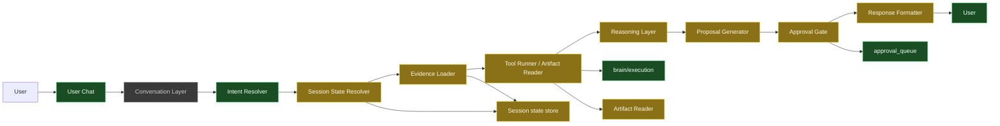

*Built: chat UI, keyword intent, `execution.run`, approval queue. Partial: in-memory session object, evidence loader/fusion path, proposals + gate modules, artifact loading for grounded flows. Unbuilt: dedicated conversational layer, durable session store, full artifact reader productization.*

#### Component Roles

| Component | Role |
|-----------|------|
| **Conversation Layer** | Handles natural-language interaction and follow-up references. |
| **Intent Resolver** | Determines whether the user wants information, diagnosis, summary, proposal, execution, or approval. |
| **Session State Resolver** | Recovers relevant recent context (last scan, last repo searched, last failed command, active project). |
| **Evidence Loader** | Automatically gathers the relevant file, report, stdout/stderr, search results, or logs needed to answer. |
| **Tool Runner** | Executes allowed tools and records structured outputs. |
| **Artifact Reader** | Reads machine-generated artifacts and normalizes them into model-usable context. |
| **Reasoning Layer** | Interprets evidence and identifies significance, risk, priority, and probable next steps. |
| **Proposal Generator** | Produces concrete next actions. |
| **Approval Gate** | Prevents unapproved write actions. |
| **Response Formatter** | Turns the above into a concise, useful answer. |

### Mandatory Design Rules

1. **No blind summaries** — If the user asks about a scan, script result, report, log, or search result, the assistant must inspect the relevant evidence before answering.
2. **No generic filler** — The assistant must never answer questions about a specific operation with generic phrases like "a repo scan typically checks..." when real output exists or should exist.
3. **Every tool result is stateful** — Every completed tool run must update session state with enough information to answer follow-up questions naturally.
4. **Every grounded answer includes interpretation** — The assistant should answer not only what happened, but why it matters and what should be done next.
5. **Every meaningful write action is approval-gated** — Edits, patching, registry changes, file writes, commits, sends, or workflow changes require explicit approval unless the action is explicitly whitelisted as safe.

### Session State Design

The assistant needs a working memory object for the current session.

#### Suggested schema

```json
{
  "active_project": "ai-lab",
  "active_topic": "growflow sales failure",
  "last_tool_action": {
    "name": "repo_scan",
    "status": "ok",
    "timestamp": "2026-03-16T20:30:00"
  },
  "last_artifacts": [
    {
      "type": "repo_scan",
      "path": "E:\\Repos\\ai-lab\\summaries\\repos\\repos_root.json",
      "summary_path": "E:\\Repos\\ai-lab\\summaries\\repos\\repos_root_summary.md",
      "timestamp": "2026-03-16T20:30:00"
    }
  ],
  "last_failure": {
    "intent": "growflow_sales_today",
    "reason": "script path not found",
    "path": "E:\\Repos\\Greg-Kylo\\integrations\\growflow\\sales_today.py"
  },
  "recent_entities": [
    "GrowFlow",
    "repo scan",
    "registry/scripts.json"
  ],
  "approval_mode": "strict"
}
```

#### What must be tracked

* active project
* active topic
* last tool invoked
* last tool result status
* last relevant artifact paths
* last failed action and reason
* recent entities
* safety/approval mode

#### Why it matters

This is what lets the assistant correctly understand: "what did that scan say", "fix that", "find it in repos", "can you patch it".

#### Session State and Evidence Flow Graph

*Green = built. Amber = partial (in-memory session + grounded follow-up path). Gray = not durable / not complete.*

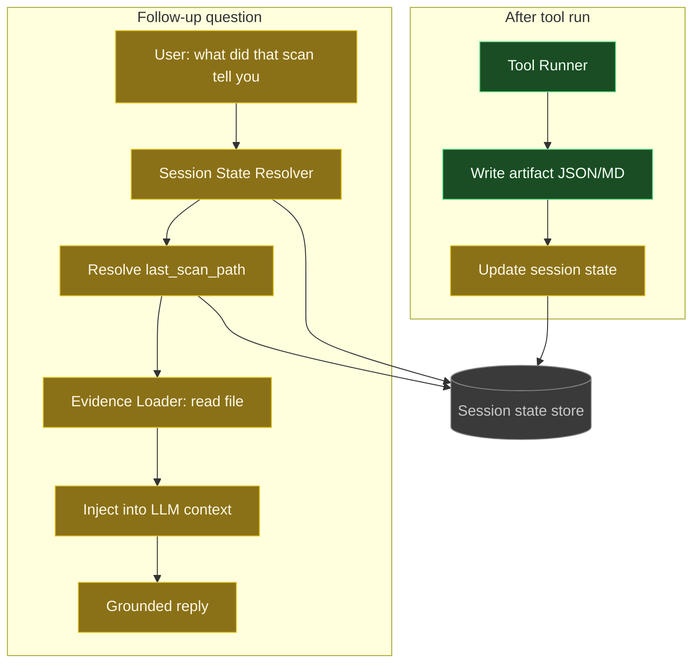

*Built: tool runner + artifacts on disk. Partial: session updates in memory, resolver + evidence load for scan follow-ups. Unbuilt: durable session store across restarts.*

### Intent Model

Intent resolution must be semantic, not exact-phrase dependent.

#### Intent families

| Family | User wants | Examples |
|--------|-------------|----------|
| **Informational** | Fact or current status | "what's my growflow sales for today", "what repo did that come from" |
| **Diagnostic** | Explanation of failure or anomaly | "why did that fail", "what's broken", "anything look off" |
| **Summary** | Synthesized understanding of evidence | "what did the scan tell you", "give me the improvements from the scan" |
| **Proposal** | Recommended next steps | "what should I do", "what would you fix first" |
| **Execution** | Action taken | "do it", "patch that", "search for it" |
| **Approval** | Authorizes a previously proposed change | "approved", "go ahead", "yes update it" |

#### Follow-up reference resolution

The assistant must resolve phrases like: *that*, *it*, *those results*, *the scan*, *the failure*, *the script*. Resolution should prefer the most recent relevant artifact or action in session state.

### Evidence Loading Rules

Whenever a user message refers to an operation result or artifact, the assistant must attempt to load relevant evidence automatically.

* **Trigger examples:** scan, results, report, output, logs, json, summary, improvements from that, why did that fail, what did it find.
* **Evidence sources:** generated files (JSON, MD, TXT, CSV), command stdout/stderr, tool structured returns, repo search matches, script registry entries, logs.
* **Loading order:** (1) explicit file path from latest tool result, (2) latest matching artifact from session state, (3) standard output from latest operation, (4) most relevant repo/log/search source.
* **Failure behavior:** If evidence cannot be found, the assistant must say that clearly and must not invent findings.

### Tool Result Contract

Every tool must return structured output. Avoid bare success strings.

#### Minimum contract

```json
{
  "status": "ok",
  "tool": "repo_scan",
  "timestamp": "2026-03-16T20:30:00",
  "artifacts": [
    { "type": "json", "path": "E:\\Repos\\ai-lab\\summaries\\repos\\repos_root.json" },
    { "type": "markdown", "path": "E:\\Repos\\ai-lab\\summaries\\repos\\repos_root_summary.md" }
  ],
  "summary": {
    "repos_scanned": 12,
    "top_findings": [
      "GrowFlow entrypoint missing",
      "3 repos missing tests",
      "4 repos missing README"
    ]
  },
  "stdout_excerpt": "Repo scan done"
}
```

Benefits: immediate conversational usefulness, better follow-ups, easier UI/report formatting, easier safety checks.

### Artifact Strategy

For operations like repo scans, create both machine-readable and human-readable outputs.

* **Required outputs for scans:** (1) Raw JSON for downstream parsing, (2) Markdown summary for human reading, (3) Optional action plan JSON or MD with ranked proposed fixes.

#### Example markdown summary format

```md
# Repo Scan Summary

Scanned: 12 repos
Generated: 2026-03-16 20:30

## Top Findings
- Missing GrowFlow entrypoint blocks sales query workflow
- 3 repos have no tests
- 4 repos have stale or incomplete README docs

## Highest Priority Repos
### Greg-Kylo
- Expected GrowFlow sales script missing
- Registry likely outdated

### ai-lab
- Missing real scan-results summary handling
- Needs dedicated scan_results intent
```

### Reasoning Template

Every grounded analytical response should internally answer these in order:

1. What happened?
2. Why does it matter?
3. What does the evidence most likely mean?
4. What do I recommend?
5. What can I do next if approved?

Example response pattern:

> The GrowFlow sales request failed because the registered script path does not exist. That matters because it blocks a real business workflow you want to query naturally. The likely issue is that the integration was moved or renamed and the registry was not updated. I recommend searching the repo for the current sales entrypoint and then patching the registry. I can search for that now.

### Proposal Engine

The assistant should propose actions after most analytical answers.

* **User-only actions:** check credentials, verify external system access, confirm desired output format.
* **Assistant-safe actions:** search repos, read logs, inspect artifacts, compare config files, draft a patch, generate a summary.
* **Approval-gated actions:** edit config, update registry, create or modify scripts, write docs into repo, commit changes, run state-changing workflows.

**Proposal quality rules:** max 2–4 proposals per answer; prioritize by impact; tie directly to evidence; do not suggest vague fluff.

### Approval Model

* **Tier 1 (auto-allowed):** file reads, repo scans, repo searches, artifact loading, log inspection, dry-run analysis.
* **Tier 2 (proposed first):** config changes, registry updates, script scaffolding, documentation edits, patch generation.
* **Tier 3 (explicit approval):** writing to repos, deleting files, changing production settings, sending notifications, calendar changes, commits/pushes, financial workflow execution.

**Approval memory:** Once the assistant proposes an action, it should store the pending proposal in session state so "do it" can map correctly.

#### Approval Tiers Graph

*Green = built. Amber = partial (execute-after-approve works for some paths; tier classifier / session proposal memory not). Gray = not built.*

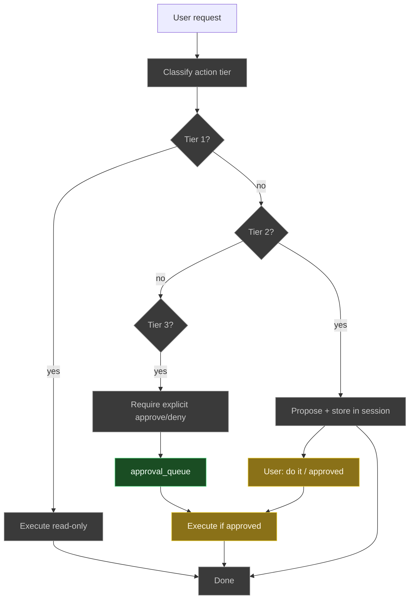

*Built today: approval_queue (approve/deny by id). Partial: post-approval execution for queued specs. Unbuilt: tier classification, Tier 1 auto-execute path, Tier 2 proposal + durable session memory, Tier 3 gate before queue, reliable mapping "do it" → pending proposal.*

### Router and Command Handling

Common aliases should be supported even with semantic intent handling.

| Alias | Resolves to |
|-------|-------------|
| "scan my repos" | repo_scan |
| "find it in repos" | repo_search or repo_scan depending on context |
| "show scan results" / "view scan results" | scan_results |
| "what did the scan tell you" | scan_results_summary |
| "what's my growflow sales for today" | growflow_sales_today |

**Rule:** If the user clearly refers to the latest relevant action, prefer contextual resolution over literal alias matching.

### Main Brain vs Worker Split

* **Main Brain (strongest model):** conversation, intent resolution, evidence interpretation, follow-up handling, proposal generation, approval gating, final response composition.
* **Worker (smaller models / deterministic):** repo indexing, code search, chunk summarization, file classification, schema extraction, low-cost batch analysis.

**Rule:** Do not let the worker model act as the full user-facing assistant. The user-facing conversation layer stays with the strongest orchestrator model.

#### Main Brain vs Worker Graph

*Green = built. Amber = partial (code exists / worker path without chat NL). Gray = not built.*

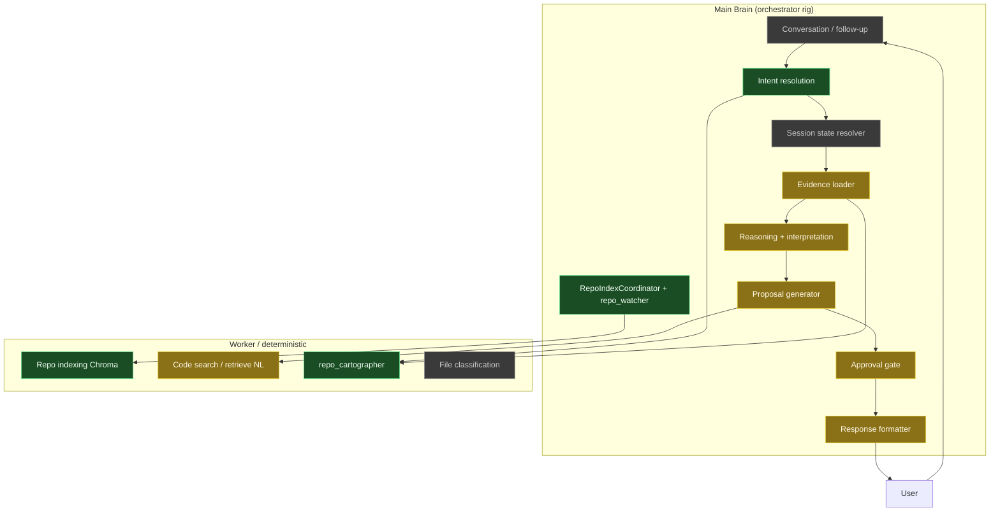

*Built: keyword intent, repo scan (cartographer), **hub-driven repo index** (watcher → coordinator → tunnel → worker). Partial: evidence fusion / proposals / gate / formatter / worker **retrieve** (no orchestrator NL routing yet). Unbuilt: dedicated conversation layer, durable session resolver, productized code search from chat, file classification worker.*

### Recommended V1 Data Flows

**Flow A: Repo scan then follow-up summary**

```text
User: scan my repos
-> tool runs repo scan
-> tool returns structured result + artifact paths
-> session state updated
-> assistant responds with initial summary

User: what did that scan tell you
-> session state resolves latest repo scan
-> artifact loader reads repos_root.json or summary.md
-> reasoning layer interprets findings
-> proposal engine suggests next steps
-> assistant responds with grounded summary
```

**Flow B: Failed GrowFlow query**

```text
User: what's my growflow sales for today
-> growflow intent
-> tool fails: script path not found
-> failure stored in session state
-> assistant explains failure and proposes next steps

User: find it in repos
-> session state resolves "it" to GrowFlow sales script problem
-> repo search runs on relevant repos/terms
-> assistant ranks likely matches
-> assistant proposes registry patch if appropriate
```

**Flow C: Approval-gated fix**

```text
User: patch it
-> assistant identifies pending proposal
-> checks approval requirement
-> asks for confirmation if not already approved

User: approved
-> assistant executes patch
-> returns exact files changed and a short validation summary
```

#### V1 Data Flow A: Repo scan then follow-up summary

*Green = built. Amber = partial (`scan_results` / grounded path exists but not all edge cases). Gray = missing.*


#### V1 Data Flow B: Failed GrowFlow then find in repos

*Green = built. Gray = not yet built.*

```mermaid
flowchart LR
    classDef built fill:#1a4d23,stroke:#5ddf8a,color:#f2fff6
    classDef partial fill:#8a7118,stroke:#e6c82a,color:#fff8e6
    classDef unbuilt fill:#3a3a3a,stroke:#888,color:#c8c8c8

    C1[User: growflow sales today] --> C2[Intent: run]
    C2 --> C3[Tool fails: path not found]
    C3 --> C4[Store failure in session]
    C4 --> C5[Explain + propose next steps]
    C5 --> C6[User: find it in repos]
    C6 --> C7[Resolve it to GrowFlow script]
    C7 --> C8[Repo search / scan]
    C8 --> C9[Rank matches + propose patch]

    class C1,C2,C3,C6 built
    class C4,C5 partial
    class C7,C8,C9 unbuilt
```

#### V1 Data Flow C: Approval-gated fix

*Green = built. Gray = not yet built.*

```mermaid
flowchart LR
    classDef built fill:#1a4d23,stroke:#5ddf8a,color:#f2fff6
    classDef partial fill:#8a7118,stroke:#e6c82a,color:#fff8e6
    classDef unbuilt fill:#3a3a3a,stroke:#888,color:#c8c8c8

    D1[User: patch it] --> D2[Resolve pending proposal]
    D2 --> D3[Check approval required]
    D3 --> D4[Ask for confirmation]
    D4 --> D5[User: approved]
    D5 --> D6[Execute patch]
    D6 --> D7[Report changes + validate]

    class D5 built
    class D6,D7 partial
    class D1,D2,D3,D4 unbuilt
```

### Response Contract

* **Analytical answers:** direct answer, evidence-based explanation, why it matters, recommended next step(s).
* **Execution answers:** what was done, what changed, where it changed, result or validation outcome, next sensible option.
* **Failures:** what failed, why it failed, what evidence supports that, best next action.

**Tone:** natural and conversational, plain language, concise but not shallow, specific not generic, no fake certainty.

### Guardrails Against Bad Behavior

The assistant must never:

* invent scan findings it did not read
* claim vulnerabilities or issues without evidence
* suggest magic command phrases with no implementation path
* lose the current topic on simple follow-ups
* perform write actions silently
* pretend it has web/MCP access if it does not

### Implementation Priorities

| Phase | Focus | Key items |
|-------|--------|-----------|
| **Phase 1** | Stop dumb behavior | session state object, structured tool result contract, automatic artifact loading for follow-up questions, no-hallucination rule for unseen outputs, real scan_results handling |
| **Phase 2** | Improve conversational quality | semantic intent handling, follow-up reference resolution, active topic tracking, proposal generation after grounded analysis |
| **Phase 3** | Add operational usefulness | repo index/search ranking, patch drafting, registry maintenance workflows, validation after changes |
| **Phase 4** | Expand carefully | project/task awareness, daily status summaries, calendar/reminder integration, voice/mobile interface |

### V1 Minimal Technical Requirements

* One strong orchestrator model on the main rig
* Deterministic tool wrappers
* Artifact reader for JSON/MD/TXT/CSV
* Repo search/indexing capability
* Session state storage
* Approval-state storage
* Prompt rules for grounded reasoning

### Example V1 System Prompt Principles

The user-facing assistant prompt should enforce:

* Use real evidence from tool outputs and artifacts whenever available.
* If asked about a result, inspect the result before answering.
* Resolve follow-up references against recent session state.
* Explain what matters, not just what exists.
* Propose a few concrete next steps when useful.
* Never make write changes without approval unless explicitly whitelisted.
* If evidence is missing, say so plainly.

### Final Product Definition

V1 is successful when the assistant feels like a grounded operator partner, not a dumb command wrapper. It should:

* understand what the user means
* reason over the user's actual data
* keep the thread of conversation alive
* point out what matters
* suggest the next move
* ask before changing things

That is the right target for the user's local main-brain assistant. **Implementation starts only after this spec is agreed; then execute Phase 1 first.**

---

## 20. Unified Source Orchestration & Web Extension

*One assistant, multiple evidence sources. Web is baked in as a capability, not a separate mode. User talks naturally; the orchestrator chooses local, web, or both internally.*

### Design principle: no user-visible modes

The assistant should feel like a single partner. The user says things like:

* "get this today"
* "what's the weather"
* "is this library still current"
* "what's my growflow sales for today"
* "anything look off?"

The orchestrator decides in the background:

* answer from local systems only
* need current web data
* need both local and web
* need date/time context
* ask for clarification only when genuinely ambiguous

**Do not** expose "local mode" vs "web mode" to the user.

### Evidence sources (baked in)

| Source | Use for |
|--------|--------|
| **Local** | Repos, configs, logs, scan results, scripts, business docs, tool outputs |
| **Web** | Weather, latest docs, API changes, package updates, broker/contact info, product/pricing |
| **Time/date** | "Today", "this week", "latest", "current", "as of now" |
| **Session** | Active project, last failure, last scan, pending proposal, active topic |

### Source selection policy (priority tiers)

Enforce source selection as **priority tiers** to avoid unnecessary web calls:

| Tier | When to use | Examples |
|------|-------------|----------|
| **Tier 1 – Local only** | Question clearly references internal systems | repo scan, scripts, logs, integrations, configs, "what did that scan tell you" |
| **Tier 2 – Local + Web** | Evaluating your system against the outside world | "is this API still valid", "is this package outdated", "are these brokers still active", "compare with current docs" |
| **Tier 3 – Web only** | Question is purely external | weather, current news, pricing, laws, vendor info, "what's the weather" |

Rules:

* Use local first when the question is about the user's systems, files, repos, scripts, outputs, or business data.
* Add web when the request depends on current or external information (weather, today, latest, docs, price, broker, law, etc.).
* Use both (Tier 2) when accuracy depends on comparing local state to current outside reality.
* Use date/time context when wording implies freshness ("today", "latest", "current", "this week").
* Do not make the user switch modes or specify the source unless the request is ambiguous.

### Freshness / web-needed detection (implementation triggers)

When the message suggests current or external info, the orchestrator should consider web (and/or time context). Use these trigger categories in code:

| Category | Triggers (examples) |
|----------|----------------------|
| **Explicit freshness** | today, now, current, latest, recent, as of, this week |
| **External lookup** | weather, price, docs, API, release, broker, law, regulation, availability |
| **Verification phrases** | is this still, has this changed, is this outdated, compare with current |

Implementation: e.g. `needs_web = detect_freshness(message)` returning true when any trigger matches; then combine with intent and session to decide Tier 2 or Tier 3.

### User-directed, automatic when needed

* **Auto-use web** (no ask) when: current accuracy is required, the question explicitly asks for latest/weather/today, local data is insufficient, or verifying external facts improves correctness.
* **Prefer not to use web** when: the question is clearly internal-only or local artifacts fully answer it.
* **Propose or ask** before acting when: web results would lead to a write/change, external data is ambiguous, or the next step would modify systems.

### What gets built (extension)

1. **Web tool** — e.g. controlled search API, HTTP fetch, or MCP server exposing web search to the assistant runtime. Results become an evidence source like scan artifacts.
2. **Freshness detection** — intent/routing layer flags when a question needs current/external info and can trigger web (and time context).
3. **Local-vs-web routing** — orchestrator chooses local-only, web-only, or both; no user-facing mode switch.
4. **Response fusion** — when both local and web are used, combine in one answer (e.g. "your repo uses X; current docs say X is deprecated; here's what to do").
5. **Approval rules for web-informed actions** — using web to decide is fine; acting on that (e.g. patching, updating) stays approval-gated.

### Phase-7 implementation: five components (interfaces)

Build these so the orchestrator can select sources, gather evidence, and reason over fused context.

| Component | Interface / contract | Responsibility |
|-----------|----------------------|----------------|
| **1. Web tool** | `web_search(query: str) -> list[{title, url, snippet, timestamp}]` | Call search API or MCP; return structured results for evidence fusion. |
| **2. Freshness detector** | `detect_freshness(message: str) -> bool` | Return true when message matches explicit freshness, external lookup, or verification triggers (see table above). |
| **3. Source router** | `select_sources(intent, freshness_flag, session_context) -> local \| web \| local+web \| web+time \| local+time` | Decide which evidence sources to gather before reasoning; implements Tier 1/2/3. |
| **4. Evidence fusion** | Build `context = { local_artifacts, web_results, time_context, session_state }` and pass to reasoning layer | Reasoning layer consumes one combined context; it does not care where evidence came from. |
| **5. Web-informed approval** | Proposals that cite web data still go through approval gate; never apply web-derived changes without user approval | e.g. "Web check shows GrowFlow API endpoint changed. Recommended: update integration in growflow_client.py. Approve patch?" |

### Phase-1 evaluation (summary)

Phase-1 delivered:

* **Session state** — last_tool_action, last_artifacts, last_failure, recent_entities; enables "what did that scan tell you", "why did that fail", "find it in repos".
* **Structured tool results** — status, artifacts, summary (e.g. top_findings); enables immediate summarization and follow-ups without re-running tools.
* **scan_results intent** — show/view scan results, what did the scan tell you, improvements from scan; real handler, no magic phrases.
* **Evidence loading + anti-hallucination** — append artifact to prompt; instruct model not to invent; triggers for scan/result/report/output/improvement/what did/that scan.
* **session_id in chat API** — per-thread state for web UI, CLI, multiple users.
* **Failure recording** — last_failure in session for "why did that fail", "fix it", "search for it".

**Still to add:** active_topic, pending_proposal (so "do it" maps to a proposed action); expand evidence triggers (findings, issues, analysis, summary, problems); optional session persistence (disk/Redis).

### Session schema additions (implementation)

Add these fields to session state (see §19 and `brain/session_state.py`) so Phase-2 and Phase-7 work correctly.

| Field | Type | Purpose |
|-------|------|--------|
| **active_topic** | `str \| null` | Current focus; prevents drift. Examples: `growflow_sales_issue`, `repo_scan_analysis`, `registry_patch`. Set when user asks about a failure, scan, or fix; clear or update when topic changes. |
| **pending_proposal** | `dict \| null` | Proposed action awaiting approval so "do it" / "yes" / "approve" resolve. Example: `{ "action": "patch_registry_path", "target": "growflow_sales_script", "detail": "..." }`. Clear after approval/deny. |

Implementation: extend `brain/session_state.get()` default state and add `update_active_topic(session_id, topic)`, `set_pending_proposal(session_id, proposal)`, `clear_pending_proposal(session_id)`. Orchestrator resolves "do it" by reading `pending_proposal` and executing or re-proposing.

### Phase-2 components (recommended)

| Component | Purpose |
|-----------|--------|
| **Proposal engine** | After analyzing evidence, output 2–4 concrete next steps (e.g. search repo for script, update registry, run test). |
| **Repo search tool** | Search repos by keyword/semantic; return ranked matches (path, score, why); e.g. "find GrowFlow script" → list of candidates. |
| **Topic tracking** | active_topic in session (e.g. growflow_sales_failure, repo_scan_analysis); keeps follow-ups coherent. |
| **Pending proposal memory** | pending_proposal in session; "do it" / "fix it" resolve to that action and stay approval-gated. |
| **Web search tool** | web_search(query); invoked when freshness/external triggers; results fed in as evidence; assistant summarizes and proposes. |

### Target behavior after Phase-2 + web

Example:

* **User:** scan my repos  
* **Assistant:** Repo scan completed. Top findings: GrowFlow entrypoint missing; 3 repos missing tests; 4 missing README. I recommend: 1) Search for the updated GrowFlow sales script. 2) Update the registry path. 3) Run a test query. I can search the repos now.
* **User:** anything look off?  
* **Assistant:** Yes. The biggest issue is the missing GrowFlow entrypoint because it blocks a real workflow. Missing READMEs/tests are lower priority. [Same recommendations.]
* **User:** do it  
* **Assistant:** [Resolves to pending proposal; runs repo search; reports matches and proposes registry patch; approval-gated for write.]

Weather / "get this today" / "is this package still good" work the same way: one assistant, internal source selection, web used when needed for current accuracy.

### Expanded evidence triggers (answer path)

When deciding whether to load last scan/artifact into the answer path, also match these (in addition to scan, result, report, output, improvement, what did, that scan):

* findings, issues, analysis, summary, problems, what's wrong, what changed

This keeps follow-ups like "any issues?" or "what's wrong with that" grounded in the last artifact.

### Guardrail

**Web-capable, not web-dependent.** Prefer local; use web when the answer requires current external information or the user explicitly asks. Avoid overusing web (slow, noisy, less trust in local answers).

---

### Implementation checklist (build order)

Phase-1 already provides **state awareness** (session_state), **evidence grounding** (artifact loading, anti-hallucination), and **structured tool outputs** (scan result contract). Phase-2 and Phase-7 extend that foundation; use the order below so each step builds on the previous. Phase-2 can be done before or in parallel with web tooling; Phase-7 web pieces depend on Phase-2 reasoning/proposal flow.

**Phase-2 (reasoning & proposals)**

| # | Task | Delivered |
|---|------|-----------|
| 2.1 | Add `active_topic` and `pending_proposal` to session state schema and get/update helpers | Session supports topic and proposal memory |
| 2.2 | Expand evidence-loading triggers in orchestrator (findings, issues, analysis, summary, problems, what's wrong, what changed) | More follow-ups get artifact context |
| 2.3 | Proposal engine: after scan_results and after answer with evidence, append 2–4 concrete next steps to reply (from template or LLM) | Assistant suggests "search repo for X", "update registry", etc. |
| 2.4 | Set `pending_proposal` when assistant proposes an action; resolve "do it" / "yes" / "approve" to pending_proposal and run approval flow | "Do it" maps to last proposal |
| 2.5 | Repo search tool: search repos by keyword (or semantic); return ranked list (path, score, why); register as tool and call from orchestrator when intent is "find in repos" or proposal is "search repo for X" | "Find it in repos" returns real matches |

**Phase-7 (web & fusion)**

| # | Task | Delivered |
|---|------|-----------|
| 7.1 | Freshness detector: `detect_freshness(message)` using trigger categories above | Boolean flag for "needs current/external info" |
| 7.2 | Source router: `select_sources(intent, freshness_flag, session_context)` returning local | web | local+web | etc. | Implements Tier 1/2/3 |
| 7.3 | Web tool: `web_search(query)` returning list of {title, url, snippet, timestamp} (via API or MCP) | Web results as evidence |
| 7.4 | Evidence fusion: build combined context (local_artifacts, web_results, time_context, session_state) and pass to reasoning/LLM in one blob | Single context for reasoning |
| 7.5 | Web-informed approval: proposals that use web data still require approval before any write; prompt clarifies "Approve patch?" | No silent writes from web |

**Optional later**

* Persist session state (disk or Redis) so it survives restarts.
* Richer scan summary: issues_by_repo, severity, action_candidates for better proposal ranking.

---

## 21. Implementation Plan: Source Router and Evidence Fusion

*Detailed build plan for the layer that turns the assistant from a command wrapper into a grounded, evidence-driven assistant. See rollout order at the end.*

### Target outcome

The assistant should:

* resolve references like *that*, *it*, *the scan*, *do it*
* decide whether to use local, web, time, session, or a combination
* load the smallest useful set of evidence
* fuse that evidence into a compact reasoning packet
* choose an appropriate answer style
* propose next actions
* require approval for meaningful write actions

### Proposed module layout

```text
brain/
  orchestrator/
    main.py
    answering.py
    source_router.py
    evidence_loader.py
    evidence_fusion.py
    freshness.py
    session_resolution.py
    strategies.py
    proposal_engine.py
    approval_gate.py
  schemas/
    routing.py
    evidence.py
    proposals.py
  session_state.py
  tools/
    web_search.py
    repo_search.py
    time_context.py
```

### Data schemas (summary)

* **RoutingDecision** (routing.py): intent, needs_local, needs_web, needs_time, needs_session, local_targets (kind, path, query, priority), web_queries, session_targets, reason, confidence, answer_style_hint.
* **LoadedEvidence** (evidence.py): session_context, local_evidence, web_evidence, time_context, sufficient, notes; **EvidenceItem**: source_type, title, path, content, metadata, weight.
* **FusedContext** (evidence.py): resolved_question, active_topic, key_evidence, secondary_evidence, time_context, constraints, recommended_answer_style, proposal_candidates.
* **ProposalRecord** (proposals.py): action, title, description, tool, args, approval_required, expires_after_turns.

### Session state additions

* `last_web_lookup`, `last_routing_decision`
* Helpers: `set_active_topic`, `get_active_topic`, `set_pending_proposal`, `get_pending_proposal`, `clear_pending_proposal`, `set_last_web_lookup`, `get_last_web_lookup`, `set_last_routing_decision`.

### Key function signatures

| Module | Function | Role |
|--------|----------|------|
| freshness.py | `detect_freshness(message) -> FreshnessResult` | freshness_needed, needs_time, confidence, triggers |
| session_resolution.py | `resolve_session_references(message, session) -> SessionResolution` | resolved_artifact, resolved_failure, resolved_proposal, active_topic |
| source_router.py | `route_sources(message, intent, entities, session, freshness, resolved) -> RoutingDecision` | local/web/time/session targets |
| evidence_loader.py | `load_evidence(decision, session_id) -> LoadedEvidence` | Normalize artifacts, web, time into evidence items |
| evidence_fusion.py | `fuse_evidence(message, intent, decision, evidence) -> FusedContext` | key_evidence, answer_style, proposal_candidates |
| strategies.py | `choose_answer_style(fused) -> str` | direct_status, summary_from_artifact, proposal_after_analysis, etc. |
| proposal_engine.py | `build_proposals(fused) -> list[ProposalRecord]` | 2–4 grounded next actions |
| approval_gate.py | `requires_approval(action, tool) -> bool` | Tier 1 auto vs Tier 3 approval |
| tools/time_context.py | `get_time_context(timezone) -> dict` | current_date, current_datetime, today_label, week_label |

### Orchestrator flow

1. Parse request, load session  
2. Classify intent  
3. Detect freshness  
4. Resolve session references  
5. Route sources  
6. Load evidence  
7. Fuse evidence  
8. Build proposals  
9. If execution requested, check approval gate  
10. Build final answer using chosen strategy  
11. Save routing decision / topic / proposal to session  

### Rollout order (milestones)

| Milestone | Deliverable |
|-----------|-------------|
| 1 | Session fields: active_topic, pending_proposal, last_web_lookup, last_routing_decision + helpers |
| 2 | freshness.py, session_resolution.py, source_router.py |
| 3 | evidence_loader.py, time_context.py, repo_search contract |
| 4 | evidence_fusion.py, strategies.py, proposal_engine.py |
| 5 | approval_gate.py, orchestrator integration (build_grounded_response) |
| 6 | web_search integration, local+web comparison flows |
| 7 | Tests and prompt refinements |

### Definition of done

Implementation is done when the assistant can reliably:

* understand follow-up references without constant clarification  
* decide when local evidence is enough and when current external evidence is necessary  
* combine local + web when comparison is needed  
* answer from grounded evidence instead of fallback chatter  
* propose sensible next actions after analysis  
* hold write actions behind an approval gate  
* feel like one assistant instead of disconnected tools  

---

## 22. Local Assistant PDR — Phase 2.75 → Phase 3 Completion

This section documents the Product Design Requirements (PDR) for stabilizing and extending the Local Assistant from a partially integrated reasoning engine into a production-capable operator assistant.

### 22.1 Objective

* Grounded reasoning (local + web + session + time)
* Proposal + approval execution loop
* Structured evidence fusion
* Typed proposal lifecycle
* Connector + automation planning foundation

### 22.2 Current State Summary (post–Phase 2.75)

**Completed:**

* Source routing (basic)
* Evidence loading + fusion (structured prompt)
* Proposal engine (typed ProposalRecord)
* Approval gate (functional)
* Repo search + failure loop
* Session memory (active_topic, pending_proposal, turn_counter, user_timezone)
* Unified pipeline: `build_grounded_response()`
* Structured FusedContext → prompt (`brain/prompts/grounded_prompt.txt`)
* Typed proposal storage (ProposalRecord with to_dict/from_dict, created_at)
* Proposal lifecycle (turn_counter, creation_turn, expiry)
* Time context (ZoneInfo, user_timezone America/Chicago)
* Config evidence loader (kind "config")
* Active topic expansion (growflow_sales_failure, registry_patch_proposal, tool_failure)
* Unit tests: freshness, session_resolution, source_router, evidence_loader, fusion, proposals, approval_gate

**Phase 2.9:**

* Web query builder (`brain/web_query_builder.py`)
* Web tool remains stub until real provider (SerpAPI/Tavily) wired

**Phase 3 (skeleton):**

* Connector registry (`config/connectors.yaml`)
* Secret broker stub (`brain/secret_broker.py`)
* Automation planner stub (`brain/automation/planner.py`)
* Job runner stub (`brain/automation/runner.py`)

### 22.3 Execution Order (as built)

1. Structured FusedContext → prompt
2. Typed proposals + lifecycle (turn_counter, expiry)
3. Timezone fix (ZoneInfo + session user_timezone)
4. Config loader
5. Active topic expansion
6. Unit tests
7. Web query builder
8. Connector registry + secret broker + automation planner + job runner (stubs)

### 22.4 Success Criteria

* “what did that scan tell you” → grounded answer from structured evidence
* “anything look off” → analysis + proposal
* “do it” → executes correct action (repo_search → then patch_registry proposed)
* Proposal expiry after N turns
* No hallucinated data; no unsafe credential exposure

### 22.5 PDR Architecture Diagram

*Green = shipped. **Slate (stub)** = module exists, not production-complete. Aligns with §22.8 table.*

```mermaid
flowchart LR
  subgraph PDR_Phase_275[Phase 2.75 — Stabilization]
    A[Structured Prompt]
    B[Typed Proposals]
    C[Lifecycle + Expiry]
    D[Timezone]
    E[Config Loader]
    F[Active Topic]
    G[Unit Tests]
  end
  subgraph PDR_Phase_29[Phase 2.9 — Web]
    H[Web Query Builder]
    I[Real Web Tool]
  end
  subgraph PDR_Phase_3[Phase 3 — Automation]
    J[Connector Registry]
    K[Secret Broker]
    L[Automation Planner]
    M[Job Runner]
  end
  PDR_Phase_275 --> PDR_Phase_29
  PDR_Phase_29 --> PDR_Phase_3
  classDef built fill:#1a4d23,stroke:#5ddf8a,color:#f2fff6
  classDef partial fill:#8a7118,stroke:#e6c82a,color:#fff8e6
  classDef stub fill:#3d4550,stroke:#7a8aa0,color:#dde4f0
  class A,B,C,D,E,F,G,H,J built
  class I partial
  class K,L,M stub
```

### 22.6 Proposal Lifecycle Diagram

*State colors are neutral; **implementation** of these transitions is **built** in `brain/schemas/proposals.py` + orchestrator (see §22.8).*

```mermaid
stateDiagram-v2
  [*] --> NoProposal
  NoProposal --> Pending: set_pending_proposal (ProposalRecord)
  Pending --> Executed: execute_proposal / do it
  Pending --> NoProposal: clear_pending_proposal
  Pending --> Expired: turn_counter > creation_turn + expires_after_turns
  Expired --> NoProposal: clear + inform user
  Executed --> Pending: chain (e.g. patch_registry proposed)
  Executed --> NoProposal: no chain
```

### 22.7 Evidence and Prompt Flow

*Green = live path. Amber = session object exists but not yet durable across restarts.*

```mermaid
flowchart TD
  User[User message]
  Session[Session state]
  Fresh[Freshness]
  Resolve[Session resolution]
  Route[Source router]
  Load[Evidence loader]
  Fuse[Evidence fusion]
  Prompt[grounded_prompt.txt]
  LLM[LLM]
  User --> Session
  User --> Fresh
  Session --> Resolve
  Fresh --> Route
  Resolve --> Route
  Route --> Load
  Load --> Fuse
  Fuse --> Prompt
  Prompt --> LLM
  classDef built fill:#1a4d23,stroke:#5ddf8a,color:#f2fff6
  classDef partial fill:#8a7118,stroke:#e6c82a,color:#fff8e6
  classDef unbuilt fill:#3a3a3a,stroke:#888,color:#c8c8c8
  class User,Fresh,Resolve,Route,Load,Fuse,Prompt,LLM built
  class Session partial
```

### 22.8 File and Module Reference

| Component | Path | Status |
|-----------|------|--------|
| Grounded prompt template | brain/prompts/grounded_prompt.txt | Built |
| ProposalRecord (created_at, to_dict, from_dict) | brain/schemas/proposals.py | Built |
| Session (turn_counter, user_timezone, expiry, get_user_timezone) | brain/session_state.py | Built |
| Time context (ZoneInfo) | brain/tools/time_context.py | Built |
| Config loader | brain/orchestrator/evidence_loader.py | Built |
| Web query builder | brain/web_query_builder.py | Built |
| Connector registry | config/connectors.yaml | Built |
| Secret broker | brain/secret_broker.py | Stub |
| Automation planner | brain/automation/planner.py | Stub |
| Job runner | brain/automation/runner.py | Stub |
| Unit tests | tests/test_freshness.py, test_session_resolution.py, test_source_router.py, test_evidence_loader.py, test_fusion.py, test_proposals.py, test_approval_gate.py | Built |

---

## 23. Operations Fabric — Main Brain + Worker Ops Platform

The target is **bigger than email**. This is a **local operations fabric** for the whole environment: one system that can eventually manage computer-wide file organization, file mapping + lineage + backtracing, centralized repo structure, centralized development docs, graphs/runbooks/system maps, workers that maintain apps and servers, standardized onboarding for new apps, and automation that pays for itself first.

**Right direction:** Build the **operating layer first**, then attach ROI automations to it. Do not start with “automate everything.”

### 23.1 Real Target Architecture: Four Planes

*Heuristic coloring vs current ai-lab/command-center: **green** control + execution basics; **amber** knowledge registries / indexes partially filled (e.g. `ops/registry`, summaries); **gray** ROI plane and unmigrated server-maintainer story.*

```mermaid
flowchart TB
  subgraph Control[Control Plane]
    A[Understand intent]
    B[Know systems / files / repos / docs / logs]
    C[Propose actions]
    D[Approve / execute]
    E[Assign work to workers]
    F[Maintain system maps]
  end
  subgraph Knowledge[Knowledge Plane]
    G[Repo catalog]
    H[App registry]
    I[File maps]
    J[Automation registry]
    K[Infra inventory]
    L[Docs / logs / dependency graphs / runbooks / connectors]
  end
  subgraph Execution[Execution Plane]
    M[Local scripts]
    N[Worker rigs]
    O[Background jobs / schedulers / watchers]
    P[Server maintainers / deploy / sync]
  end
  subgraph ROI[ROI Automation Plane]
    Q[Bill/receipt ingestion]
    R[Sales/report pulls]
    S[Repo docs generation]
    T[File cleanup / health alerts / status rollups]
  end
  Control --> Knowledge
  Control --> Execution
  Knowledge --> Execution
  Execution --> ROI
  ROI --> Knowledge
  classDef built fill:#1a4d23,stroke:#5ddf8a,color:#f2fff6
  classDef partial fill:#8a7118,stroke:#e6c82a,color:#fff8e6
  classDef unbuilt fill:#3a3a3a,stroke:#888,color:#c8c8c8
  class A,B,C,D,E,F,M,N,O built
  class G,H,I,J,K,L partial
  class P,Q,R,S,T unbuilt
```

| Plane | Role |
|-------|------|
| **Control** | Assistant/orchestrator: intent, system awareness, file/repo/docs/logs location, propose/approve/execute, assign workers, system maps |
| **Knowledge** | Centralized truth: repo catalog, app registry, file maps, automation registry, infra inventory, docs index, logs index, dependency graphs, runbooks, connector inventory |
| **Execution** | Where work runs: local scripts, worker rigs, background jobs, schedulers, watchers, server maintainers, deploy/sync tasks |
| **ROI Automation** | Automations that save time/money first: bill/receipt ingestion, sales/report pulls, repo doc generation, file cleanup, backup verification, health alerts, status rollups |

### 23.2 What to Build First — Standardized Systems Backbone

Before advanced automation, build a **standardized systems backbone**.

#### A. System Registry

One canonical place listing every important system. Each app/system has: name, purpose, repo path, local folders used, services required, ports, databases, env/secrets references, log locations, worker dependencies, deployment target, status, owner, runbook path, diagram path.

**Example structure (YAML):**

```yaml
systems:
  kylo:
    type: app
    purpose: finance and operations automation
    repo: E:/Repos/Greg-Kylo
    docs: E:/Ops/docs/systems/kylo.md
    logs: E:/Ops/logs/kylo/
    runbook: E:/Ops/runbooks/kylo_runbook.md
    services: [postgres, redis, worker-queue]
    workers: [main-brain, worker-rig-01]
    secrets: [kylo_db_url, kylo_api_key]
```

This is the backbone for everything else.

#### B. File Mapping + Lineage Index

A **file intelligence layer**: for each important file/artifact, track absolute path, system/app owner, file type, created by, last modified by, upstream source, downstream consumers, generated vs manual, linked docs/runbooks, hash/version, archival state. Enables: “what generated this file?”, “what app owns this folder?”, “what breaks if I move this?”, “where should output from this script live?”, “what logs explain how this got here?”

#### C. Centralized Docs and Graphs

One **root operations structure**, separate from app repos.

**Example layout:**

```text
E:\Ops\
  registry\
    systems.yaml
    workers.yaml
    automations.yaml
    connectors.yaml
    file_map.db
  docs\
    systems\
    automations\
    infrastructure\
    standards\
  graphs\
    system\
    dataflows\
    dependencies\
  runbooks\
    apps\
    workers\
    connectors\
  logs\
    assistant\
    workers\
    automation\
    indexing\
  reports\
    daily\
    weekly\
    health\
```

Do not bury this inside one repo.

**Central Ops Structure (diagram):**

*All nodes **unbuilt** (gray): target central `E:\Ops` layout — not deployed as this single on-disk tree yet (in-repo registries/docs are parallel, not this structure). See **Diagram Legend**.*

```mermaid
flowchart TB
  classDef built fill:#1a4d23,stroke:#5ddf8a,color:#f2fff6
  classDef partial fill:#8a7118,stroke:#e6c82a,color:#fff8e6
  classDef unbuilt fill:#3a3a3a,stroke:#888,color:#c8c8c8
  subgraph Ops["E:/Ops"]
    subgraph Registry[registry]
      R1[systems.yaml]
      R2[workers.yaml]
      R3[automations.yaml]
      R4[connectors.yaml]
      R5[file_map.db]
    end
    subgraph Docs[docs]
      D1[systems]
      D2[automations]
      D3[infrastructure]
      D4[standards]
    end
    subgraph Graphs[graphs]
      G1[system]
      G2[dataflows]
      G3[dependencies]
    end
    subgraph Runbooks[runbooks]
      RB1[apps]
      RB2[workers]
      RB3[connectors]
    end
    subgraph Logs[logs]
      L1[assistant]
      L2[workers]
      L3[automation]
      L4[indexing]
    end
    subgraph Reports[reports]
      RP1[daily]
      RP2[weekly]
      RP3[health]
    end
  end
  Registry --> Docs
  Registry --> Graphs
  Docs --> Runbooks
  Logs --> Reports
  class R1,R2,R3,R4,R5,D1,D2,D3,D4,G1,G2,G3,RB1,RB2,RB3,L1,L2,L3,L4,RP1,RP2,RP3 unbuilt
```

#### D. Worker Registry

Each worker has a formal profile: worker name, machine, OS, capabilities, hosted services, allowed actions, watched repos/folders, health status, heartbeat, assigned jobs, maintenance windows. Enables the assistant to wire new apps into existing infra.

**Registry relationship (systems ↔ workers ↔ automations):**

*Gray = formal **system** + **automation** registry rows not productized yet. Amber = **worker** rigs that exist in practice (SSH/tunnel/index path). See **Diagram Legend**.*

```mermaid
flowchart LR
  classDef built fill:#1a4d23,stroke:#5ddf8a,color:#f2fff6
  classDef partial fill:#8a7118,stroke:#e6c82a,color:#fff8e6
  classDef unbuilt fill:#3a3a3a,stroke:#888,color:#c8c8c8
  subgraph Systems[System Registry]
    S1[kylo]
    S2[ai-lab]
    S3[geomapper]
  end
  subgraph Workers[Worker Registry]
    W1[main-brain]
    W2[worker-rig-01]
  end
  subgraph Automations[Automation Registry]
    A1[repo-docs]
    A2[file-lineage]
    A3[health-monitor]
  end
  S1 --> W1
  S2 --> W1
  S2 --> W2
  S3 --> W2
  W1 --> A1
  W2 --> A2
  W1 --> A3
  class S1,S2,S3,A1,A2,A3 unbuilt
  class W1,W2 partial
```

### 23.3 ROI-First Priority Stack

Highest-ROI automations first (save recurring hours, prevent mistakes, reduce lost files/context, reduce admin overhead, improve visibility):

| Priority | Automation | Why |
|----------|------------|-----|
| 1 | Repo + docs auto-maintenance | Scan repos, detect changes, update docs/summaries/dependency graphs, flag missing runbooks, stale env/docs. Documentation drift compounds. |
| 2 | File intake / classification / mapping | Detect important new files, classify by project/system/type, move or suggest move, log lineage, update file map, flag orphans, link artifacts to source systems. |
| 3 | System health + worker health | Check services, disk, log growth, failed jobs, stale watchers, heartbeats; summarize issues daily. |
| 4 | Receipt / bill / admin intake | Pull from email/folders, classify, save to directories, extract fields, budget-ready records. Approval-gated. |
| 5 | App onboarding / wiring kit | When starting a new app: scaffold repo registration, docs, runbook, graph placeholders, logs dir, config, connectors, deployment mapping, worker assignment. |

### 23.4 Build Order — Operations Fabric Phases

*Per-node: **green** live in repo; **amber** started / uneven; **gray** not a product yet. Phase B repo indexer = hub + worker pipeline (§26.12).*

```mermaid
flowchart LR
  subgraph A[Phase A — Operations Backbone]
    A1[Systems registry]
    A2[Worker registry]
    A3[Automation registry]
    A4[Connectors registry]
    A5[File map index]
    A6[Ops folder structure]
    A7[Logging standards]
  end
  subgraph B[Phase B — Observability]
    B1[Watched roots]
    B2[File event logger]
    B3[File classifier]
    B4[Repo indexer]
    B5[Log collector]
    B6[Worker heartbeat]
    B7[Daily status summary]
  end
  subgraph C[Phase C — ROI Automations]
    C1[Repo docs maintainer]
    C2[File organizer + lineage]
    C3[Health monitor]
    C4[Receipt/bill intake]
    C5[Daily ops summary]
  end
  subgraph D[Phase D — App Wiring]
    D1[Onboarding template]
    D2[Logs/docs/runbooks standards]
    D3[Service mapping]
    D4[Connector registration]
    D5[Worker assignment]
  end
  subgraph E[Phase E — Autonomous Maintenance]
    E1[Scheduled maintenance]
    E2[Dependency checks]
    E3[Stale doc detection]
    E4[Service restarts with approval]
    E5[Backup verification]
  end
  A --> B
  B --> C
  C --> D
  D --> E
  classDef built fill:#1a4d23,stroke:#5ddf8a,color:#f2fff6
  classDef partial fill:#8a7118,stroke:#e6c82a,color:#fff8e6
  classDef unbuilt fill:#3a3a3a,stroke:#888,color:#c8c8c8
  class A2,A3,A4 partial
  class A1,A5,A6,A7 unbuilt
  class B1,B2,B4 built
  class B3,B5,B6,B7 partial
  class C1,C2,C3,C4,C5,D1,D2,D3,D4,D5,E1,E2,E3,E4,E5 unbuilt
```

| Phase | Name | Deliverables |
|-------|------|--------------|
| **A** | Operations Backbone | Systems registry, worker registry, automation registry, connectors registry, file map index, ops folder structure, docs/runbooks/graphs structure, logging standards. **Mandatory first.** |
| **B** | Machine-Wide Observability | Watched roots, file event logger, file classifier, repo indexer, log collector, worker heartbeat, daily status summary. Gives the assistant eyes. |
| **C** | ROI Automations | Repo docs maintainer, file organizer + lineage, health monitor, receipt/bill intake, daily operations summary. Gives usefulness. |
| **D** | App Wiring Framework | App onboarding template, standardized logs/docs/runbooks, service mapping, connector registration, worker assignment, deployment profile templates. Gives scale. |
| **E** | Autonomous Maintenance Workers | Scheduled maintenance, dependency checks, stale doc detection, service restarts with approval, backup verification, patch proposals, infra drift reports. Gives operational leverage. |

### 23.5 Target Assistant Behavior (Long-Term)

- **“Wire this new app into my system”** → Where it should live, registry entries, workers that could host it, logs/docs/runbooks to create, connectors, existing infra reuse, graph of proposed wiring, rollout plan, approval prompt.
- **“What’s drifting in my systems right now?”** → From worker health, missing docs, broken mappings, stale repos, failed services, orphaned files, unindexed folders, pending automation failures.
- **“Organize my project files and tell me what looks wrong”** → Inspect watched roots, classify files, detect anomalies, identify misplaced outputs, show proposed moves and system ownership, wait for approval for changes.

### 23.6 Mistakes to Avoid

1. Do not make email the center of the system; it is one connector.
2. Do not start with raw account passwords; use scoped secrets and connector registration.
3. Do not let workers freely mutate the environment; workers propose, log, and escalate higher-risk changes.
4. Do not scatter standards across repos; put shared operations in one central ops layer.
5. Do not automate without lineage and logs; untraceable changes become untrustworthy.

### 23.7 Recommended Phase Name and Next PDR Scope

**Phase 4 — Operations Fabric + ROI Automation**

**Goal:** Create a centralized, traceable, extensible operating layer for all projects, files, repos, workers, and automation, with ROI-first workflows delivered before broader autonomy.

**Next PDR should define:** central ops directory structure, systems registry schema, workers registry schema, automations registry schema, file lineage schema, logging standards, watcher services, worker responsibilities, app onboarding flow, ROI-first automation roadmap, approval matrix for machine-wide actions, secrets/connector framework, dependency and graph generation standards.

### 23.8 Operations Fabric — Layer Diagram

*Roughly: assistant + workers **live**; knowledge registries **partial**; ROI plane **mostly roadmap**.*

```mermaid
flowchart TB
  User[User / Operator]
  CP[Control Plane: Assistant]
  KP[Knowledge Plane: Registries + Indexes]
  EP[Execution Plane: Workers + Jobs]
  ROI2[ROI Automation Plane]
  User --> CP
  CP --> KP
  CP --> EP
  KP --> EP
  EP --> ROI2
  ROI2 --> KP
  CP --> ROI2
  classDef built fill:#1a4d23,stroke:#5ddf8a,color:#f2fff6
  classDef partial fill:#8a7118,stroke:#e6c82a,color:#fff8e6
  classDef unbuilt fill:#3a3a3a,stroke:#888,color:#c8c8c8
  class User,CP,EP built
  class KP partial
  class ROI2 unbuilt
```

---

## 24. Phase 3.1 Stabilization PDR — Local Assistant UX + Reliability

**Objective:** Refine the Local Assistant from a technically capable grounded system into a smooth, intelligent, production-grade operator assistant. This phase is **not** about adding broad new capability first; it is about making the existing system feel reliable, natural, deliberate, and high quality in daily use.

**Outcome:** An assistant that responds naturally to conversational openers, stays grounded without feeling robotic, handles common flows end-to-end without awkward gaps, uses web evidence cleanly when needed, presents proposals and approvals clearly, behaves consistently across sessions and follow-up turns, and feels polished enough to trust as a daily control surface.

### 24.1 Design Principles

| Principle | Meaning |
|-----------|---------|
| **Local-first, not local-only** | Prefer local evidence for internal questions; use web automatically when current external truth is required. |
| **Grounded, not brittle** | No hallucination about artifacts/logs/scan results; do not collapse into `insufficient_evidence` for normal conversational interaction. |
| **Proposal-driven execution** | Analyze first, propose next actions clearly, wait for approval when appropriate, execute predictably. |
| **One assistant experience** | No user-facing mode switching; unified feel whether using session memory, local evidence, time context, repo search, or web. |
| **High signal, low friction** | Do not bury the user in raw artifacts or vague filler; surface what matters, why, and what can be done next. |

### 24.2 Current Strengths (Preserve)

Session state and topic/proposal memory; grounded artifact loading; source routing and evidence fusion; structured prompt from FusedContext; typed proposal schema and lifecycle; approval gate for writes; repo search and first-step “do it”; timezone-aware time context; unit test coverage across core modules.

### 24.3 Core Problems to Solve in Phase 3.1

| Problem | Symptoms | Root cause |
|---------|----------|------------|
| **Conversational brittleness** | `hello` returns `insufficient_evidence`; lightweight openers feel broken | No graceful no-evidence conversational fallback |
| **End-to-end confidence gap** | Full user flows not fully covered by tests; chain regressions possible | Lack of integration tests for real session sequences |
| **Web path immature** | Web provider stubbed; query generation shallow; local+web comparison not proven | Architecture exists; production provider and query-quality layer incomplete |
| **Chained proposal UX awkward** | Second-step execution (e.g. patch_registry) not smooth or clearly framed | Proposal lifecycle and approval UX need consistent formatting |
| **Session process-bound** | Restarts lose context | No persistence layer |

### 24.4 Phase 3.1 Pipeline (Intent → Answer Style)

*Green = in production path. Amber = implemented but still being hardened (§24.3).*

```mermaid
flowchart TD
  Msg[User message]
  Intent[Intent classification]
  ConvCheck{Conversational / greeting?}
  Fallback[Conversational fallback]
  Grounded[Grounded pipeline]
  Evidence[Evidence load + fuse]
  Style[Answer style]
  Reply[Reply]
  Msg --> Intent
  Intent --> ConvCheck
  ConvCheck -->|yes| Fallback
  ConvCheck -->|no| Grounded
  Fallback --> Style
  Grounded --> Evidence
  Evidence --> Style
  Style --> Reply
  classDef built fill:#1a4d23,stroke:#5ddf8a,color:#f2fff6
  classDef partial fill:#8a7118,stroke:#e6c82a,color:#fff8e6
  classDef unbuilt fill:#3a3a3a,stroke:#888,color:#c8c8c8
  class Msg,Intent,ConvCheck,Grounded,Evidence,Style,Reply built
  class Fallback partial
```

### 24.5 Phase 3.1 Deliverables Overview

*Green = largely landed. Amber = in progress / partial. Gray = not done.*

```mermaid
flowchart LR
  subgraph Sprint1[Sprint 1 — Smooth UX]
    D1[Conversational fallback]
    D2[Answer style expansion]
    D3[Proposal UX cleanup]
    D4[Regression tests for hello/openers]
  end
  subgraph Sprint2[Sprint 2 — Trust flows]
    D5[Integration tests]
    D6[Proposal transition consistency]
    D7[Instrumentation basics]
  end
  subgraph Sprint3[Sprint 3 — Current-awareness]
    D8[Real web provider]
    D9[Stronger query builder]
    D10[Local+web comparison tests]
  end
  subgraph Sprint4[Sprint 4 — Durable]
    D11[Session persistence]
    D12[Session recovery tests]
    D13[Persistence-aware telemetry]
  end
  Sprint1 --> Sprint2
  Sprint2 --> Sprint3
  Sprint3 --> Sprint4
  classDef built fill:#1a4d23,stroke:#5ddf8a,color:#f2fff6
  classDef partial fill:#8a7118,stroke:#e6c82a,color:#fff8e6
  classDef unbuilt fill:#3a3a3a,stroke:#888,color:#c8c8c8
  class D1,D2,D3 built
  class D4,D5,D6,D7 partial
  class D8,D9,D10,D11,D12,D13 unbuilt
```

### 24.6 Deliverables (Detail)

#### Deliverable A — Conversational Fallback Layer

- **Required:** No `insufficient_evidence` for hello / hi / hey, what can you do, help, good morning, general conversational openers with no evidence requirements.
- **Expected output style:** e.g. “Ready. What do you want to work on?” or “Ready. We were last working on growflow_sales_failure. Continue there or start something new?” or “I can help with repo scans, failures, searches, automations, and system planning. What do you want to do?”
- **Guardrail:** Fallback must not weaken grounding for evidence-based technical answers.

#### Deliverable B — Answer Style Expansion

- **New styles:** `conversational`, `guided_start`, `capability_overview`.
- **Preserve:** summary_from_artifact, failure_explanation, local_plus_web_comparison, proposal_after_analysis, insufficient_evidence.
- **Rule:** When no key evidence and intent is conversational/exploratory, route to a conversational style instead of insufficient_evidence.

#### Deliverable C — Full Integration Test Suite

**Mandatory scenarios:**

1. **Greeting:** `hello` → natural fallback.
2. **Scan loop:** `scan my repos` → `what did that scan tell you` → `anything look off?` → `do it`.
3. **Failure loop:** `what's my growflow sales for today` → fail → `why did that fail` → `find it in repos` → `do it`.
4. **Proposal expiry:** proposal created, turns advance, `do it` fails cleanly (expired).
5. **Approval boundary:** read-only executes with `do it`; write action requires explicit approval or clear approval-needed message.
6. **Local + web comparison:** (once web active) `is this package still current` uses local + web evidence.

Success: all integration tests pass as a group.

#### Deliverable D — Real Web Activation

- Replace stubbed web provider with production-ready provider; normalized result shape.
- Requirements: read-only lookup, timeout/empty/error handling, session logging via last_web_lookup.
- Result fields: title, url, snippet, source, published_at if available, retrieved_at.
- **Safety:** Web cannot silently trigger writes or system changes.

#### Deliverable E — Web Query Quality Layer

- Use: current message, session entities, freshness cues, location/time when relevant.
- Example: build “weather today Norman Oklahoma current forecast” instead of “weather today”; “GrowFlow API sales endpoint current documentation” instead of “GrowFlow docs”.
- Rules: include important entities from session; expand vague verbs; append freshness qualifiers when useful; avoid noisy over-expansion.

#### Deliverable F — Proposal UX Cleanup

- **Standard format:** title; what it will do; whether approval required; how to proceed (`do it` vs `approve`).
- **Example (read-only):** “Proposed action: Search repos for GrowFlow sales script. This will: scan repos and rank likely matches. Approval required: no. To proceed: say do it.”
- **Example (write):** “Proposed action: Patch registry mapping. This will: update script path in registry. Approval required: yes. To proceed: say approve patch registry.”
- **Goal:** User never unclear about what happens next.

#### Deliverable G — Proposal Transition Consistency

- **Read-only:** may run on `do it`.
- **Write requiring approval:** must not run on plain `do it` unless policy allows; return clean approval-needed message.
- **Manual-only:** label clearly as manual recommendation, not executable proposal.
- **Current case:** `patch_registry` explicitly framed as approval-gated or manual-only until execution path is implemented.

#### Deliverable H — Session Persistence

- **Backends:** SQLite first; PostgreSQL later if folded into ops infra.
- **Persist at minimum:** session_id, active_topic, pending_proposal, turn_counter, last_failure, last_artifacts, recent_entities, user_timezone, last_web_lookup.
- **Goal:** Assistant feels continuous across restarts.

#### Deliverable I — Basic Instrumentation

- **Telemetry for:** routed intent, answer style, sources used (local/web/time/session), proposal created, execution attempted/outcome, web query issued.
- **Output:** debug log file; optional future `/api/tools/stats` support.
- **Goal:** Stronger debugging and trustworthiness.

### 24.7 File-by-File Build Plan

| Work | Files |
|------|--------|
| Conversational fallback | brain/orchestrator/main.py, strategies.py, grounded_prompt.txt, optionally brain/orchestrator/conversational.py |
| Integration tests | tests/test_integration_flows.py (new) |
| Real web activation | brain/web_tool.py, web_query_builder.py, evidence_loader.py, session_state.py |
| Proposal UX cleanup | proposal_engine.py, main.py, optionally prompt/style files |
| Persistence | brain/session_store.py (new), session_state.py, API startup/shutdown if needed |
| Instrumentation | brain/telemetry.py (new), main.py |

### 24.8 Execution Order (Sprints)

| Sprint | Focus | Items |
|--------|--------|--------|
| **1** | Smooth the UX | Conversational fallback, answer style expansion, proposal UX cleanup, regression tests for hello/openers |
| **2** | Trust the flows | Integration tests, proposal transition consistency, instrumentation basics |
| **3** | Activate current-awareness | Real web provider, stronger query builder, local+web comparison tests |
| **4** | Make it durable | Session persistence, session recovery tests, persistence-aware telemetry |

### 24.9 Success Criteria

- **Conversational:** `hello` natural; `what can you do` useful; vague openers not broken.
- **Grounded:** Scan/report/failure answers remain evidence-based; no regression to blind summaries or invented findings.
- **Flow:** Scan loop, failure loop, proposal expiry, approval boundaries all work and are clear.
- **Web:** Current external lookups work; local+web comparison works; web failures degrade gracefully.
- **Trust:** Session survives restart; telemetry explains what happened; user can see sources used and pending action.

### 24.10 Non-Goals for Phase 3.1

- Do not expand into broad new automation execution yet.
- Do not introduce uncontrolled autonomous behavior.
- Do not add large new connector surfaces before UX and flow quality are stable.
- Do not weaken grounding rules to fix conversational roughness.

### 24.11 Definition of Done

Phase 3.1 is complete when: the assistant greets naturally; reasons from evidence when needed; uses web when freshness requires it; proposes next actions clearly; handles approval cleanly; survives restart without feeling amnesiac; and passes both module and real-flow tests. At that point the system is ready for serious connector implementation and ROI-first automation rollout.

### 24.12 Phase 3.1 vs Operations Fabric

*Green = shipped capability. Amber = PDR in flight. Gray = roadmap.*

```mermaid
flowchart LR
  subgraph Now[Current]
    LA[Local Assistant §19–22]
  end
  subgraph P31[Phase 3.1]
    UX[Conversational UX]
    IT[Integration tests]
    Web[Real web]
    Persist[Session persistence]
    Telemetry[Instrumentation]
  end
  subgraph Phase4[Phase 4 — Operations Fabric]
    Backbone[Ops backbone]
    Observability[Observability]
    ROI_Auto[ROI automations]
    Wiring[App wiring]
    Maintenance[Autonomous maintenance]
  end
  LA --> P31
  P31 --> Phase4
  classDef built fill:#1a4d23,stroke:#5ddf8a,color:#f2fff6
  classDef partial fill:#8a7118,stroke:#e6c82a,color:#fff8e6
  classDef unbuilt fill:#3a3a3a,stroke:#888,color:#c8c8c8
  class LA built
  class UX,IT,Telemetry partial
  class Web,Persist,Backbone,Observability,ROI_Auto,Wiring,Maintenance unbuilt
```

### 24.13 Conversational Layer: Live Path and insufficient_evidence Fixes

**Status:** The greeting/conversational fix may **not** be on the live path. If `hi` still returns "Insufficient evidence", one of the following is true.

| Cause | Meaning |
|-------|--------|
| **1. Matcher too narrow** | Greeting handling covers only some phrases (e.g. `hello` but not `hi`), or is case-sensitive, whitespace-sensitive, or punctuation-sensitive. |
| **2. Branch runs after pipeline** | Code does: intent classify → source route → fuse → choose insufficient_evidence → *then* maybe check conversational fallback. That order is backwards. Greeting detection must run **before** the evidence pipeline for obvious conversational openers. |
| **3. Stale backend** | Code was fixed in one repo copy but the running backend is another copy, or the backend was not restarted after the patch. Multiple ai-lab/command-center folders can cause this. |
| **4. No hard override** | `answer_style == insufficient_evidence` but no hard override exists; the LLM is asked to respond from no evidence and says "Insufficient evidence." That is not acceptable. |

**Required fixes:**

- **Fix 1 — Hard early conversational gate**  
  Apply the hard early conversational gate **only** to normalized messages that match an **explicit allowlist** of conversational openers and help-style prompts. Do **not** treat all short messages as conversational: e.g. `logs`, `scan`, `weather` must **not** be swallowed by this path. At the **top** of `run()` (or before `build_grounded_response()`): if the normalized message is in the allowlist, return immediately with a human reply; do **not** run intent → route → fuse first.  
  Allowlist (normalized): `hi`, `hello`, `hey`, `yo`, `sup`, `what's up`, `good morning`, `good afternoon`, `good evening`, `help`, `what can you do`.  
  Use **normalized** input (strip, lower, strip trailing `!?.,`) before matching against the allowlist only.

- **Fix 2 — Hard insufficient_evidence override**  
  When `answer_style == "insufficient_evidence"` **and** there is no artifact/failure/proposal/web evidence loaded **and** the intent is plain `answer`, bypass the LLM and return a fixed conversational fallback (e.g. *"Nothing to go on yet — what do you want to work on?"* optionally with 2–3 suggested directions). Do **not** call the LLM or use the generic `[Orchestrator] Intent: …` fallback. This condition avoids accidentally suppressing legitimate evidence-missing technical replies where the user asked something specific but no evidence was found.

- **Fix 3 — Normalize input before matching**  
  Handle capitalization, extra spaces, trailing punctuation. Examples that must all match: `hi`, `Hi`, `  hi  `, `hi!`, `hello...`. e.g. `normalize_chat_text(message)` → strip, lower, remove trailing `[!?.,]+`.

- **Fix 4 — Verify live backend**  
  Confirm: running repo copy is the one that was patched; backend was restarted after patch; orchestrator import path points to the intended `brain/`; no duplicate ai-lab or command-center folders in use.

**Implementation order (patch now):** (1) normalize input, (2) early conversational opener gate, (3) hard insufficient_evidence override, (4) restart backend, (5) test exact phrases: `hi`, `hello`, `hey`, `yo`, `help`, `what can you do`.

**Expected final behavior:**

| User input | Expected reply |
|------------|----------------|
| `hi` | Ready. What do you want to work on? (or with active topic: Ready. Active topic: X. Continue there or start something new?) |
| `help` | I can help with repo scans, failures, searches, hardware status, proposals, and automations. What do you want to do? |
| Vague low-signal input with no evidence | Nothing to go on yet — what do you want to work on? |

**Never:** Raw "Insufficient evidence." or the generic `[Orchestrator] Intent: answer. Say 'run script X'…` for these cases. The correct fix is **not** loosening grounding; it is adding a **hard pre-routing conversational gate** plus a **hard no-evidence human fallback**.

**Testing:** These fixes must be covered by **integration tests**, not only unit tests, because the main failure mode is the live orchestration path rather than isolated helper logic.

### 24.14 Behavior Layers Roadmap (Post–Phase 3.1 Tightening)

Remaining work is **runtime behavior**, not core architecture. Foundations are in place: session state, evidence fusion, source router, proposals, approval gate, web plumbing, telemetry foundation, hardware monitoring. What still slips through are the layers that make the system feel **smooth**, **deliberate**, **self-aware**, and **progressively smarter**.

**Behavior layers to add (documented for implementation):**

| Layer | What exists | What to add |
|-------|-------------|-------------|
| **Failure analysis** | Failure captured and injected as evidence | **Failure classified:** category, summary, likely_cause, suggested_actions (e.g. `missing_script_path` → search_repos, inspect_registry, propose_patch_registry). Output shape: `{ category, summary, likely_cause, suggested_actions[] }`. Makes failure responses sharper. |
| **Per-turn tracing** | Telemetry events (intent, execute_proposal, etc.) | **Structured turn trace** per request: message, intent, routing_decision, sources_used, answer_style, proposals_created, execution_attempted, outcome. Enables debugging, trust, future UI inspection. |
| **Multi-step execution** | One-turn reasoning; proposal chains | **Task state:** goal → current step → result → update task state → decide next step. Even with user approval gating progress, an internal state machine makes the assistant feel like a task-executive. |
| **Tool registry** | Tools invoked by name + args | **Single source of truth** per tool: name, description, args, side_effects, approval_required, risk_level, output_shape. Improves proposal generation, approval messaging, safety, routing consistency. |
| **Learning log** | None | **Structured feedback memory:** store proposal_shown, approved/denied, executed_ok/failed, user_correction. Retrieve patterns (e.g. "you usually approve repo searches for this kind of failure") and inject into evidence. No model training; retrieval + prompt injection only. |

**Transparency (quick win):** Surface one line from routing: *"Used: X. Reason: Y."* (from `decision.reason` / sources) so the user sees what the assistant used and why.

**Best implementation order:**

1. **Do immediately:** Hard insufficient_evidence branch; one "Used: X. Reason: Y." line; integration test that no-evidence turn returns the conversational reply (not generic fallback).
2. **Do next:** Failure analysis layer; structured per-turn trace log; tool metadata registry.
3. **Then (big leap):** Multi-step execution engine; learning log / approval-outcome memory.

---

## 25. Hardware Observability + Resource Control

**Objective:** Add full hardware monitoring and limited approval-gated resource control so the assistant can explain machine load, track thermal/performance headroom, attribute usage to real processes, and propose safe adjustments that keep the system responsive.

This is not just a dashboard feature. It is part of the assistant’s operating awareness.

The assistant should eventually be able to answer questions like:

* “what’s my hardware doing right now”
* “why is my system lagging”
* “what’s using my GPU memory”
* “how much CPU headroom do I have”
* “which service is overloading the worker”
* “keep the main rig responsive while AI runs”
* “pin this worker to less important cores”
* “alert me if GPU temp gets too high”

### 25.1 Scope

This section covers:

* CPU monitoring
* GPU monitoring
* per-process attribution
* telemetry logging
* threshold alerts
* approval-gated CPU allocation adjustments
* approval-gated workload scheduling recommendations

This does not grant unrestricted automatic system control. **Monitoring** can be automatic. **Resource adjustments** must remain approval-gated unless explicitly whitelisted later.

### 25.2 CPU Monitoring

Track at minimum:

* package temperature
* per-core temperature if available
* total CPU usage percent
* per-core usage percent
* current and max clock speed
* process-level CPU usage
* available vs used CPU capacity
* process priority
* process affinity / pinned cores where supported

**CPU metrics schema (example):**

```yaml
cpu:
  package_temp_c:
  total_usage_percent:
  available_percent:
  used_percent:
  frequency_current_mhz:
  frequency_max_mhz:
  per_core_usage_percent: []
  per_core_temp_c: []
  process_top:
    - pid:
      name:
      cpu_percent:
      priority:
      affinity:
```

### 25.3 GPU Monitoring

Track at minimum:

* GPU temperature
* GPU utilization percent
* VRAM used / total / free
* power draw if available
* fan speed if available
* clocks if available
* per-process GPU memory usage where supported
* process-level attribution to model runners / apps

**GPU metrics schema (example):**

```yaml
gpu:
  temp_c:
  utilization_percent:
  vram_used_mb:
  vram_total_mb:
  vram_free_mb:
  available_percent:
  used_percent:
  power_w:
  fan_percent:
  process_top:
    - pid:
      name:
      gpu_memory_mb:
```

### 25.4 Monitoring vs Control

**Monitoring** — Automatic and safe:

* collect metrics
* attribute usage to processes
* log snapshots
* detect threshold violations
* summarize current state

**Control** — Approval-gated and limited:

* change process priority
* change CPU affinity
* recommend workload relocation
* queue or delay noncritical GPU jobs
* reduce background worker intensity

Do not assume fine-grained direct GPU memory partitioning on consumer hardware. In practice, GPU “allocation adjustment” means workload scheduling, process control, and launch gating more than true VRAM partitioning.

### 25.5 Resource Control Policy

| Tier | Actions |
|------|---------|
| **Tier 1 — Auto-allowed** | read CPU/GPU/process metrics, write telemetry logs, generate recommendations, raise alerts |
| **Tier 2 — Approval required** | lower process priority, change CPU affinity, pause noncritical worker jobs, queue background GPU tasks, adjust worker job placement |
| **Tier 3 — Explicit high-risk approval** | stop running services, kill processes, change startup behavior, reassign production workloads automatically, apply persistent scheduling policies |

### 25.6 Assistant Behavior

The assistant should reason over hardware evidence, not just display numbers.

**Example 1 — “what’s my hardware doing right now”**

> CPU package is 62°C and total usage is 31%. Most of the load is concentrated on cores 0–3. GPU is 55°C, 43% utilized, and using 7.4 GB of 16 GB VRAM. The heaviest processes right now are Ollama and Cursor. You still have room for a light background worker, but not a second heavy model without risking responsiveness.

**Example 2 — “why is the worker rig slowing down”**

> CPU load is moderate, but GPU memory is near saturation and two model-serving processes are competing for VRAM. The slowdown looks GPU-bound, not CPU-bound. I recommend queueing one of the model workloads instead of running both concurrently.

**Example 3 — “keep the main rig responsive while local AI runs”**

> I recommend lowering the priority of the background indexing worker and pinning it away from your primary interactive cores. That should reduce UI lag while keeping the job running. Approve that adjustment?

### 25.7 Architecture

Add a hardware observability layer to the assistant and ops fabric.

**Module layout:**

```text
brain/
  hardware/
    collectors/
      cpu_monitor.py
      gpu_monitor.py
      process_monitor.py
    control/
      cpu_affinity.py
      process_priority.py
      gpu_scheduler.py
    schemas/
      hardware_metrics.py
    telemetry/
      hardware_logger.py
      alerts.py
```

**Ops structure:**

```text
E:\Ops\
  registry\
    hardware_nodes.yaml
  docs\
    infrastructure\
      hardware_monitoring.md
  logs\
    hardware\
```

### 25.8 Data Flow

*Green = snapshot path live in command-center. Amber = alerts/logging partial. Gray = control plane not wired.*

```mermaid
flowchart LR
  Collectors[CPU/GPU/Process collectors]
  Schema[hardware_metrics schema]
  Logger[hardware_logger]
  Alerts[alerts]
  Control[cpu_affinity / process_priority / gpu_scheduler]
  Assistant[Assistant / Orchestrator]
  ComputePanel[Compute panel]
  Collectors --> Schema
  Schema --> Logger
  Schema --> Alerts
  Schema --> Assistant
  Schema --> ComputePanel
  Assistant --> Control
  Control -.->|approval-gated| Collectors
  classDef built fill:#1a4d23,stroke:#5ddf8a,color:#f2fff6
  classDef partial fill:#8a7118,stroke:#e6c82a,color:#fff8e6
  classDef unbuilt fill:#3a3a3a,stroke:#888,color:#c8c8c8
  class Collectors,Schema,Assistant,ComputePanel built
  class Logger,Alerts partial
  class Control unbuilt
```

### 25.9 Integration with Existing Panels

This should feed both:

* the assistant
* the Compute panel

Eventually the Compute panel should stop being mostly static and become a live view backed by normalized hardware metrics and process attribution.

At minimum, expose:

* current snapshot
* recent trends
* hottest processes
* GPU VRAM consumers
* alerts / threshold events

### 25.10 Telemetry and Logging

Log periodic snapshots and important changes.

**Suggested log fields:** timestamp, node/machine, cpu package temp, cpu total usage, gpu temp, gpu utilization, vram used/free, top CPU processes, top GPU processes, alerts triggered, action recommendations issued, adjustments approved/applied.

These logs support: trend analysis, debugging, capacity planning, later worker placement decisions.

### 25.11 ROI Value

Worth doing early because it gives immediate return through:

* keeping the main rig usable while AI runs
* identifying overload before it causes failures
* helping place workloads on the right machine
* reducing troubleshooting time
* improving confidence in worker and automation stability
* supporting future app wiring into existing server systems

### 25.12 Build Order

| Phase | Focus | Deliverables |
|-------|--------|----------------|
| **25A — Monitoring first** | CPU collector, GPU collector, process attribution, snapshot endpoint, telemetry logger, threshold alerts, assistant query integration |
| **25B — Process-aware reasoning** | Map processes to services/workers/apps, explain bottlenecks in plain language, recommend scheduling/priority changes |
| **25C — Controlled adjustments** | CPU priority changes, CPU affinity changes, noncritical workload queueing, approval-gated control actions |

### 25.13 Acceptance Criteria

This section is complete when:

* the assistant can report current CPU and GPU state clearly
* the assistant can identify top CPU and GPU consumers
* the assistant can estimate available vs used capacity
* the assistant can explain likely bottlenecks
* the assistant can propose safe CPU/core allocation changes
* any actual adjustment remains approval-gated
* telemetry logs and alerts are written consistently
* the Compute panel can consume the same normalized metrics

### 25.14 Non-Goals for First Pass

Do not include in the first pass:

* unrestricted automatic process killing
* persistent silent resource policy changes
* fake direct VRAM partition controls
* broad autonomous service relocation
* aggressive control without attribution and logs

The first pass should make the assistant **observant and helpful** before it becomes authoritative.

### 25.15 Implementation Priority

Do this before wide connector automation, because it improves the entire environment immediately.

**Best order:** CPU/GPU/process snapshot collectors → telemetry logging → assistant hardware reasoning → alerts → approval-gated affinity/priority controls.

### 25.16 As implemented — runtime notes (2026-03)

Collector and UI wiring must account for:

* **psutil `cpu_percent`:** The first call with `interval=None` returns **0.0** (documented). Implementation uses a short **blocking interval** (e.g. ~80ms) for a real aggregate sample; per-core can follow with `interval=None` after that sample.
* **`nvidia-smi` on Windows:** PATH may resolve **`System32\nvidia-smi.exe`** before the driver’s real binary. Prefer **`NVIDIA Corporation\NVSMI\nvidia-smi.exe`** (64- and 32-bit Program Files) or set **`NVIDIA_SMI_PATH`** in backend `.env`.
* **WebSocket replay:** Event bus keeps only the **latest** `hardware` payload in history for new WS clients; frontend store rejects **degrading** all-zero hardware snapshots when good data is already present.
* **Compute panel polling:** With **mounted tabs** (see **Recent implementation updates** near the top of this doc), the Compute panel’s interval fetch continues while other tabs are visible; hardware store still receives poller + WS updates.

**Framing:** This is not just "show temps." This is **Hardware Observability + Resource Control for the Main Brain and Worker Platform**.

---

## 26. Worker Service Integration — Assistant + n8n + Ollama

**Objective:** Turn the worker machine from a partially used SSH scan target into a **first-class remote capability node** that the main rig can use for Worker Assistant API, n8n workflows, Ollama inference, service health checks, and tunnel-backed local access. The main rig should treat the worker as a controlled extension of the local system, not only as an SSH task runner.

**Current worker status (validated):** Ports up — Worker Assistant 8765, n8n 5678, Ollama 11434; health verified; STOP-file pattern supported; supervisor at logon supported.

**Main rig integration contract:** The main rig AI brain can use the worker through (1) **SSH command execution** (already in place for repo scan), (2) **SSH local port forwarding** (tunnel), (3) **service env configuration** (`WORKER_ASSISTANT_URL`, `WORKER_N8N_URL`, `OLLAMA_HOST`).

### 26.1 Architecture: Two Capability Classes

| Mode | Use when |
|------|----------|
| **A. SSH task execution** | Running worker-side scripts directly; repo cartographer; deterministic remote commands; worker maintenance checks. |
| **B. Tunnel-backed service consumption** | Calling Worker Assistant API; calling n8n API/UI; using worker Ollama endpoint. |

These must be represented **separately** in code and registries. Right now the system underuses the worker: it is mostly SSH task runner + repo scan host, not yet a first-class remote capability node.

### 26.2 Current Tunnel Pattern

Manual tunnel from main rig: `ssh -L 8765:localhost:8765 -L 5678:localhost:5678 -L 11434:localhost:11434 worker@WORKER_IP -N`. Expected main-rig env after tunnel is up: `WORKER_ASSISTANT_URL=http://127.0.0.1:8765`, `WORKER_N8N_URL=http://127.0.0.1:5678`, `OLLAMA_HOST=127.0.0.1:11434`.

### 26.3 What Is Still Missing

1. **Worker service registry entry** — Worker represented formally in registries with roles (`remote_execution`, `worker_assistant`, `n8n`, `ollama`), services (ports, env_var, health_path), stop_file, validation_script, docs. Without this, the assistant cannot reason about the worker cleanly.
2. **Worker tunnel manager** — Today: manual SSH tunnel. Target: main rig has a tunnel manager that can check if tunnel is up, start if missing, report health, reconnect if dropped, expose status to the assistant. Until then, worker integration remains brittle.
3. **Main-brain capability routing** — Orchestrator needs explicit logic for when to use Worker Assistant (summarize, retrieve, index_repo), n8n (workflow triggers, automation pipelines), Ollama on worker (inference offload, local model calls). Right now this is not fully integrated into source routing / tool routing.
4. **Tool registry / connector entries** — Worker-backed services must be formal tools/connectors (e.g. `worker_assistant_health`, `worker_assistant_index_repo`, `worker_n8n_trigger`, `worker_ollama_tags`) with `requires_approval`, `risk_level`, `side_effects` so the assistant knows they exist.

### 26.4 Required Deliverables

| # | Deliverable | Notes |
|---|-------------|--------|
| 5.1 | Worker registry entry | Canonical record for worker and its services (workers.yaml or ops/registry equivalent). |
| 5.2 | Tunnel-aware env wiring | Main rig resolves worker service URLs from env + registry. |
| 5.3 | Health-check layer | Probes for tunnel status, Worker Assistant GET /health, n8n GET /, Ollama GET /api/tags. Normalized status objects; timeouts 2–5 s; no unhandled exceptions. |
| 5.4 | Tool/connector definitions | Worker services as first-class tools with metadata. |
| 5.5 | Orchestrator routing rules | Route worker health questions, Worker Assistant usage, n8n triggers (approval-gated), worker Ollama (health/model list; no silent switching). |
| 5.6 | Telemetry/events | worker_health_check, worker_service_call, worker_service_failure, worker_tunnel_missing, worker_service_unavailable. |
| 5.7 | UI/API surfacing | Backend endpoint e.g. GET /api/workers/health; optional Compute/Tools panel for worker service status. |

### 26.5 Worker Registry Schema (Example)

Registry path: `ops/registry/workers.yaml` (ai-lab) or deployment-specific (e.g. E:\Ops\registry\workers.yaml). Merge or extend existing workers.yaml so that worker-rig-01 includes: host, ssh_user, purpose, status, roles: [remote_execution, worker_assistant, n8n, ollama]; services: worker_assistant (remote_port 8765, env_var WORKER_ASSISTANT_URL, health_path /health), n8n (5678, WORKER_N8N_URL, /), ollama (11434, OLLAMA_HOST, /api/tags); stop_file, validation_script, docs paths on worker.

### 26.6 Implementation Modules (Build Order)

1. workers.yaml — Worker + service definitions.
2. brain/worker_registry.py — Load registry; get_worker, get_worker_service, list_worker_services; safe empty on missing file.
3. brain/worker_services.py — Resolve URLs from env then registry; get_worker_assistant_url, get_worker_n8n_url, get_worker_ollama_base_url, get_service_url.
4. brain/worker_health.py — ServiceHealth / WorkerHealthSnapshot; check_worker_assistant, check_worker_n8n, check_worker_ollama, get_worker_health_snapshot.
5. brain/worker_clients.py — HTTP wrappers for health, index_repo, retrieve, n8n_trigger, ollama_tags; normalized return shape; telemetry on success/failure.
6. Telemetry — Add worker_health_check, worker_service_call, worker_service_failure events.
7. Orchestrator — Worker health intent; route to get_worker_health_snapshot; route Worker Assistant / n8n / Ollama usage; approval-gated n8n triggers.
8. brain/worker_tunnel.py — is_local_port_open, get_tunnel_status (expected_ports, reachable_ports, likely_up, detail).
9. Backend API — GET /api/workers/health and optionally GET /api/workers/health/{worker_name}.
10. Frontend — Surface worker service health (Compute/Tools panel).
11. Integration tests — Registry load, service resolution, health checks, clients, orchestration routing and failure messaging.

### 26.7 Orchestrator Routing Rules

- **Worker health:** For "is the worker up", "check worker", "is worker assistant running", "is n8n up", "is ollama on the worker up" → use get_worker_health_snapshot() and optionally get_tunnel_status(); reply with concise summary (all up vs partial + next steps).
- **Worker Assistant:** For "index this repo on the worker", "retrieve from worker assistant", "summarize with the worker" → use worker assistant client wrappers.
- **n8n:** For "trigger workflow", "run n8n flow", "start worker automation" → proposal + approval first; then execute.
- **Worker Ollama:** For "list worker ollama models", "use worker ollama" → health/model list first; no silent switching without explicit policy.

### 26.8 User-Facing Behavior Examples

- **User:** is the worker up → **Assistant:** Worker worker-rig-01 is up through the current local tunnel. Worker Assistant is healthy, n8n is reachable, and Ollama is responding.
- **User:** why can't the main rig use the worker assistant → **Assistant:** The configured Worker Assistant endpoint is not reachable. Likely causes: SSH tunnel not running, worker service down, or STOP file. Check tunnel first, then run worker validation script.
- **User:** trigger the worker n8n flow for repo indexing → **Assistant:** Proposed action: trigger the worker n8n workflow for repo indexing. Approval required: yes. To proceed: say approve worker n8n trigger.

### 26.9 Implementation Rules

Do not hardcode URLs in multiple places; resolve all worker service URLs through worker_services.py. Use the worker registry as source of truth. Fail cleanly on missing env/config; never crash orchestrator on worker service outage. Emit telemetry for worker service success/failure. Keep write/trigger actions (e.g. n8n) approval-gated. Use normalized return objects for all worker service wrappers. Keep reply wording human and operational; tie into hardware/worker observability and future job placement logic.

### 26.10 Definition of Done

Worker Service Integration is complete when: worker is in registry; main rig resolves worker service URLs from env/registry; health checks work for Worker Assistant, n8n, and Ollama; assistant answers worker health questions clearly; worker service failures degrade gracefully; worker-backed tools are defined with approval metadata; n8n triggers are approval-gated; backend exposes worker health; UI can show worker services status; tests cover main worker integration paths.

### 26.11 Status: Phase 1 vs Phase 2 (assessment)

**Phase 1 — complete.** The worker is a **recognized platform node** (no longer sidecar/manual only). Done: worker registry; env/registry URL resolution; health checks (Worker Assistant, n8n, Ollama); tunnel status detection (`get_tunnel_status`); worker HTTP clients (`worker_assistant_index_repo`, `worker_assistant_retrieve`, `worker_n8n_trigger`, `ollama_tags`); orchestrator routing for **worker_health** intent only; backend API (`GET /api/workers/health`); frontend visibility (ComputePanel worker services); test coverage for main plumbing. Distinction: **platform wiring is done.** For **chat/orchestrator** NL, the main brain still mostly uses local tools—**except** the **hub-driven repo index** path (watcher → `RepoIndexCoordinator` → worker `index_repo` / `promote_repo_index`), which already performs real remote work. User-initiated “index / retrieve / summarize on worker” from chat remains Phase 2 (§26.12 vs table below).

**Phase 2 — not yet complete** (repo index subsystem is an exception — see **§26.12**).

| Gap | Detail |
|-----|--------|
| **No orchestrator/chat routing to worker index/retrieve** | **Hub coordinator + watcher** already drive `index_repo` → validate → `promote_repo_index` on the worker. The **orchestrator** still routes only **worker_health** for NL; it does not map “index this repo”, “retrieve from worker assistant”, “summarize on the worker” to worker clients for user-initiated chat. |
| **n8n trigger path not end-to-end** | No confirmed flow: user asks to trigger worker workflow → proposal generated → approval phrase resolves → `worker_n8n_trigger()` runs. Treat as partial until tested. |
| **Ollama integration is reachability, not policy** | Health and tags work. Not yet: when to prefer worker Ollama vs local; model selection policy; fallback if worker Ollama down; intentional inference offload. |
| **Tunnel lifecycle passive** | `worker_tunnel.py` provides detection only. No tunnel manager, reconnect logic, or startup integration; no explicit "main rig connected/disconnected" lifecycle control. |
| **No structured worker telemetry trace** | Worker events are logged, but no single per-turn trace with: worker chosen, service chosen, why, fallback used or not, latency/outcome. |
| **Compute panel / API basic** | Phase 1 visibility only. Missing: tunnel status in API/UI, last checked time, latency in UI, richer failure detail, action buttons/suggested fixes, worker service usage stats. |

**Best next steps (order):** (1) Route **chat/orchestrator** intents to Worker Assistant for retrieve/summarize and optional manual index (coordinator already covers **watcher-driven** index). (2) Implement n8n proposal → approval → `worker_n8n_trigger()` and verify response. (3) Add Ollama offload policy (when worker vs local; behavior if worker unavailable). (4) Improve worker health API/UI payloads (tunnel status, service latency, last checked, probable failure cause). (5) Add worker-aware per-turn telemetry (chosen worker/service, reason, outcome, latency, fallback path).

### 26.12 Repo index hub — staging, validate, promote (as built)

**Flow:** Watched file events → `repo_watcher` marks repo dirty → `RepoIndexCoordinator` debounces → plans job (incremental / repo_refresh / full_rebuild with Gates **A** or **C** when required) → **`supervisor_bridge`** POSTs to worker **`index_repo`** with `target=staging` and expected identity fields → worker returns **`meta`** (strict required keys) → hub validates identity + integrity → **`retrieve`** smoke with `target=staging` → **`promote_repo_index`** → hub persists active identity in coordinator state. Policy hash = **SHA-256 of raw `index_policy.yaml` bytes** on hub and worker (keep files identical). **Slow tunnel timeouts** apply to **`index_repo`** and **`promote_repo_index`**. **Docs:** `docs/WORKER_REPO_INDEX_API_CONTRACT.md`. **Debug:** `GET /api/repo/index_state` and optional `?worker_repo_id=` to merge worker `GET /repo_status`.

```mermaid
flowchart TB
  subgraph Main["Main rig - command-center"]
    RW[repo_watcher]
    CO[RepoIndexCoordinator]
    POL[index_policy.yaml]
    ST[state/repo_index_state.json]
    BR[supervisor_bridge + tunnel]
    API["GET /api/repo/index_state"]
  end
  subgraph WorkerRig["Worker - worker_assistant"]
    IR["POST index_repo staging"]
    RT["POST retrieve target=staging"]
    PR["POST promote_repo_index"]
    CH["Chroma + index_state pointers"]
  end
  RW -->|dirty| CO
  POL --> CO
  CO --> ST
  CO --> BR
  BR -->|HTTP| IR
  IR --> CH
  CO --> BR
  BR --> RT
  RT --> CH
  CO --> BR
  BR --> PR
  PR -->|atomic active pointer| CH
  API --> CO
  API -.->|optional worker_repo_id| BR
  classDef built fill:#1a4d23,stroke:#5ddf8a,color:#f2fff6
  classDef partial fill:#8a7118,stroke:#e6c82a,color:#fff8e6
  class RW,CO,POL,ST,BR,IR,RT,PR,CH built
  class API partial
```

**Approvals:** Gate **A** (integrity / incremental failures / missing worker metadata / validation failures). Gate **C** (policy/schema/model drift vs hub expected identity). **No Gate B** on routine promote when validation passes.
