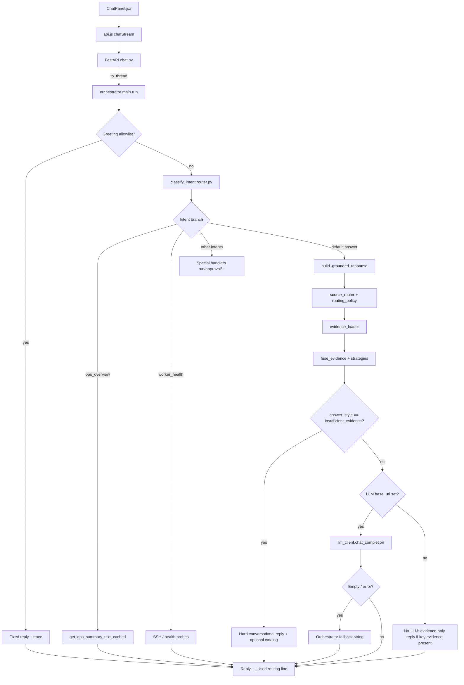

# AI response pipeline audit (Command Center → ai-lab)

This document maps the **current** request path for chat in the local Command Center + ai-lab stack, with **exact files**, where **latency** tends to accumulate, where **generic** answers appear, and where **“insufficient evidence”** behavior is decided.

## End-to-end request path

| Stage | Location | Notes |
|--------|----------|--------|
| UI input / send | `ai-lab/command-center/command-center/frontend/src/components/ChatPanel.jsx` | Builds `request_id` (`crypto.randomUUID()`), `client_submit_epoch_ms` (`Date.now()`), calls `api.chatStream(...)`. |
| HTTP client | `ai-lab/command-center/command-center/frontend/src/lib/api.js` | `chatStream` POST body includes `message`, `session_id`, optional `request_id`, `client_submit_epoch_ms`. |
| Non-stream API | `ai-lab/command-center/command-center/backend/routers/chat.py` → `chat()` | `asyncio.to_thread(orchestrator_run, ..., request_id=rid, client_submit_epoch_ms=..., receive_wall_ms=recv_wall)`. |
| Stream API (SSE) | Same file → `chat_stream()` | Thread runs `orchestrator_run(..., stream_delta=push_delta, request_id=..., receive_wall_ms=...)`. Queue yields `delta` events; heartbeat while worker thread alive. |
| Orchestrator entry | `ai-lab/brain/orchestrator/main.py` → `run()` | Sanitize input, optional **greeting short-circuit**, `classify_intent`, intent branches, grounded pipeline, LLM, traces. |
| Intent classifier | `ai-lab/brain/router/router.py` → `classify_intent()` | Keyword router: `answer`, `run`, `ops_overview`, `worker_health`, `scan_results`, etc. |
| Evidence / routing | `build_grounded_response()` in `main.py` | Calls `detect_freshness` (`brain/orchestrator/freshness.py`), `resolve_session_references` (`session_resolution.py`), `route_sources` (`source_router.py` + `routing_policy.match_answer_fast_path`), `load_evidence` (`evidence_loader.py`), `fuse_evidence` (`evidence_fusion.py`), `choose_answer_style` (`strategies.py`), `build_proposals` (`proposal_engine.py`). |
| Model call | `brain/llm_client.py` → `chat_completion()` | OpenAI-compatible HTTP; optional `on_first_token` for streaming first-token marks. |
| Worker / SSH | `brain/orchestrator/main.py` (e.g. `worker_health`), `brain/ssh_worker.py` | Worker checks can dominate wall time when hosts are down (connection timeouts). |
| Trace append | `brain/orchestrator/response_trace.py` → `append_response_trace()` | One JSON line per turn to `ai-lab/state/ai_response_traces.jsonl` (gitignored). |

## Mermaid: request flow (happy paths + fallbacks)

## Where time is usually spent

1. **`worker_health`**: SSH / TCP checks to configured worker endpoints — often **multi-second** when a service is down (e.g. `WinError 10061`). See `main.py` worker branch and `ssh_worker.py`.
2. **LLM round-trip**: LAN/Tailscale LM Studio host + model size + `chat_completion` streaming vs buffered.
3. **`GET /v1/models` probe** (when not skipped): `llm_client.list_openai_model_ids` — mitigated by cache and env `AI_LAB_LLM_SKIP_MODEL_LIST_PROBE`.
4. **Evidence load**: `ops_registry.get_ops_summary_text_cached()` (I/O + formatting), optional `web_tool.web_search` (timeout budget, e.g. 6s cap in loader/tooling).
5. **Cold session / SQLite**: `session_store.load_session` on first touch of a `session_id`.

## Where generic / unhelpful answers are introduced

- **`[Orchestrator] Intent: …` fallback** — built in `main.py` as `fallback` when the model returns empty/unreachable and catalog substitution does not apply.
- **No-LLM “dump full grounded template”** — when `AI_LAB_ORCH_NO_LLM=1` or empty `LLM_BASE_URL`, the assistant may return the **raw** `grounded_prompt.txt` block (verbose for end users); improvement is to add a **short extractive** formatter (recommended in `AI_MODEL_USEFULNESS_AUDIT.md`).
- **Transparency suffix** — `_Used: …` appended from `routing_reason` (can feel mechanical but aids debugging).

## Where “insufficient evidence” is triggered

| Mechanism | File / function |
|-----------|------------------|
| Fused style set to `insufficient_evidence` | `evidence_fusion.fuse_evidence()` when `intent == "answer"` and there is **no** local/web evidence and **no** `time_context`. |
| Strategy confirmation | `strategies.choose_answer_style()` returns `insufficient_evidence` when fusion already chose it, or no key/secondary evidence (unless `time_context` → `direct_status`). |
| **Hard stop** (no LLM call) | `main.py` after `build_grounded_response`: if `answer_style == "insufficient_evidence"`, return the conversational “no session-specific evidence” reply (+ optional catalog). **Catalog text in the prompt no longer bypasses this stop** (previously `## Lab system catalog` in `evidence_block` skipped the stop and led to LLM → empty → fallback). |

## Streaming / first-token semantics

- **Backend → first token**: `receive_wall_ms` and `on_first_token` in `run()` / `chat_completion` mark wall time; traces store `first_token_ms`, `receive_to_first_token_ms`, `client_epoch_to_first_token_ms` when provided.
- **Frontend → first token**: requires correlating `client_submit_epoch_ms` with server trace (`client_epoch_to_first_token_ms`). Payload is sent from `ChatPanel.jsx` / `api.js`.

## Related artifacts

- Traces: `ai-lab/state/ai_response_traces.jsonl` (append-only; **gitignored**).
- Benchmark script: `ai-lab/scripts/benchmark_ai_response.py`.
