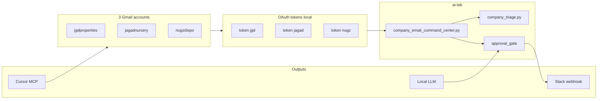

# Company Email Command Center

Unified triage for separate company Gmail accounts outside the `stonedprojects.com` org.

Configured accounts (see `email_sorter/config/accounts.yaml`):

| ID | Email | Focus |
|----|-------|-------|
| `jgdproperties` | jgdpropertiesllc@gmail.com | Executive, licenses, investor outreach |
| `jagadnursery` | jagadnurseryllc@gmail.com | Executive, licenses, investor outreach |
| `nugzdispo` | nugzdispo@gmail.com | Retail front business |

Outputs: **Slack digest**, **Cursor chat (MCP)**, **local LLM** — with writes/notifications behind the approval gate.

---

## Architecture



**Auto-allowed (no approval):** read inbox, classify, print digest, JSON export.

**Approval required:** Slack post, Gmail label apply, draft create, send.

---

## Step 1 — Google Cloud OAuth (non-org project)

Use a **personal** Google Cloud project (not Workspace domain delegation).

1. Enable **Gmail API**.
2. OAuth consent screen → **External**.
3. Scopes:
   - `https://www.googleapis.com/auth/gmail.modify` (read + label + draft)
4. OAuth client → **Desktop app**.
5. Download JSON → save as:

```
secrets/gmail/credentials.json
```

6. Add all three Gmail addresses as **Test users** while the app is in Testing mode.

---

## Step 2 — Authenticate each account

```powershell
cd E:\Repos\ai-lab

python -m email_sorter.accounts --auth jgdproperties
python -m email_sorter.accounts --auth jagadnursery
python -m email_sorter.accounts --auth nugzdispo
```

Each command opens a browser. Sign in with **that specific Gmail account**. Tokens are stored at:

```
secrets/gmail/tokens/jgdproperties.json
secrets/gmail/tokens/jagadnursery.json
secrets/gmail/tokens/nugzdispo.json
```

Verify:

```powershell
python -m email_sorter.accounts --auth-check
```

---

## Step 3 — Run the command center

Print digest (read-only):

```powershell
python scripts/company_email_command_center.py
```

JSON output:

```powershell
python scripts/company_email_command_center.py --json
```

---

## Step 4 — Slack hot digest

Create a Slack incoming webhook for your workspace/channel, then:

```powershell
$env:SLACK_WEBHOOK_URL = "https://hooks.slack.com/services/..."
```

Default: queues approval (does not post immediately):

```powershell
python scripts/company_email_command_center.py --slack
```

After you approve in the approval queue:

```powershell
python scripts/company_email_command_center.py --slack --approved
```

---

## Step 5 — Cursor MCP (interactive search + drafts)

See **`docs/JAGAD_GMAIL_CURSOR_SETUP.md`** for the jagadnursery walkthrough with current Cursor UI steps.

Summary:

1. Install `uv` so `uvx` is available.
2. **Cursor Settings → Tools & MCP → New MCP Server** (or create `.cursor/mcp.json` in the project).
3. **Ctrl+Shift+P → Developer: Reload Window**
4. Confirm the server is green under **Tools & MCP**; enable its tools there.
5. Use **Agent** mode in chat (Ask mode cannot call MCP tools).

Example server entry ([mcp-google-gmail](https://github.com/zachliu/mcp-google-gmail)):

```json
{
  "mcpServers": {
    "gmail-jagadnursery": {
      "command": "uvx",
      "args": ["mcp-google-gmail@latest"],
      "env": {
        "GMAIL_CREDENTIALS_PATH": "${workspaceFolder}/secrets/gmail/credentials.json",
        "GMAIL_TOKEN_PATH": "${workspaceFolder}/secrets/gmail/tokens/jagadnursery.json"
      }
    }
  }
}
```

Add one MCP entry per account (swap `GMAIL_TOKEN_PATH`). Tool calls show an approval prompt by default.

Draft creation via MCP should still be treated as a write action — confirm before sending.

---

## Step 6 — Inbox cleaner (label + archive + toast)

Near-real-time declutter for company inboxes (worker-node or Acheron):

```powershell
cd E:\Repos\ai-lab
# Prep OAuth files + optional interactive auth
powershell -ExecutionPolicy Bypass -File .\scripts\setup_company_gmail_oauth.ps1 -AuthAll

# Dry-run (no Gmail writes)
python -m email_sorter.company_inbox_cleaner --limit 20

# Live: apply category label, remove INBOX (archive, never delete), toast Acheron
python -m email_sorter.company_inbox_cleaner --apply --toast --limit 20
```

Schedule every 5 minutes:

```powershell
powershell -ExecutionPolicy Bypass -File .\scripts\install_company_inbox_cleaner_schedule.ps1 `
  -AiLabRoot "E:\Repos\ai-lab" -EnvFile "C:\secrets\email_sorter_env.ps1"
```

Env template: `scripts/email_sorter_env.example.ps1`. Ollama summary model: `llama3.1:8b` via `OLLAMA_HOST` / `OLLAMA_MODEL`.

---

## Step 7 — Local LLM (optional AI triage/drafts for command center)


The existing email sorter uses your local OpenAI-compatible endpoint:

```powershell
$env:LLM_BASE_URL = "http://127.0.0.1:1234/v1"
$env:LLM_MODEL = "Qwen2.5-Coder-14B-Instruct"
```

AI-assisted classification and draft generation should route through `brain/orchestrator` and the approval gate for any mailbox mutation.

---

## Labels and rules

Gmail labels (created on first apply):

| Category | Label |
|----------|-------|
| Hot / urgent | `Hot / Urgent` |
| Bills | `Bills / Invoices` |
| Legal | `Legal / Compliance` |
| Licenses / executive | `Licenses / Executive` |
| Investors | `Investors / Finance` |
| Retail | `Retail / Operations` |
| Needs reply | `Needs Reply` |
| Digest | `Summary-worthy` |
| Fallback | `Needs Review` |

Rules live in:

- `email_sorter/config/company_rules.yaml`
- `email_sorter/config/company_labels.yaml`

Tune sender domains and keywords as you see real mail patterns.

---

## Approval gate behavior

| Action | Gate |
|--------|------|
| Scan inbox | Auto |
| Print digest | Auto |
| Slack post | Approval (`notify`) |
| Apply Gmail label | Approval (`modify`) |
| Create draft | Approval (`modify`) |
| Send email | Approval (`send`) |

Queue label proposals:

```powershell
python scripts/company_email_command_center.py --queue-labels
```

Resolve approvals via your existing approval queue under `logs/approval_logs/`.

---

## Adding more accounts later

Edit `email_sorter/config/accounts.yaml`, then:

```powershell
python -m email_sorter.accounts --auth NEW_ACCOUNT_ID
python -m email_sorter.accounts --auth-check
```

---

## Security

- Never commit `secrets/gmail/` (already gitignored).
- Keep OAuth app in Testing mode with explicit test users unless you publish and verify the app.
- Use separate tokens per entity inbox for clean audit trails.
- Prefer drafts over auto-send; review in Gmail before sending investor or legal mail.
