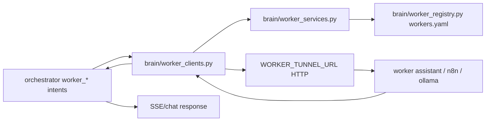

# System Wiring Audit

Scope: `ai-lab`, `command-center`, orchestrator/router, approvals, prepared context, worker bridge/tunnel, repo index coordinator, schedulers.

## 1) Chat prompt -> router -> orchestrator -> response

```mermaid
flowchart LR
  UI[ChatPanel.jsx] --> API[frontend api.chatStream]
  API --> SSE[/POST /api/chat/stream/]
  SSE --> CHAT[backend routers/chat.py chat_stream]
  CHAT --> ORCH[brain/orchestrator/main.py run()]
  ORCH --> INTENT[brain/router/router.py classify_intent]
  INTENT --> PC{prepared context hit?}
  PC -->|yes| PCRESP[prepared_context.loader.try_prepared_context_answer]
  PC -->|no| GROUNDED[build_grounded_response + evidence loader/fusion]
  GROUNDED --> LLM{LLM enabled?}
  LLM -->|yes| MODEL[brain/llm_client.py chat_completion]
  LLM -->|no| LOCAL[local evidence fallback]
  PCRESP --> TRACE[response_trace append JSONL]
  MODEL --> TRACE
  LOCAL --> TRACE
  TRACE --> SSEOUT[SSE delta/final payload]
```

Evidence:
- `command-center/frontend/src/components/ChatPanel.jsx` (`streamChatFromUser`)
- `command-center/frontend/src/lib/api.js` (`chatStream`)
- `command-center/backend/routers/chat.py` (`chat_stream`, `chat`)
- `brain/orchestrator/main.py` (`run`, `_write_turn_trace_if_enabled`)
- `brain/router/router.py` (`classify_intent`)
- `brain/prepared_context/loader.py` (`try_prepared_context_answer`)
- `brain/orchestrator/response_trace.py` (`append_response_trace`)

## 2) Approval request -> queue -> resolution -> execution

```mermaid
flowchart LR
  O[orchestrator run()] --> ENQ[intent enqueue_approval]
  ENQ --> RULE{permanent allowlist match?}
  RULE -->|yes| SKIP[no queue card]
  RULE -->|no| Q[approval_queue.submit]
  Q --> PENDING[logs/approval_logs/pending.json]
  UI[Command Center approvals UI] --> RES[/POST /api/approvals/resolve/]
  RES --> RQ[approval_queue.resolve]
  RQ --> DONE[resolved_*.json]
  RES --> EXEC{tool_name attached?}
  EXEC -->|yes| RUN[brain.execution.run]
  EXEC -->|no| NOTE[dismiss/no deferred payload]
```

Evidence:
- `brain/orchestrator/main.py` (`intent == "enqueue_approval"`)
- `brain/permanent_allowlist.py` (`find_matching_rule`)
- `brain/approval_queue/queue.py` (`submit`, `resolve`, persistence files)
- `command-center/backend/routers/events.py` (`resolve_approval`, `_execute_approved`)
- `brain/execution.py` (`run`)

## 3) Prepared context refresh -> display -> orchestrator use

```mermaid
flowchart LR
  REFRESH[build_prepared_context.py / refresher loop] --> BUILD[prepared_context.builders]
  BUILD --> STORE[state/prepared_context/*.json]
  STORE --> API[/api/prepared-context]
  API --> UI[ToolsPanel + top bar badge]
  STORE --> ORCH[orchestrator run()]
  ORCH --> LOADER[prepared_context.loader]
  LOADER --> RESP[prepared answer / quality gate / fallback]
```

Evidence:
- `brain/prepared_context/builders.py`
- `brain/prepared_context/store.py`
- `command-center/backend/services/prepared_context_refresher.py`
- `command-center/backend/routers/prepared_context.py`
- `command-center/frontend/src/components/ToolsPanel.jsx`
- `command-center/frontend/src/App.jsx`
- `brain/orchestrator/main.py`

## 4) Worker request -> bridge/tunnel -> worker service -> response



Evidence:
- `brain/orchestrator/main.py` (`worker_health`, `worker_index`, `worker_retrieve`, `trigger_workflow`)
- `brain/worker_clients.py`
- `brain/worker_services.py`
- `brain/worker_registry.py`
- `ops/registry/workers.yaml`
- `command-center/backend/services/supervisor_bridge.py` (`_worker_call`)

## 5) Scheduled script -> trigger -> output -> consumption

- Backend lifespan triggers:
  - `command-center/backend/main.py` starts:
    - `nvidia_poll_loop`
    - `repo_watcher.start_watcher`
    - `repo_index_coordinator.run_forever`
    - `prepared_context_refresher.run_prepared_context_refresher`
- OS task scripts:
  - `scripts/setup_prepared_context_tasks.ps1`
  - `scripts/setup_worker_tunnel_task.ps1`
  - `scripts/maintain_worker_tunnel.ps1`
- Snapshot outputs consumed by:
  - orchestrator prepared-context precheck
  - `/api/prepared-context*`
  - top-bar/ToolsPanel status UI

## 6) Notable integration gaps

- Approval gate function exists (`brain/orchestrator/approval_gate.py`) but `brain/execution.py` does not enforce it at execution boundary.
- Supervisor `APR-*` events can be dismissed without durable queue linkage (`backend/routers/events.py`).
- Some `final_answer_source` rows in old traces remain `unknown` (new traces now set explicit values).
- Worker integration has two execution lanes (orchestrator direct and supervisor bridge), increasing policy/timeout drift risk.

